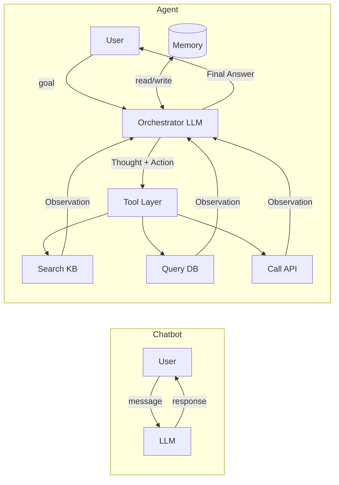

Most developers start building AI applications the same way: call an LLM with a prompt, get a response, display it. That works for Q&A, summarization, and content generation. But when you need an AI system that can use tools, remember context across steps, and make decisions autonomously — you need an agent architecture, not a chatbot.

Having transitioned production systems from simple LLM integrations to full agentic pipelines, the shift is more fundamental than it first appears.

## The Chatbot Pattern

A chatbot is essentially a stateless function:

```python
from langchain_anthropic import ChatAnthropic
from langchain_core.messages import SystemMessage, HumanMessage

llm = ChatAnthropic(model="claude-sonnet-4-6")

def chat(user_message: str, history: list) -> str:
    response = llm.invoke([
        SystemMessage(content="You are a helpful assistant."),
        *history,
        HumanMessage(content=user_message)
    ])
    return response.content
```

Simple, predictable, appropriate for many use cases. The LLM has no ability to take action in the world — it can only produce text.

## The Three Pillars of Agent Architecture

Agents differ from chatbots in three fundamental ways:

### 1. Tools (Action)
An agent can call external functions — APIs, databases, code executors, file systems. The LLM decides *when* and *with what arguments* to call them.

### 2. Memory (State)
Agents maintain state across steps:
- **Short-term**: The current trajectory (all steps taken so far)
- **Long-term**: Vector store retrieval of past interactions and knowledge
- **Working memory**: Scratchpad for intermediate reasoning

### 3. Planning (Reasoning)
Agents don't just respond — they reason about a sequence of actions needed to achieve a goal, observe results, and adapt when things go wrong.

## The Agent Loop: ReAct Pattern

The foundational pattern for agents is **ReAct** (Reasoning + Acting):

```
Observation → Thought → Action → Observation → Thought → Action → ... → Final Answer
```

The LLM sees what happened (observation), reasons about what to do next (thought), calls a tool (action), and gets back a result (new observation). This loop repeats until the goal is achieved or a limit is hit.

```python
from langchain_anthropic import ChatAnthropic
from langchain.agents import create_react_agent, AgentExecutor
from langchain_core.tools import tool
from langchain import hub

@tool
def search_knowledge_base(query: str) -> str:
    """Search the knowledge base for relevant information."""
    results = vector_store.similarity_search(query, k=3)
    return "\n".join([doc.page_content for doc in results])

@tool
def run_data_query(sql: str) -> str:
    """Execute a read-only SQL query and return results as JSON."""
    try:
        with db.connect() as conn:
            result = conn.execute(text(sql))
            rows = [dict(row) for row in result]
            return json.dumps(rows[:50])  # Cap at 50 rows
    except Exception as e:
        return f"ERROR: {str(e)}"  # Return errors, don't raise

@tool
def send_notification(channel: str, message: str) -> str:
    """Send a notification to a Slack channel."""
    response = slack_client.chat_postMessage(channel=channel, text=message)
    return "Notification sent" if response["ok"] else f"Failed: {response['error']}"

llm = ChatAnthropic(model="claude-sonnet-4-6")
tools = [search_knowledge_base, run_data_query, send_notification]

prompt = hub.pull("hwchase17/react")
agent = create_react_agent(llm, tools, prompt)

executor = AgentExecutor(
    agent=agent,
    tools=tools,
    verbose=True,
    max_iterations=15,
    handle_parsing_errors=True,
    return_intermediate_steps=True  # Critical for debugging
)

result = executor.invoke({
    "input": "Analyze this week's API error rate and notify the #alerts channel if it's above 2%"
})

# result["intermediate_steps"] contains the full trajectory
```

## Architecture Comparison



## Chatbot vs Agent: The Practical Differences

| Dimension | Chatbot | Agent |
|---|---|---|
| **Execution model** | Single LLM call | Multi-step loop |
| **State** | Stateless | Stateful trajectory |
| **Actions** | Text only | Tools, APIs, code execution |
| **Failure recovery** | None | Retry, replanning |
| **Latency** | 1–3 seconds | 5–60+ seconds |
| **Cost** | 1–2 LLM calls | N LLM calls |
| **Best for** | Q&A, summarization | Research, automation, multi-step tasks |

## What Actually Changes in Your Codebase

### Prompts become contracts

Your system prompt must now include:
- Descriptions of every available tool
- Instructions for the reasoning format (thought → action → observation)
- Constraints on what the agent should and shouldn't do
- Expected output format when the task is complete

### Error handling must be built into tools

When a tool fails, the agent needs to receive an error string it can reason about — not an exception that crashes the loop.

```python
@tool
def fetch_user_profile(user_id: str) -> str:
    """Fetch a user's profile data by their ID."""
    if not user_id or not user_id.startswith("usr_"):
        return "ERROR: Invalid user_id format. Expected format: usr_XXXXX"
    
    try:
        user = db.get_user(user_id)
        if not user:
            return f"ERROR: No user found with ID {user_id}"
        return json.dumps(user.to_dict())
    except DatabaseError as e:
        return f"ERROR: Database unavailable: {str(e)}"
```

The agent sees `"ERROR: No user found with ID usr_12345"` and can decide to try a different user ID, ask the user for clarification, or report that it cannot complete the task.

### Observability is no longer optional

With a chatbot: one input, one output — debugging is trivial.  
With an agent: a trajectory of N steps — you need to trace every decision.

Add tracing before you ship anything to production:

```python
from langfuse import Langfuse
from langfuse.callback import CallbackHandler

langfuse = Langfuse()
handler = CallbackHandler()

result = executor.invoke(
    {"input": user_query},
    config={"callbacks": [handler]}
)
# Every step is now traced in Langfuse with latency, tokens, and reasoning
```

### Testing strategy changes completely

Unit tests for chatbots are straightforward. Agent testing requires three layers:

1. **Tool unit tests** — test each tool in isolation with known inputs
2. **Trajectory tests** — assert the agent took the right sequence of steps
3. **End-to-end evals** — measure task completion rate over a golden dataset

```python
# Tool unit test
def test_run_data_query_handles_invalid_sql():
    result = run_data_query.invoke("DROP TABLE users")
    assert result.startswith("ERROR:")

# Trajectory test with LangSmith
def test_agent_calls_search_before_summarizing():
    result = executor.invoke({"input": "Summarize the Q3 performance report"})
    tool_calls = [step[0].tool for step in result["intermediate_steps"]]
    assert "search_knowledge_base" in tool_calls
```

## When Not to Use an Agent

Not every problem needs an agent. Use a plain LLM call when:
- The task completes in a single prompt (summarization, classification, generation)
- Latency matters — agents add seconds per step
- Cost per request is a constraint
- The output is purely text with no external actions needed

Agents shine when a task genuinely requires: deciding which tools to use, executing multiple steps in sequence, adapting based on intermediate results, or recovering from partial failures.

## Key Takeaways

1. **The agent loop is the core abstraction** — perceive → reason → act → observe → repeat
2. **Tools define capability** — a well-designed tool library is more valuable than a better LLM
3. **Return errors as strings** — never let tool exceptions crash the agent loop
4. **Trace everything from day one** — you cannot debug what you cannot observe
5. **Agents are overkill for simple tasks** — match the architecture to the problem

---

*Part of the [Agentic AI in Practice series](/tags/agentic-ai-series/) — lessons from building production multi-agent systems.*
