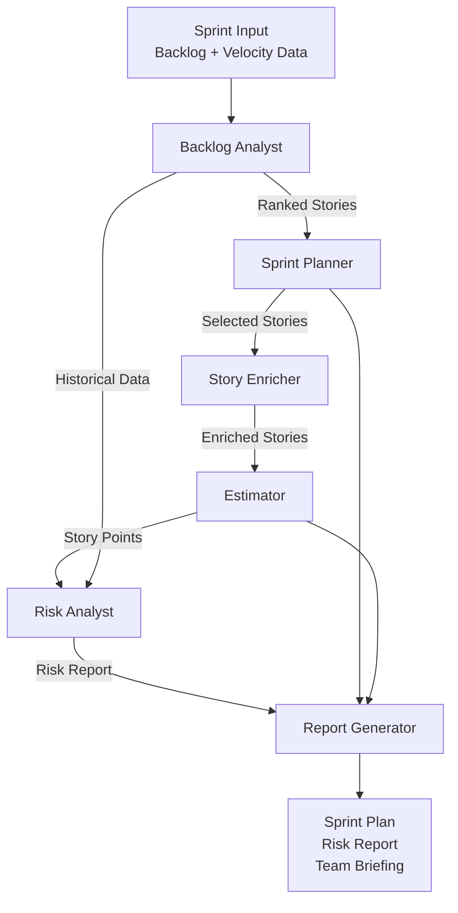

Single-agent systems are powerful. But some problems are inherently parallel, specialized, or too large for one agent to handle reliably. Multi-agent orchestration — where specialized agents collaborate on a shared goal — is the architecture that makes complex AI automation production-ready.

This post walks through designing and building a multi-agent system for automating Agile sprint workflows using CrewAI. The core ideas generalize to any domain where a workflow has distinct phases that benefit from specialization.

## Why Multiple Agents?

The naive approach: one LLM prompt with all the context, all the instructions, all the expected outputs. This fails in practice for three reasons:

1. **Context saturation** — packing everything into one prompt degrades output quality as context grows
2. **Role confusion** — a single agent switching between analysis, writing, estimation, and planning produces mediocre work at each
3. **No parallelism** — sequential steps that could run concurrently are bottlenecked

A multi-agent architecture solves this by decomposing the problem: each agent is an expert in a narrow task, gets only the context it needs, and hands results to the next agent in the pipeline.

## The Problem: Sprint Management is Repetitive and Manual

Sprint planning, backlog grooming, estimation, risk review, and retrospectives follow consistent patterns. They require synthesizing information from multiple sources and producing structured outputs. This is exactly where a multi-agent system excels.

## The Architecture: 7-Agent Crew



Each agent is scoped to a single responsibility:

| Agent | Responsibility | Input | Output |
|---|---|---|---|
| **Backlog Analyst** | Rank stories by business value | Raw backlog | Prioritized list |
| **Sprint Planner** | Select stories that fit capacity | Ranked backlog + velocity | Sprint scope |
| **Story Enricher** | Add acceptance criteria | Selected stories | Complete stories |
| **Estimator** | Assign story points | Enriched stories + history | Estimated stories |
| **Risk Analyst** | Identify blockers and risks | Sprint scope + history | Risk report |
| **Report Generator** | Produce final artifacts | All agent outputs | Sprint plan + briefing |

## CrewAI Implementation

```python
from crewai import Agent, Task, Crew, Process
from crewai_tools import SerperDevTool, FileReadTool
from langchain_anthropic import ChatAnthropic
from langchain_openai import ChatOpenAI

llm = ChatAnthropic(model="claude-sonnet-4-6", temperature=0.2)

# --- Agents ---

backlog_analyst = Agent(
    role="Backlog Analyst",
    goal="Analyze and prioritize the product backlog based on business value, "
         "dependencies, and team capacity.",
    backstory=(
        "You are an experienced product analyst with deep understanding of "
        "agile prioritization frameworks (WSJF, MoSCoW, RICE). You excel at "
        "identifying high-value work and eliminating low-value noise."
    ),
    llm=llm,
    verbose=True,
    allow_delegation=False,
)

sprint_planner = Agent(
    role="Sprint Planner",
    goal="Select the optimal set of stories for the upcoming sprint based on "
         "team velocity, story priorities, and dependencies.",
    backstory=(
        "You are a seasoned Scrum Master who knows how to balance ambition with "
        "realism. You understand velocity trends, team capacity, and the cost "
        "of carrying unfinished work."
    ),
    llm=llm,
    verbose=True,
    allow_delegation=False,
)

story_enricher = Agent(
    role="Story Writer",
    goal="Write clear, testable user stories with well-defined acceptance criteria "
         "following the INVEST principles.",
    backstory=(
        "You have written hundreds of user stories across enterprise products. "
        "You know that ambiguous requirements are the #1 cause of sprint failure."
    ),
    llm=llm,
    verbose=True,
    allow_delegation=False,
)

estimator = Agent(
    role="Estimation Expert",
    goal="Provide realistic story point estimates using historical team velocity "
         "and complexity analysis.",
    backstory=(
        "You use reference stories and three-point estimation to reduce bias. "
        "You flag stories that are too large or too ambiguous to estimate accurately."
    ),
    llm=llm,
    verbose=True,
    allow_delegation=False,
)

risk_analyst = Agent(
    role="Risk Analyst",
    goal="Identify technical risks, blockers, dependencies, and capacity risks "
         "that could derail the sprint.",
    backstory=(
        "You've seen sprints fail in predictable ways: unclear dependencies, "
        "overestimated capacity, unresolved technical debt. You surface these "
        "issues before the sprint starts."
    ),
    llm=llm,
    verbose=True,
    allow_delegation=False,
)

report_generator = Agent(
    role="Report Generator",
    goal="Synthesize all agent outputs into a complete, structured sprint plan "
         "ready for team review.",
    backstory=(
        "You are a technical writer who can transform complex analysis into "
        "clear, actionable documents that engineering and product teams can act on immediately."
    ),
    llm=llm,
    verbose=True,
    allow_delegation=False,
)

# --- Tasks ---

analyze_backlog_task = Task(
    description=(
        "Analyze the following product backlog:\n\n{backlog}\n\n"
        "Team velocity (last 3 sprints): {velocity}\n\n"
        "Prioritize stories using the WSJF framework. Return a ranked list with "
        "brief rationale for the top 15 stories."
    ),
    expected_output=(
        "A ranked list of the top 15 backlog items with: rank, story ID, "
        "title, WSJF score, and 1-sentence prioritization rationale."
    ),
    agent=backlog_analyst,
)

plan_sprint_task = Task(
    description=(
        "Using the prioritized backlog from the analyst, select stories for the "
        "next 2-week sprint. Team capacity: {capacity} story points.\n\n"
        "Leave 20%% buffer for unplanned work. Respect dependencies."
    ),
    expected_output=(
        "Sprint scope: list of selected story IDs with justification. "
        "Total estimated points. Buffer analysis."
    ),
    agent=sprint_planner,
    context=[analyze_backlog_task],
)

enrich_stories_task = Task(
    description=(
        "For each story selected for the sprint, write complete user stories "
        "with: user story format (As a... I want... So that...), "
        "3-5 acceptance criteria, and definition of done."
    ),
    expected_output=(
        "Complete user stories for all sprint items in structured markdown format."
    ),
    agent=story_enricher,
    context=[plan_sprint_task],
)

estimate_task = Task(
    description=(
        "Review each enriched story and provide story point estimates. "
        "Use these reference stories for calibration:\n{reference_stories}\n\n"
        "Flag any story that cannot be completed within a single sprint."
    ),
    expected_output=(
        "Story point estimates for each story with complexity rationale. "
        "Flag oversized stories with recommended split approach."
    ),
    agent=estimator,
    context=[enrich_stories_task],
)

risk_analysis_task = Task(
    description=(
        "Analyze the sprint plan for risks:\n"
        "1. Technical dependencies and blockers\n"
        "2. Capacity risks (team leaves, public holidays: {holidays})\n"
        "3. Stories with unclear requirements or external dependencies\n"
        "4. Technical debt items that could slow delivery\n\n"
        "Historical blockers from last 3 sprints: {historical_blockers}"
    ),
    expected_output=(
        "Risk report with: identified risks (High/Medium/Low), impact analysis, "
        "and mitigation recommendations for each risk."
    ),
    agent=risk_analyst,
    context=[plan_sprint_task, estimate_task],
)

generate_report_task = Task(
    description=(
        "Synthesize all previous outputs into a complete sprint plan document. "
        "Include: executive summary, sprint goal, full story list with estimates, "
        "risk summary with mitigations, and team capacity breakdown."
    ),
    expected_output=(
        "Complete sprint plan in structured markdown:\n"
        "1. Sprint Goal\n"
        "2. Team Capacity\n"
        "3. Sprint Backlog (stories with estimates)\n"
        "4. Risk Register\n"
        "5. Definition of Done\n"
        "6. Sprint Kickoff Agenda"
    ),
    agent=report_generator,
    context=[enrich_stories_task, estimate_task, risk_analysis_task],
)

# --- Crew ---

sprint_crew = Crew(
    agents=[
        backlog_analyst,
        sprint_planner,
        story_enricher,
        estimator,
        risk_analyst,
        report_generator,
    ],
    tasks=[
        analyze_backlog_task,
        plan_sprint_task,
        enrich_stories_task,
        estimate_task,
        risk_analysis_task,
        generate_report_task,
    ],
    process=Process.sequential,  # Each task uses previous task outputs as context
    verbose=True,
    memory=True,  # Enable crew memory for cross-task context
)

# --- Run ---

result = sprint_crew.kickoff(inputs={
    "backlog": backlog_data,
    "velocity": "42, 38, 45",  # Last 3 sprint velocities
    "capacity": 40,
    "reference_stories": reference_stories,
    "holidays": "April 14 (public holiday)",
    "historical_blockers": historical_data,
})

print(result.raw)
```

## Key Design Decisions

### Sequential vs Hierarchical Process

CrewAI supports two orchestration modes:

**`Process.sequential`** — Tasks run in order. Each task's output becomes available as context for subsequent tasks. Simple and predictable.

**`Process.hierarchical`** — A manager agent coordinates other agents, deciding who does what and when. More flexible but harder to debug.

For this use case, sequential works well because the workflow has clear dependencies: you can't plan a sprint before you've prioritized the backlog.

### Memory Configuration

```python
from crewai.memory import LongTermMemory, ShortTermMemory, EntityMemory
from crewai.memory.storage.rag_storage import RAGStorage

crew = Crew(
    ...
    memory=True,
    long_term_memory=LongTermMemory(
        storage=RAGStorage(
            embedder_config={"provider": "openai", "config": {"model": "text-embedding-3-small"}},
            storage_config={"path": "./sprint_memory"}
        )
    ),
)
```

Long-term memory lets the crew learn from past sprints — previous risk patterns, estimation accuracy, and team capacity trends inform future runs.

### Context Passing Between Tasks

The `context` parameter on each task explicitly declares which prior task outputs to include. This avoids context bloat — the report generator doesn't need the full backlog analysis, only the final estimates and risks.

## Results and Lessons Learned

After running this system across multiple sprint cycles, the patterns that emerged:

**What worked well:**
- Each agent's output quality exceeded what a single prompt could produce for the same task
- The Risk Analyst consistently surfaced blockers that were missed in manual planning
- Story enrichment quality was measurably better with a dedicated Story Writer agent

**What needed tuning:**
- Agent backstories matter more than expected — vague backstories produce generic output
- Temperature needs to be low (0.1–0.3) for structured outputs like story points
- Adding `allow_delegation=False` prevents agents from trying to hand off tasks unexpectedly

**The biggest win:**  
What previously took 2-3 hours of planning meetings produced a comparable output in ~4 minutes of agent execution time, with a structured document that teams could review and adjust.

## Key Takeaways

1. **Decompose by specialization** — each agent should have one job it does extremely well
2. **Context is precious** — use the `context` parameter to pass only what each agent needs
3. **Sequential for clear pipelines, hierarchical for dynamic workflows**
4. **Agent backstories are prompt engineering** — write them as you would a senior hire's job description
5. **Start with 3 agents max** — add agents only when you have a clear specialization need

---

*Part of the [Agentic AI in Practice series](/tags/agentic-ai-series/) — lessons from building production multi-agent systems.*
