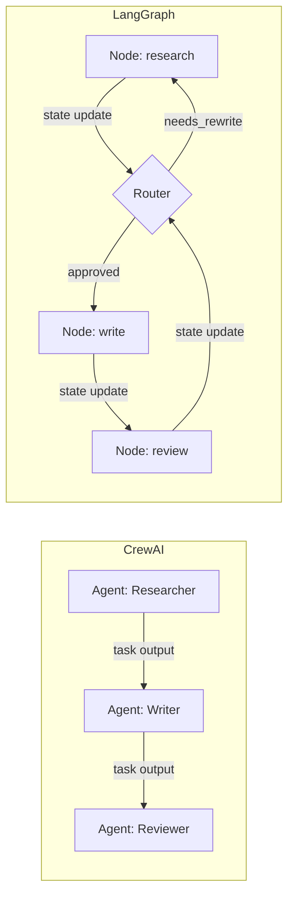

After building production systems with both LangGraph and CrewAI, one question comes up constantly: *which framework should I use?* The honest answer is that they solve different problems. This post walks through the fundamental differences, shows the same use case implemented in both, and gives you a decision framework.

## The Core Philosophy Difference

**CrewAI** thinks in terms of *roles and collaboration*. You define agents as team members with jobs, goals, and backstories. Tasks flow through them in sequence or hierarchy. It's a high-level abstraction that maps to how humans organize work.

**LangGraph** thinks in terms of *state and flow*. You define a graph where each node is a function that reads from and writes to a shared state. Edges control routing — including conditional branching based on the state. It's a lower-level abstraction that gives you precise control over execution.



## A Concrete Example: Research → Draft → Review Pipeline

To make the comparison tangible, implement the same pipeline in both frameworks: research a topic, draft a blog post, review it for quality, and revise if needed.

### Implementation with CrewAI

```python
from crewai import Agent, Task, Crew, Process
from langchain_anthropic import ChatAnthropic

llm = ChatAnthropic(model="claude-sonnet-4-6", temperature=0.3)

# Define agents
researcher = Agent(
    role="Research Specialist",
    goal="Gather accurate, comprehensive information on the given topic.",
    backstory="You are a technical researcher who finds primary sources and synthesizes complex information clearly.",
    llm=llm,
    allow_delegation=False,
)

writer = Agent(
    role="Content Writer",
    goal="Write a clear, engaging blog post from the research findings.",
    backstory="You write technical content for software engineers. You prioritize clarity, code examples, and actionable insights.",
    llm=llm,
    allow_delegation=False,
)

reviewer = Agent(
    role="Senior Editor",
    goal="Review the draft for technical accuracy, clarity, and completeness. Approve or request revisions.",
    backstory="You have high standards. You ensure every post is technically accurate and genuinely useful.",
    llm=llm,
    allow_delegation=False,
)

# Define tasks
research_task = Task(
    description="Research the topic: {topic}. Gather key concepts, use cases, and code patterns.",
    expected_output="Structured research notes: key concepts, 3+ code examples, pros/cons, use cases.",
    agent=researcher,
)

write_task = Task(
    description="Write a technical blog post based on the research. Include code examples and practical takeaways.",
    expected_output="Complete blog post in markdown, 800-1200 words, with code blocks.",
    agent=writer,
    context=[research_task],
)

review_task = Task(
    description="Review the draft. Check technical accuracy, clarity, and completeness. If the quality meets bar, approve it. If not, list specific revisions needed.",
    expected_output="Either 'APPROVED: [final post]' or 'REVISION NEEDED: [specific issues]'",
    agent=reviewer,
    context=[write_task],
)

crew = Crew(
    agents=[researcher, writer, reviewer],
    tasks=[research_task, write_task, review_task],
    process=Process.sequential,
    verbose=True,
)

result = crew.kickoff(inputs={"topic": "LangGraph stateful agents"})
```

**What you notice:** Clean, readable, maps to human roles. But: if the reviewer requests revisions, you'd need to restructure the tasks or add more agents — CrewAI's sequential process doesn't natively loop back.

---

### Implementation with LangGraph

```python
from typing import TypedDict, Annotated
from langgraph.graph import StateGraph, END
from langchain_anthropic import ChatAnthropic
from langchain_core.messages import SystemMessage, HumanMessage
import operator

llm = ChatAnthropic(model="claude-sonnet-4-6", temperature=0.3)

# Define shared state
class ResearchState(TypedDict):
    topic: str
    research_notes: str
    draft: str
    review_feedback: str
    revision_count: int
    status: str  # "researching" | "writing" | "reviewing" | "approved"

# Define nodes (each is a pure function: state → state update)
def research_node(state: ResearchState) -> dict:
    response = llm.invoke([
        SystemMessage(content="You are a technical researcher. Gather key concepts, patterns, and code examples."),
        HumanMessage(content=f"Research this topic: {state['topic']}")
    ])
    return {"research_notes": response.content, "status": "writing"}

def write_node(state: ResearchState) -> dict:
    prompt = f"Write a technical blog post about {state['topic']} using these research notes:\n\n{state['research_notes']}"
    if state.get("review_feedback"):
        prompt += f"\n\nPrevious feedback to address:\n{state['review_feedback']}"
    
    response = llm.invoke([
        SystemMessage(content="Write a clear technical blog post with code examples. 800-1200 words."),
        HumanMessage(content=prompt)
    ])
    return {
        "draft": response.content,
        "status": "reviewing",
        "revision_count": state.get("revision_count", 0)
    }

def review_node(state: ResearchState) -> dict:
    response = llm.invoke([
        SystemMessage(content=(
            "You are a senior technical editor. Review this draft strictly.\n"
            "Respond with exactly one of:\n"
            "APPROVED\n"
            "REVISION: [specific issues to fix]"
        )),
        HumanMessage(content=f"Review this draft:\n\n{state['draft']}")
    ])
    
    content = response.content.strip()
    if content.startswith("APPROVED"):
        return {"status": "approved", "review_feedback": ""}
    else:
        feedback = content.replace("REVISION:", "").strip()
        return {"status": "writing", "review_feedback": feedback}

# Conditional routing
def route_after_review(state: ResearchState) -> str:
    if state["status"] == "approved":
        return "approved"
    if state.get("revision_count", 0) >= 2:
        return "approved"  # Max 2 revisions, then accept as-is
    return "revise"

# Build the graph
workflow = StateGraph(ResearchState)

workflow.add_node("research", research_node)
workflow.add_node("write", write_node)
workflow.add_node("review", review_node)

workflow.set_entry_point("research")
workflow.add_edge("research", "write")
workflow.add_edge("write", "review")
workflow.add_conditional_edges(
    "review",
    route_after_review,
    {
        "revise": "write",    # Loop back for revision
        "approved": END,
    }
)

graph = workflow.compile()

# Run it
result = graph.invoke({
    "topic": "LangGraph stateful agents",
    "research_notes": "",
    "draft": "",
    "review_feedback": "",
    "revision_count": 0,
    "status": "researching",
})

print(result["draft"])
```

**What you notice:** More code, but you get the revision loop natively. The graph makes execution flow explicit. You can add checkpointing to resume interrupted runs.

## Adding Checkpointing (LangGraph Only)

One of LangGraph's most powerful features is persistence — the ability to pause, resume, and inspect execution mid-graph:

```python
from langgraph.checkpoint.sqlite import SqliteSaver

# Persist state to SQLite
checkpointer = SqliteSaver.from_conn_string("./blog_pipeline.db")
graph = workflow.compile(checkpointer=checkpointer)

# Run with a thread ID for resumability
config = {"configurable": {"thread_id": "post-001"}}
result = graph.invoke(initial_state, config=config)

# Later, inspect the current state
state = graph.get_state(config)
print(state.values["status"])

# Or resume from a specific checkpoint
graph.update_state(config, {"revision_count": 0})  # Reset revision counter
```

CrewAI has no equivalent native checkpointing — if your 6-agent pipeline fails at agent 4, you restart from agent 1.

## Head-to-Head Comparison

| Feature | LangGraph | CrewAI |
|---|---|---|
| **Abstraction level** | Low (graph nodes) | High (roles + tasks) |
| **Conditional branching** | Native (conditional edges) | Limited (needs custom logic) |
| **Loops / retry** | Native | Workaround required |
| **State management** | Explicit TypedDict | Implicit (task context) |
| **Checkpointing** | Built-in | Not available |
| **Parallelism** | Node-level | Process.parallel |
| **Learning curve** | Steeper | Gentler |
| **Debugging** | Full state visibility | Task-level visibility |
| **Human-in-the-loop** | Native breakpoints | Limited |
| **Best for** | Complex flows, production | Rapid prototyping, role-based |

## Decision Framework

**Choose CrewAI when:**
- You can model the problem as a team of specialists with distinct roles
- The workflow is predominantly linear (A → B → C)
- You're prototyping and want to move fast
- The team is less familiar with graph-based thinking
- You need role-based access control or agent personas

**Choose LangGraph when:**
- Your workflow has conditional branching (if X do Y, else do Z)
- You need retry loops or revision cycles
- You need to pause and resume long-running pipelines
- You want human-in-the-loop approval steps
- You need full auditability and state inspection
- You're building something that will run in production at scale

## They're Not Mutually Exclusive

You can use both in the same system. A common pattern: use **LangGraph for the outer orchestration** (the state machine that manages the overall pipeline) and **CrewAI crews as LangGraph nodes** for tasks that benefit from role-based multi-agent collaboration.

```python
def run_research_crew(state: PipelineState) -> dict:
    # CrewAI handles the research phase as a multi-agent crew
    research_crew = Crew(agents=[analyst, researcher], tasks=[...], process=Process.sequential)
    result = research_crew.kickoff(inputs={"topic": state["topic"]})
    return {"research_output": result.raw}

# This crew execution is just one node in a larger LangGraph workflow
workflow.add_node("research_phase", run_research_crew)
```

## Key Takeaways

1. **LangGraph = control plane, CrewAI = role-based teams** — they solve different problems
2. **Conditional logic and loops require LangGraph** — don't fight CrewAI's sequential model
3. **Checkpointing is production-critical** — LangGraph's persistence is a major advantage for long pipelines
4. **Start with CrewAI for prototyping**, migrate to LangGraph when you need fine-grained control
5. **Both frameworks work together** — use CrewAI crews as nodes inside LangGraph graphs for the best of both worlds

---

*Part of the [Agentic AI in Practice series](/tags/agentic-ai-series/) — lessons from building production multi-agent systems.*
