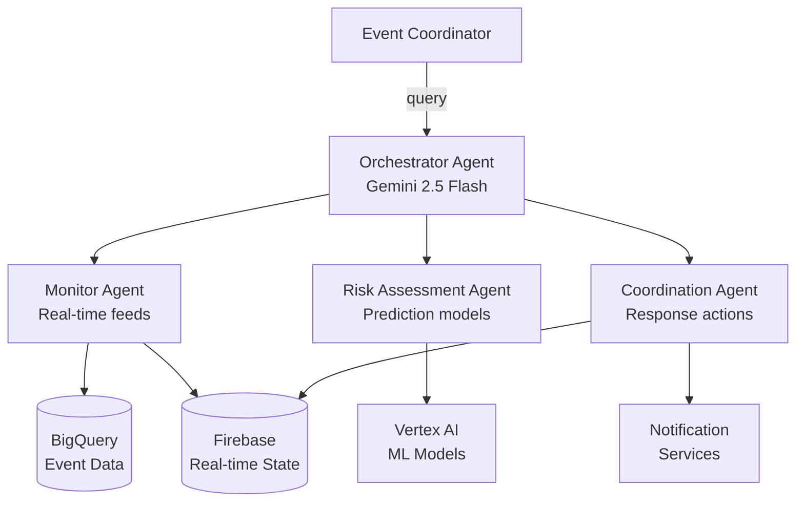

Google's Agent Development Kit (ADK) is a framework for building multi-agent systems powered by Gemini models. Unlike LangChain or CrewAI — which are model-agnostic — ADK is designed specifically for the Google Cloud ecosystem, giving you tight integration with Vertex AI, Firebase, BigQuery, and Cloud Run.

This post covers ADK's core concepts and architecture through the lens of building a real-time event management agent — the kind of multi-agent system that monitors a live situation, assesses risk, and coordinates automated responses.

## What is Google ADK?

ADK provides three key abstractions:

- **Agent**: A unit of reasoning backed by a Gemini model. Can have tools, sub-agents, and memory.
- **Runner**: Manages agent execution, session state, and streaming.
- **Session**: A conversation thread with persistent state across multiple turns.

ADK's differentiator is its **sub-agent architecture**: agents can delegate to other agents, creating hierarchical multi-agent systems where a root orchestrator coordinates specialized sub-agents.

## Installation and Setup

```bash
pip install google-adk google-cloud-aiplatform
```

```python
import vertexai
from google.adk.agents import Agent
from google.adk.runners import Runner
from google.adk.sessions import InMemorySessionService
from google.adk.tools import FunctionTool
from vertexai.generative_models import GenerativeModel

# Initialize Vertex AI
vertexai.init(project="your-gcp-project", location="us-central1")
```

## Building a Multi-Agent System

The use case: monitor a live public event, assess crowd density and safety risks, predict potential issues, and coordinate response actions. Each concern is handled by a specialized sub-agent.

### Architecture



### Define Tools for Each Sub-Agent

```python
import json
from google.cloud import bigquery, firestore
from google.adk.tools import FunctionTool

bq_client = bigquery.Client()
db = firestore.Client()

# Monitor Agent tools
def get_crowd_density(zone_id: str, time_window_minutes: int = 5) -> dict:
    """
    Get real-time crowd density data for a specific zone.
    
    Args:
        zone_id: Zone identifier (e.g., 'zone_A', 'zone_B')
        time_window_minutes: Number of minutes of historical data to include
    
    Returns:
        Dictionary with current_count, density_score, trend, and alerts
    """
    query = f"""
        SELECT 
            zone_id,
            COUNT(*) as current_count,
            AVG(density_score) as avg_density,
            MAX(timestamp) as last_updated
        FROM `events.crowd_data`
        WHERE zone_id = '{zone_id}'
          AND timestamp >= TIMESTAMP_SUB(CURRENT_TIMESTAMP(), INTERVAL {time_window_minutes} MINUTE)
        GROUP BY zone_id
    """
    results = list(bq_client.query(query).result())
    if not results:
        return {"error": f"No data found for zone {zone_id}"}
    
    row = results[0]
    return {
        "zone_id": zone_id,
        "current_count": row.current_count,
        "density_score": round(row.avg_density, 2),
        "last_updated": str(row.last_updated),
        "status": "HIGH" if row.avg_density > 0.8 else "NORMAL"
    }

def get_all_zone_status() -> dict:
    """Get a summary of all zones and their current status."""
    doc_ref = db.collection("event_state").document("zone_summary")
    doc = doc_ref.get()
    if doc.exists:
        return doc.to_dict()
    return {"error": "Zone summary not available"}

# Risk Assessment Agent tools
def predict_crowd_surge(zone_id: str, forecast_minutes: int = 30) -> dict:
    """
    Predict crowd surge probability for the next N minutes using historical patterns.
    
    Returns surge_probability (0-1), peak_time_estimate, and recommended_actions.
    """
    from google.cloud import aiplatform
    
    endpoint = aiplatform.Endpoint("projects/your-project/locations/us-central1/endpoints/crowd-model")
    
    # Get historical features from BigQuery
    features = _get_zone_features(zone_id)
    
    prediction = endpoint.predict(instances=[features])
    surge_prob = prediction.predictions[0]["surge_probability"]
    
    actions = []
    if surge_prob > 0.8:
        actions = ["Activate additional entry gates", "Deploy crowd control team", "Send advisory to attendees"]
    elif surge_prob > 0.5:
        actions = ["Monitor closely", "Pre-position response team", "Prepare contingency plan"]
    
    return {
        "zone_id": zone_id,
        "surge_probability": round(surge_prob, 3),
        "forecast_window_minutes": forecast_minutes,
        "recommended_actions": actions,
        "confidence": "high" if surge_prob > 0.7 or surge_prob < 0.3 else "medium"
    }

# Coordination Agent tools
def deploy_response_team(zone_id: str, team_type: str, urgency: str = "normal") -> dict:
    """
    Deploy a response team to the specified zone.
    
    Args:
        zone_id: Target zone
        team_type: 'crowd_control', 'medical', 'security', 'technical'
        urgency: 'normal', 'urgent', 'emergency'
    
    Returns:
        Deployment confirmation with ETA
    """
    dispatch = {
        "zone_id": zone_id,
        "team_type": team_type,
        "urgency": urgency,
        "status": "dispatched",
        "eta_minutes": 3 if urgency == "emergency" else 8
    }
    
    # Write to Firestore for real-time tracking
    db.collection("deployments").add(dispatch)
    
    return dispatch

def broadcast_alert(zones: list, message: str, channel: str = "app") -> dict:
    """
    Broadcast an alert to attendees in specified zones.
    
    Args:
        zones: List of zone IDs to target
        message: Alert message (max 280 chars)
        channel: 'app', 'sms', 'pa_system', or 'all'
    
    Returns:
        Delivery confirmation with recipient count
    """
    if len(message) > 280:
        return {"error": "Message exceeds 280 character limit"}
    
    # Write to Firebase for real-time push
    alert_doc = {
        "zones": zones,
        "message": message,
        "channel": channel,
        "timestamp": firestore.SERVER_TIMESTAMP
    }
    db.collection("alerts").add(alert_doc)
    
    return {"status": "sent", "zones_targeted": len(zones), "channel": channel}
```

### Define Sub-Agents

```python
from google.adk.agents import Agent

# Monitor Agent — specialized in observing current state
monitor_agent = Agent(
    name="monitor_agent",
    model="gemini-2.5-flash",
    description=(
        "Monitors real-time crowd data across all event zones. "
        "Retrieves current density, identifies anomalies, and tracks trends."
    ),
    instruction=(
        "You are a real-time event monitor. Always check crowd density across all zones "
        "before reporting. Flag any zone with density_score > 0.75 as high priority. "
        "Be concise and data-focused in your responses."
    ),
    tools=[
        FunctionTool(get_crowd_density),
        FunctionTool(get_all_zone_status),
    ],
)

# Risk Assessment Agent — specialized in prediction
risk_agent = Agent(
    name="risk_assessment_agent",
    model="gemini-2.5-flash",
    description=(
        "Analyzes crowd data and predicts surge risks using ML models. "
        "Provides probability scores and recommended mitigation actions."
    ),
    instruction=(
        "You are a risk analyst. For each zone flagged as high density, "
        "predict surge probability for the next 30 minutes. "
        "Always include confidence level and specific recommended actions in your analysis."
    ),
    tools=[
        FunctionTool(predict_crowd_surge),
    ],
)

# Coordination Agent — specialized in response actions
coordination_agent = Agent(
    name="coordination_agent",
    model="gemini-2.5-flash",
    description=(
        "Coordinates response actions including team deployment and attendee notifications. "
        "Executes mitigation actions for identified risks."
    ),
    instruction=(
        "You are an event coordinator. When given risk assessments, deploy appropriate teams "
        "and send attendee alerts. Always confirm actions taken and estimated response times. "
        "For surge_probability > 0.8, automatically upgrade urgency to 'urgent'."
    ),
    tools=[
        FunctionTool(deploy_response_team),
        FunctionTool(broadcast_alert),
    ],
)

# Root Orchestrator — coordinates the sub-agents
orchestrator = Agent(
    name="event_orchestrator",
    model="gemini-2.5-flash",
    description="Orchestrates crowd safety monitoring and response for live events.",
    instruction=(
        "You are the lead event safety coordinator. Use your sub-agents to:\n"
        "1. Monitor current crowd conditions (monitor_agent)\n"
        "2. Assess risks for any high-density zones (risk_assessment_agent)\n"
        "3. Coordinate appropriate responses (coordination_agent)\n\n"
        "Always complete a full cycle: monitor → assess → coordinate. "
        "Provide a clear summary of: current situation, identified risks, and actions taken."
    ),
    sub_agents=[monitor_agent, risk_agent, coordination_agent],
)
```

### Run the Agent with Streaming

```python
from google.adk.runners import Runner
from google.adk.sessions import InMemorySessionService
from google.genai import types

session_service = InMemorySessionService()

runner = Runner(
    agent=orchestrator,
    app_name="event_safety_system",
    session_service=session_service,
)

async def run_safety_check(session_id: str, query: str):
    session = await session_service.get_session(
        app_name="event_safety_system",
        user_id="operator_001",
        session_id=session_id,
    )
    
    content = types.Content(
        role="user",
        parts=[types.Part(text=query)]
    )
    
    print(f"\nQuery: {query}\n")
    
    async for event in runner.run_async(
        user_id="operator_001",
        session_id=session_id,
        new_message=content,
    ):
        if event.is_final_response():
            print(f"Response: {event.content.parts[0].text}")
        elif event.get_function_calls():
            for call in event.get_function_calls():
                print(f"  → Calling: {call.name}({call.args})")

# Usage
import asyncio
asyncio.run(run_safety_check(
    session_id="safety-check-001",
    query="Run a full safety assessment of all event zones and take any necessary actions."
))
```

### Deploy to Cloud Run

```dockerfile
FROM python:3.11-slim

WORKDIR /app
COPY requirements.txt .
RUN pip install -r requirements.txt

COPY . .
CMD ["uvicorn", "main:app", "--host", "0.0.0.0", "--port", "8080"]
```

```python
# main.py
from fastapi import FastAPI
from google.adk.web import get_fast_api_app

# ADK provides a FastAPI app factory for web deployments
app = get_fast_api_app(
    agent=orchestrator,
    session_service=session_service,
    allow_origins=["*"],
)
```

```bash
gcloud run deploy event-safety-agent \
  --source . \
  --region us-central1 \
  --allow-unauthenticated \
  --set-env-vars GOOGLE_CLOUD_PROJECT=your-project
```

## ADK vs LangChain Agents: Key Differences

| | Google ADK | LangChain Agents |
|---|---|---|
| **Model** | Gemini-optimized | Model-agnostic |
| **Cloud integration** | Native (Vertex, Firebase, BigQuery) | Via LangChain integrations |
| **Sub-agents** | First-class concept | Via LangGraph multi-agent |
| **Streaming** | Built-in async streaming | Via stream_events |
| **Session management** | Built-in service | Custom implementation |
| **Deployment** | Cloud Run native | Any |

## Key Takeaways

1. **ADK's sub-agent model is powerful** — orchestrators that delegate to specialists produce better results than a single generalist agent
2. **Gemini 2.5 Flash is the sweet spot** — fast enough for real-time monitoring, capable enough for complex reasoning
3. **Firebase + BigQuery integration is seamless** — ADK is designed for the Google Cloud stack
4. **Async streaming is essential for live events** — use `run_async` for real-time applications
5. **Cloud Run deployment is minimal** — ADK's `get_fast_api_app` handles most of the boilerplate

---

*Part of the [Agentic AI in Practice series](/tags/agentic-ai-series/) — lessons from building production multi-agent systems.*
