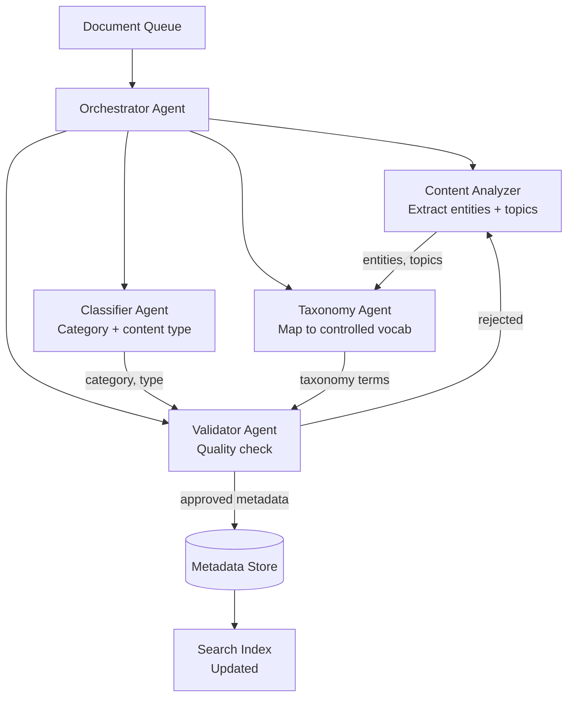

Enterprise content at scale has a metadata problem. Thousands of articles, documents, and product pages with incomplete or inconsistent tags make AI initiatives — semantic search, recommendation systems, content personalization — unreliable or impossible.

The solution isn't to manually tag everything. It's to build an agent that does it automatically, at scale, with consistent quality.

This post walks through designing a multi-agent content intelligence system that automatically enriches documents with structured metadata using AI and taxonomy services.

## The Problem: Why Manual Tagging Fails

Consider an enterprise knowledge base with 50,000+ documents. Manual tagging has three failure modes:

1. **Inconsistency** — different people apply different tags to the same content
2. **Coverage gaps** — only 20-30% of content gets properly tagged before the effort is abandoned
3. **Drift** — tags don't get updated as content evolves

For AI-powered features (semantic search, RAG, recommendations), these gaps translate directly to poor results. If your RAG pipeline can't find relevant documents because they're untagged, the LLM output is only as good as what it can retrieve.

## The Architecture: Four Specialized Agents



| Agent                | Responsibility                                             |
| -------------------- | ---------------------------------------------------------- |
| **Orchestrator**     | Coordinates the pipeline, handles retries                  |
| **Content Analyzer** | Extracts named entities, key topics, and themes            |
| **Classifier**       | Assigns content type, category, and audience               |
| **Taxonomy Agent**   | Maps extracted concepts to a controlled vocabulary         |
| **Validator**        | Quality-checks metadata and rejects low-confidence outputs |

## Tool Design

### FAISS-Based Taxonomy Lookup

The Taxonomy Agent uses a FAISS index of your controlled vocabulary to map extracted terms to official taxonomy nodes:

```python
import faiss
import numpy as np
from sentence_transformers import SentenceTransformer
from dataclasses import dataclass
from typing import Optional
import json

@dataclass
class TaxonomyNode:
    id: str
    label: str
    broader: Optional[str]  # Parent concept
    definition: str
    synonyms: list[str]

class TaxonomyService:
    def __init__(self, taxonomy_file: str, model_name: str = "all-MiniLM-L6-v2"):
        self.encoder = SentenceTransformer(model_name)
        self.nodes: list[TaxonomyNode] = []
        self.index = None
        self._load_and_index(taxonomy_file)

    def _load_and_index(self, taxonomy_file: str):
        with open(taxonomy_file) as f:
            data = json.load(f)
        
        self.nodes = [TaxonomyNode(**item) for item in data["terms"]]
        
        # Build searchable text: label + synonyms + definition
        texts = [
            f"{n.label}. {' '.join(n.synonyms)}. {n.definition}"
            for n in self.nodes
        ]
        
        embeddings = self.encoder.encode(texts, normalize_embeddings=True)
        
        self.index = faiss.IndexFlatIP(embeddings.shape[1])  # Inner product = cosine on normalized vectors
        self.index.add(embeddings.astype(np.float32))

    def map_to_taxonomy(self, term: str, top_k: int = 3, threshold: float = 0.6) -> list[dict]:
        """Map a free-text term to taxonomy nodes."""
        query_embedding = self.encoder.encode([term], normalize_embeddings=True)
        scores, indices = self.index.search(query_embedding.astype(np.float32), top_k)
        
        results = []
        for score, idx in zip(scores[0], indices[0]):
            if score >= threshold:
                node = self.nodes[idx]
                results.append({
                    "id": node.id,
                    "label": node.label,
                    "broader": node.broader,
                    "confidence": round(float(score), 3)
                })
        
        return results

taxonomy_service = TaxonomyService("taxonomy.json")
```

### Tools for Each Agent

```python
from langchain_core.tools import tool
from pydantic import BaseModel, Field
from typing import Optional

class AnalyzeContentInput(BaseModel):
    content: str = Field(description="The document content to analyze")
    title: str = Field(description="Document title")
    max_topics: int = Field(default=10, description="Maximum number of topics to extract")

@tool("analyze_content", args_schema=AnalyzeContentInput)
def analyze_content(content: str, title: str, max_topics: int = 10) -> str:
    """
    Extract named entities, key topics, and themes from document content.
    Returns structured JSON with entities grouped by type and topic list.
    """
    # In practice, use an LLM call for extraction
    from langchain_anthropic import ChatAnthropic
    from langchain_core.output_parsers import JsonOutputParser
    
    llm = ChatAnthropic(model="claude-sonnet-4-6", temperature=0)
    parser = JsonOutputParser()
    
    response = llm.invoke(f"""
    Analyze this document and extract:
    1. Named entities (people, organizations, products, technologies)
    2. Key topics (max {max_topics})
    3. Main themes (2-3 high-level themes)
    
    Title: {title}
    Content: {content[:3000]}
    
    Return JSON: {{"entities": {{"people": [], "organizations": [], "technologies": [], "products": []}}, 
                   "topics": [], "themes": []}}
    """)
    
    try:
        result = parser.parse(response.content)
        return json.dumps(result)
    except Exception as e:
        return f"ERROR: Could not parse content analysis: {str(e)}"

class MapTaxonomyInput(BaseModel):
    terms: list[str] = Field(description="List of terms to map to taxonomy")
    min_confidence: float = Field(default=0.65, description="Minimum confidence threshold (0-1)")

@tool("map_to_taxonomy", args_schema=MapTaxonomyInput)
def map_to_taxonomy(terms: list[str], min_confidence: float = 0.65) -> str:
    """
    Map a list of extracted terms to the official taxonomy vocabulary.
    Returns taxonomy IDs with confidence scores. Only returns matches above min_confidence.
    """
    all_mappings = {}
    unmapped = []
    
    for term in terms:
        matches = taxonomy_service.map_to_taxonomy(term, top_k=2, threshold=min_confidence)
        if matches:
            all_mappings[term] = matches[0]  # Take best match
        else:
            unmapped.append(term)
    
    return json.dumps({
        "mapped": all_mappings,
        "unmapped": unmapped,
        "coverage": f"{len(all_mappings)}/{len(terms)}"
    })

@tool
def validate_metadata(metadata: str) -> str:
    """
    Validate that metadata meets quality standards:
    - Minimum 3 taxonomy terms required
    - At least 1 content category required  
    - Confidence scores above 0.6
    
    Returns 'VALID' or 'INVALID: [reason]'
    """
    try:
        data = json.loads(metadata)
        
        issues = []
        
        taxonomy_terms = data.get("taxonomy_terms", [])
        if len(taxonomy_terms) < 3:
            issues.append(f"Insufficient taxonomy coverage: {len(taxonomy_terms)} terms (minimum 3)")
        
        if not data.get("category"):
            issues.append("Missing content category")
        
        low_confidence = [t for t in taxonomy_terms if t.get("confidence", 0) < 0.6]
        if low_confidence:
            issues.append(f"{len(low_confidence)} terms below confidence threshold")
        
        if issues:
            return "INVALID: " + "; ".join(issues)
        
        return "VALID"
    
    except json.JSONDecodeError as e:
        return f"INVALID: Malformed metadata JSON: {str(e)}"

@tool
def save_metadata(document_id: str, metadata: str) -> str:
    """Save validated metadata for a document to the metadata store."""
    try:
        data = json.loads(metadata)
        data["document_id"] = document_id
        data["tagged_at"] = datetime.utcnow().isoformat()
        data["tagged_by"] = "content_intelligence_agent_v1"
        
        # Save to your metadata store
        metadata_store.upsert(document_id, data)
        
        # Update search index
        search_index.update_document(document_id, data)
        
        return f"SUCCESS: Metadata saved for document {document_id}"
    
    except Exception as e:
        return f"ERROR: Failed to save metadata: {str(e)}"
```

## CrewAI Implementation

```python
from crewai import Agent, Task, Crew, Process
from langchain_anthropic import ChatAnthropic

llm = ChatAnthropic(model="claude-sonnet-4-6", temperature=0.1)

# Define agents
content_analyzer = Agent(
    role="Content Analyst",
    goal="Extract comprehensive entities, topics, and themes from document content.",
    backstory=(
        "You are an NLP specialist trained to identify meaningful entities and concepts "
        "in technical and product documentation. You are thorough and precise — you don't "
        "miss important entities and you don't hallucinate ones that aren't there."
    ),
    tools=[analyze_content],
    llm=llm,
    allow_delegation=False,
)

classifier = Agent(
    role="Content Classifier",
    goal="Assign accurate content type, primary category, and target audience.",
    backstory=(
        "You classify enterprise content with consistent taxonomy. "
        "You follow strict classification guidelines and never assign ambiguous categories."
    ),
    tools=[analyze_content],
    llm=llm,
    allow_delegation=False,
)

taxonomy_mapper = Agent(
    role="Taxonomy Specialist",
    goal="Map all extracted concepts to the official controlled vocabulary.",
    backstory=(
        "You are a knowledge management expert who maintains content taxonomy integrity. "
        "You map terms to their most specific applicable taxonomy node. "
        "When a term doesn't map cleanly, you flag it rather than forcing an incorrect match."
    ),
    tools=[map_to_taxonomy],
    llm=llm,
    allow_delegation=False,
)

validator = Agent(
    role="Metadata Quality Validator",
    goal="Validate that final metadata meets quality standards before persistence.",
    backstory=(
        "You are a data quality gatekeeper. You apply strict validation rules and reject "
        "metadata that doesn't meet minimum coverage requirements. Quality over speed."
    ),
    tools=[validate_metadata, save_metadata],
    llm=llm,
    allow_delegation=False,
)

# Define tasks
def create_tagging_crew(document: dict) -> Crew:
    analyze_task = Task(
        description=f"""
        Analyze this document and extract entities, topics, and themes:
        
        Document ID: {document['id']}
        Title: {document['title']}
        Content: {document['content'][:4000]}
        """,
        expected_output="JSON with entities (by type), topics (max 10), and themes (2-3).",
        agent=content_analyzer,
    )
    
    classify_task = Task(
        description=f"""
        Classify this document:
        Title: {document['title']}
        Content preview: {document['content'][:1000]}
        
        Assign:
        - content_type: article | tutorial | reference | release_notes | case_study | faq
        - primary_category: one top-level category
        - audience: developer | admin | end_user | executive | all
        - complexity: beginner | intermediate | advanced
        """,
        expected_output="JSON with content_type, primary_category, audience, and complexity.",
        agent=classifier,
    )
    
    taxonomy_task = Task(
        description=(
            "Using the extracted topics and entities, map each concept to taxonomy terms. "
            "Combine topics from content analysis with the classification categories. "
            "Return all taxonomy mappings with confidence scores."
        ),
        expected_output="JSON with 'mapped' terms (taxonomy ID + confidence) and 'unmapped' terms.",
        agent=taxonomy_mapper,
        context=[analyze_task],
    )
    
    validate_task = Task(
        description=f"""
        Assemble and validate the final metadata for document {document['id']}.
        
        Combine:
        - Classification results (content_type, category, audience)
        - Taxonomy mappings (filter to confidence >= 0.65)
        - Top entities from content analysis
        
        Validate the assembled metadata, then save it if valid.
        If validation fails, report the specific issues.
        """,
        expected_output=(
            "Either 'SAVED: [document_id]' with metadata summary, "
            "or 'VALIDATION_FAILED: [specific issues]'"
        ),
        agent=validator,
        context=[analyze_task, classify_task, taxonomy_task],
    )
    
    return Crew(
        agents=[content_analyzer, classifier, taxonomy_mapper, validator],
        tasks=[analyze_task, classify_task, taxonomy_task, validate_task],
        process=Process.sequential,
        verbose=False,  # Turn off for batch processing
    )

# Batch processing
def tag_document_batch(documents: list[dict], batch_size: int = 10) -> dict:
    results = {"success": 0, "failed": 0, "errors": []}
    
    for i in range(0, len(documents), batch_size):
        batch = documents[i:i + batch_size]
        
        for doc in batch:
            try:
                crew = create_tagging_crew(doc)
                result = crew.kickoff()
                
                if "SAVED:" in result.raw:
                    results["success"] += 1
                else:
                    results["failed"] += 1
                    results["errors"].append({
                        "document_id": doc["id"],
                        "reason": result.raw
                    })
            except Exception as e:
                results["failed"] += 1
                results["errors"].append({"document_id": doc["id"], "reason": str(e)})
    
    return results
```

## Quality Metrics to Track

Once the system is running, track these metrics to validate quality:

```python
def compute_tagging_quality(document_id: str) -> dict:
    metadata = metadata_store.get(document_id)
    
    return {
        "taxonomy_coverage": len(metadata["taxonomy_terms"]),  # Target: >= 5
        "avg_confidence": sum(t["confidence"] for t in metadata["taxonomy_terms"]) / len(metadata["taxonomy_terms"]),  # Target: >= 0.75
        "has_category": bool(metadata.get("primary_category")),
        "has_audience": bool(metadata.get("audience")),
        "completeness_score": _compute_completeness(metadata),  # 0-1
    }
```

In practice, monitoring completeness score across the document corpus gives you an early signal when the taxonomy mapping quality degrades — which can happen if the vocabulary evolves without updating the FAISS index.

## Key Takeaways

1. **FAISS + sentence-transformers is production-ready for taxonomy matching** — fast, accurate, and doesn't require an external service
2. **The Validator agent is the most important** — it enforces quality standards and prevents garbage metadata from entering your index
3. **Batch processing with agent crews is viable** — process hundreds of documents per hour with proper throttling
4. **Track coverage metrics, not just accuracy** — a system that tags 60% of content accurately is better than one that tags 10% perfectly
5. **Separate extraction from taxonomy mapping** — they require different LLM behaviors (creative extraction vs. precise matching)

---

*Part of the [Agentic AI in Practice series](/tags/agentic-ai-series/) — lessons from building production multi-agent systems.*
