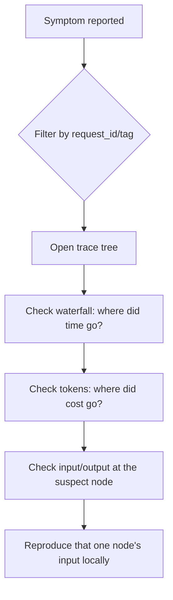

Print statements and `verbose=True` get you through a single-agent prototype. Once you have three or more agents calling tools, calling each other, and occasionally calling themselves, you need a trace you can actually navigate. LangSmith is the tool I reach for first, not because it's the only option, but because the trace tree maps directly onto how multi-agent systems actually fail.

## Setting It Up Takes Three Lines

```python
import os
os.environ["LANGCHAIN_TRACING_V2"] = "true"
os.environ["LANGCHAIN_PROJECT"] = "content-intelligence-crew"
```

Every chain, agent, and tool call in a LangChain or LangGraph run gets captured automatically from there — no manual instrumentation of individual functions required, which matters because manually-added logging is exactly the thing that gets skipped under deadline pressure and missing when you need it most.

## Reading the Trace Tree

A multi-agent trace renders as a nested tree: the top-level run, its children (agent invocations), their children (tool calls and LLM calls), and so on. Three things to check, in order:

**1. The waterfall, for where time actually went.** The trace view shows each span's duration as a horizontal bar. It is common to assume the LLM calls dominate, and then discover a synchronous tool call to an external API is 80% of total latency. You cannot know this without the waterfall — token-count-based cost estimates and latency are not the same axis.

**2. The token count per span, for where cost actually went.** A single verbose tool result fed back into context on every subsequent turn compounds fast. LangSmith totals tokens per run and per span, which makes it easy to spot the one node re-sending a 4,000-token document on every iteration instead of a summary.

**3. The input/output pairs at each node, for where reasoning went wrong.** This is the actual debugging step — not "did it fail" but "what did this specific agent see, and what did it decide, given that input." Multi-agent failures are almost always explainable once you can see exactly what one agent handed to the next.

## Tagging Runs So You Can Find Anything

Default trace names are unhelpful at scale — dozens of runs named "AgentExecutor" tell you nothing. Tag runs with metadata that maps to your actual debugging questions:

```python
from langchain_core.runnables import RunnableConfig

config = RunnableConfig(
    tags=["production", "content-crew", "v2.3"],
    metadata={"user_id": user_id, "request_id": request_id, "crew_version": "2.3"},
)
result = crew_executor.invoke(inputs, config=config)
```

When a user reports a bad result, filtering by `request_id` gets you directly to the one trace that matters instead of scrolling through a session list.

## A Debugging Sequence Worth Memorizing



That last step — reproducing a single node's input outside the full pipeline — is the part people skip. It's much faster to debug one agent's reasoning against a captured input than to re-run the entire crew and hope the bug repeats.

## Key Takeaways

1. **Tracing is three environment variables, not a rewrite** — there's no excuse to be debugging a multi-agent system blind
2. **The waterfall answers latency questions; token counts answer cost questions** — they're different views and both matter
3. **Tag runs with request-level metadata** so a bug report maps to one trace, not a search through hundreds
4. **Reproduce the single suspect node's input locally** rather than re-running the whole pipeline to catch a bug again

---

*Part of the [Agentic AI in Practice series](/tags/agentic-ai-series/) — lessons from building production multi-agent systems.*
