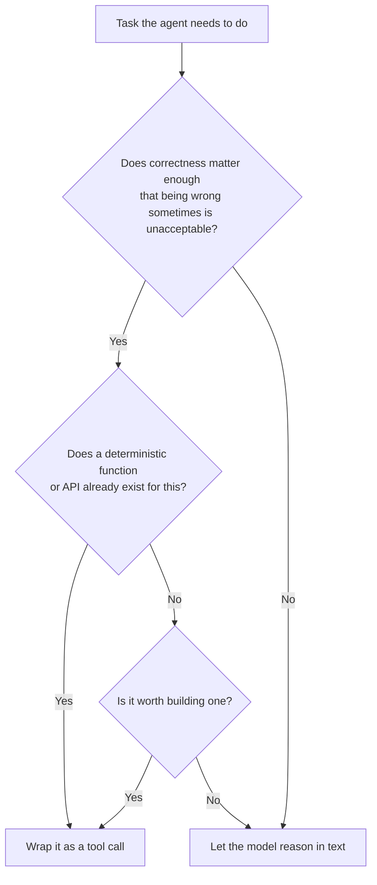

A reader asked a version of this question after last week's post on agent skills: *"If the model can already do arithmetic, summarize text, and format dates correctly in its response, why wrap any of that in a tool call? Isn't that just extra latency for something the model could do in one pass?"*

It's a good question because the instinct is right for some cases and wrong for others. Here's how I actually draw the line.

## The Model Can Be Right and Still Be the Wrong Choice

An LLM can multiply two four-digit numbers correctly most of the time. "Most of the time" is the entire problem. A calculator tool is right 100% of the time, deterministically, and its correctness doesn't degrade as the numbers get larger or the context window gets fuller. When the cost of being wrong is real — a financial calculation, a date computation feeding a database query, a unit conversion in a medical dosage context — route it to a tool even if the model could technically do it in text.

The general rule: **if there's a deterministic way to get the answer, prefer it over a probabilistic one, regardless of how good the probabilistic one usually is.**

## Where Text Reasoning Is Actually the Right Call

The inverse also holds. Not everything benefits from being wrapped in a tool:

- **Anything requiring judgment or synthesis** — summarizing, comparing options, explaining a tradeoff. There's no deterministic function for "is this argument persuasive."
- **Anything where the tool call overhead exceeds the value** — a tool call costs a round trip (latency) and consumes context (the tool schema, the call, and the result all sit in the conversation). For a task the model does reliably and cheaply in text, that overhead is pure cost.
- **Anything where you'd have to build and maintain the tool yourself for one narrow case** — if there's no existing API or library, and the model's text-based answer is good enough, building a bespoke tool is often not worth the maintenance burden.

## A Decision Framework



## A Concrete Example: Dates

This comes up constantly in production agents. "Schedule this for next Tuesday" requires resolving "next Tuesday" against the actual current date — something the model doesn't reliably have unless it's explicitly in context, and even then, off-by-one errors around timezone boundaries are common.

```python
@tool
def resolve_relative_date(expression: str, reference_date: str, timezone: str) -> str:
    """
    Resolve a relative date expression (e.g. 'next Tuesday', 'in 3 weeks')
    to an absolute ISO date, given a reference date and timezone.
    Use this for ANY date the agent needs to act on — do not compute dates in text.
    """
    # deterministic date arithmetic, not model inference
    ...
```

Notice the description explicitly tells the model *not* to do this in text. That instruction matters — without it, a capable model will sometimes compute the date itself anyway, and you lose the determinism you built the tool for.

## Key Takeaways

1. **Route to a tool when correctness must be deterministic**, not based on whether the model is "usually right"
2. **Text reasoning is still correct for judgment and synthesis tasks** — there's no tool for "is this a good summary"
3. **Tool calls have real overhead** — latency and context cost — so don't wrap everything reflexively
4. **Tell the model explicitly not to reason around a tool it should be using** — capability alone doesn't guarantee the model reaches for the deterministic path

---

*Part of the [Agentic AI in Practice series](/tags/agentic-ai-series/) — lessons from building production multi-agent systems.*
