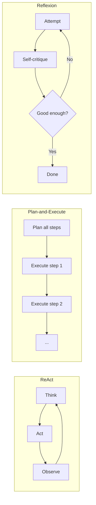

Every agent framework implements some variant of these three reasoning patterns, usually under different names. This is the cheatsheet I wish existed the first time I had to pick one.

## The Three Patterns

**ReAct (Reason + Act)** interleaves thought and action one step at a time: think, act, observe the result, think again. No upfront plan — the next step is decided based on what just happened.

**Plan-and-Execute** produces a full plan upfront, then executes each step, optionally replanning if a step fails or the situation changes.

**Reflexion** adds a self-critique loop on top of either pattern: after attempting a task, the agent evaluates its own output against the goal and retries with the critique folded into the next attempt.



## Comparison Table

| | ReAct | Plan-and-Execute | Reflexion |
|---|---|---|---|
| **Latency per step** | Low — one LLM call per action | Higher upfront (planning), lower per step after | Highest — adds a critique pass |
| **Cost** | Lowest for short tasks | Lower than ReAct for long tasks (fewer redundant re-reasoning steps) | Highest — every attempt costs 2x+ |
| **Best for** | Short tasks, unpredictable environments | Long tasks with knowable structure | Tasks where output quality matters more than speed |
| **Weakness** | Can wander on long tasks — no global plan to anchor to | Brittle if the plan is wrong and replanning isn't wired in | Can loop without converging if the critique isn't well-scoped |
| **Debugging** | Easy — trace reads linearly | Medium — need to check plan quality separately from execution | Hard — need to inspect both the attempt and the critique |

## When to Pick Each

**Pick ReAct when:** the environment is unpredictable enough that a plan would be stale by step 2. A customer support agent handling an open-ended conversation is a good fit — you genuinely don't know what the next relevant action is until you see the previous result.

**Pick Plan-and-Execute when:** the task decomposes cleanly and you know the structure in advance. "Research a company, then draft an outreach email" is naturally plannable — you can write the two-step plan without needing to see intermediate results first. This is also the better choice when you want a plan a human can review *before* execution starts, which ReAct doesn't naturally support.

**Add Reflexion when:** the cost of a wrong answer is high enough to justify the extra latency and spend, and there's a way to actually evaluate the output that isn't just "ask the model if it's happy with itself" — a rubric, a test suite, a schema check. Reflexion without a real evaluation signal degrades into the model second-guessing itself for no measurable gain.

## They Compose

These aren't mutually exclusive. A common production pattern is Plan-and-Execute at the top level (a reviewable plan), with each step executed via ReAct (adapting to what that specific step's environment returns), and Reflexion wrapping the final output before it ships.

```python
plan = planner.create_plan(goal)  # Plan-and-Execute: upfront structure
for step in plan.steps:
    result = react_executor.run(step)  # ReAct: adapt within each step
final_output = synthesizer.run(plan.results)
critique = reflexion_critic.evaluate(final_output, goal)  # Reflexion: quality gate
if not critique.passed:
    final_output = synthesizer.run(plan.results, feedback=critique.notes)
```

## Key Takeaways

1. **ReAct** for unpredictable environments where the next action depends on what just happened
2. **Plan-and-Execute** for tasks that decompose cleanly and benefit from a human-reviewable plan
3. **Reflexion** only pays off with a real evaluation signal — not just the model re-reading its own output
4. **These compose** — plan at the top level, react within a step, reflect on the final result

---

*Part of the [Agentic AI in Practice series](/tags/agentic-ai-series/) — lessons from building production multi-agent systems.*
