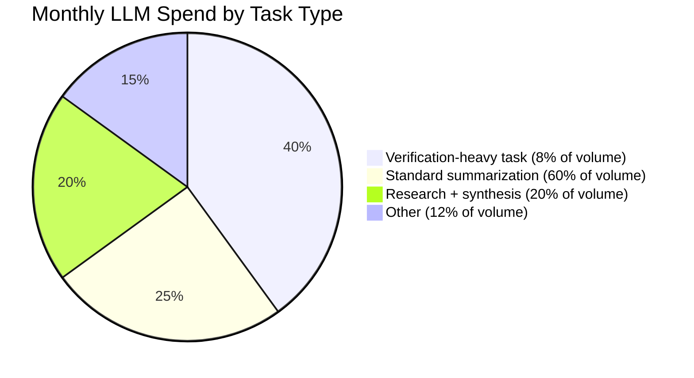

We knew our multi-agent pipeline's total monthly LLM spend down to the dollar. What we couldn't answer, when finance asked, was which of the six task types the pipeline handled was actually driving that number. This is how we closed that gap.

## The Problem With Aggregate Cost Tracking

The obvious first step — sum up tokens across all calls — tells you the pipeline costs $4,200 a month. It doesn't tell you that one task type, representing 8% of volume, accounts for 40% of that spend because it routes through an expensive verification step the other five task types skip.

Without that breakdown, every cost conversation is a guess. With it, you know exactly where to optimize.

## Attributing Cost to a Task, Not Just a Call

The core idea is simple: every LLM call already knows its token counts. What's missing is a consistent way to roll those counts up to the *task* that triggered them, across every agent and tool call that task touches — including nested delegation.

```python
from contextvars import ContextVar
from dataclasses import dataclass, field

current_task_id: ContextVar[str] = ContextVar("current_task_id", default=None)

@dataclass
class CostLedger:
    entries: list = field(default_factory=list)

    def record(self, task_id: str, agent: str, model: str, input_tokens: int, output_tokens: int, cost_usd: float):
        self.entries.append({
            "task_id": task_id, "agent": agent, "model": model,
            "input_tokens": input_tokens, "output_tokens": output_tokens,
            "cost_usd": cost_usd, "timestamp": time.time(),
        })

    def cost_by_task(self) -> dict:
        by_task = {}
        for e in self.entries:
            by_task[e["task_id"]] = by_task.get(e["task_id"], 0) + e["cost_usd"]
        return by_task

ledger = CostLedger()
```

Using `ContextVar` matters here — it propagates the task ID through async calls and nested agent delegation without threading a `task_id` parameter through every function signature in the codebase. Set it once at the top of a task's execution, and every LLM call inside it (however deeply nested) can read it back.

```python
async def run_task(task_id: str, task_type: str, ...):
    token = current_task_id.set(task_id)
    try:
        result = await orchestrator.run(task_type, ...)
    finally:
        current_task_id.reset(token)
    return result

# Inside the LLM wrapper, wherever it's called from:
def wrapped_llm_call(prompt, model):
    response = llm.invoke(prompt)
    ledger.record(
        task_id=current_task_id.get(),
        agent=get_current_agent_name(),
        model=model,
        input_tokens=response.usage.input_tokens,
        output_tokens=response.usage.output_tokens,
        cost_usd=compute_cost(response.usage, model),
    )
    return response
```

## What This Actually Revealed

Once cost was attributed per task type, the breakdown looked nothing like our assumptions:



The verification-heavy task type was routing every result through a second LLM call for fact-checking — reasonable in isolation, expensive in aggregate once we could see it against the other task types. We didn't remove the check; we made it conditional on a cheaper heuristic pre-filter, cutting that task type's cost by roughly 60% without reducing verification coverage on the cases that actually needed it.

## Key Takeaways

1. **Aggregate cost tells you a number; per-task attribution tells you what to do about it**
2. **`ContextVar` propagates a task ID through nested async calls without threading it through every signature**
3. **Instrument once at the LLM wrapper level**, not at every call site — consistency matters more than granularity
4. **The expensive task type is rarely the highest-volume one** — attribution is what surfaces that, not intuition

---

*Part of the [Agentic AI in Practice series](/tags/agentic-ai-series/) — lessons from building production multi-agent systems.*
