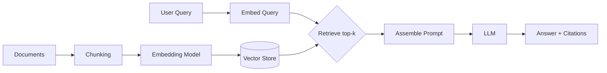

Retrieval-Augmented Generation (RAG) is the default answer to "how do I get an LLM to answer questions about *our* data?" It's also one of the easiest patterns to get working in a demo and one of the hardest to get right in production. The gap between a RAG notebook that impresses in a demo and a RAG system that survives real user queries comes down to a handful of architectural decisions this post walks through.

## Why RAG Instead of Fine-Tuning

Fine-tuning bakes knowledge into model weights — it's slow to update, expensive to retrain, and doesn't give you citations. RAG keeps knowledge in an external store and retrieves the relevant pieces at query time:

- **Freshness**: update the index, not the model
- **Attribution**: you can point to the exact source chunk used
- **Access control**: filter retrieval by what the requesting user is allowed to see
- **Cost**: no retraining pipeline required for new content

The trade-off is that RAG's quality is bounded by retrieval quality — a perfect LLM with irrelevant context still produces a wrong answer.

## The Basic Pipeline



Every stage in this diagram has failure modes that don't show up until you have real documents and real users.

## Chunking: The Decision That Matters Most

Chunking strategy affects retrieval quality more than embedding model choice does. Three approaches, in order of increasing sophistication:

```python
from langchain_text_splitters import RecursiveCharacterTextSplitter, MarkdownHeaderTextSplitter

# Fixed-size with overlap — simple, works for unstructured prose
splitter = RecursiveCharacterTextSplitter(
    chunk_size=800,
    chunk_overlap=120,
    separators=["\n\n", "\n", ". ", " ", ""],
)
chunks = splitter.split_text(raw_text)

# Structure-aware — respects document hierarchy (headers, sections)
headers_to_split_on = [("#", "h1"), ("##", "h2"), ("###", "h3")]
md_splitter = MarkdownHeaderTextSplitter(headers_to_split_on=headers_to_split_on)
sections = md_splitter.split_text(markdown_doc)
# Each section keeps its header path as metadata — critical for citations
```

For structured content (docs, wikis, API references), structure-aware chunking consistently outperforms fixed-size splitting because it never cuts a chunk mid-concept. For unstructured prose, semantic chunking (splitting on embedding-distance discontinuities) is worth the extra compute if retrieval quality is a bottleneck.

**Rule of thumb**: chunk size should match the granularity of questions you expect. FAQ-style content wants small chunks (200–400 tokens); narrative or procedural content wants larger ones (600–1000 tokens) with generous overlap so a step near a chunk boundary isn't orphaned.

## Embedding and Indexing

```python
from langchain_openai import OpenAIEmbeddings
from langchain_community.vectorstores import Qdrant

embeddings = OpenAIEmbeddings(model="text-embedding-3-large")

vector_store = Qdrant.from_texts(
    texts=[c.page_content for c in chunks],
    embedding=embeddings,
    metadatas=[c.metadata for c in chunks],  # source, section, doc_id, updated_at
    collection_name="knowledge_base",
    url=QDRANT_URL,
)
```

Always store metadata alongside the vector: `source_url`, `doc_id`, `section_path`, `updated_at`, and any access-control fields. You will need every one of these fields in production — for citations, for incremental re-indexing, and for permission filtering.

## Retrieval: Dense Alone Isn't Enough

Dense (embedding) retrieval is good at semantic similarity but weak on exact matches — product codes, error messages, acronyms. Sparse retrieval (BM25) is the reverse. Hybrid retrieval combines both:

```python
from rank_bm25 import BM25Okapi

class HybridRetriever:
    def __init__(self, vector_store, corpus_tokens, alpha=0.5):
        self.vector_store = vector_store
        self.bm25 = BM25Okapi(corpus_tokens)
        self.alpha = alpha  # weight toward dense vs sparse

    def retrieve(self, query: str, k: int = 8) -> list[dict]:
        dense_hits = self.vector_store.similarity_search_with_score(query, k=k * 2)
        sparse_scores = self.bm25.get_scores(query.split())

        combined = {}
        for doc, score in dense_hits:
            combined[doc.metadata["chunk_id"]] = {"doc": doc, "dense": score, "sparse": 0.0}
        for idx, score in enumerate(sparse_scores):
            chunk_id = self.corpus_ids[idx]
            if chunk_id in combined:
                combined[chunk_id]["sparse"] = score

        ranked = sorted(
            combined.values(),
            key=lambda x: self.alpha * x["dense"] + (1 - self.alpha) * x["sparse"],
            reverse=True,
        )
        return [r["doc"] for r in ranked[:k]]
```

Then add a **reranker** as a final precision pass — retrieve broadly (top 20–30), rerank with a cross-encoder, and keep only the top 4–6 that actually go into the prompt:

```python
from sentence_transformers import CrossEncoder

reranker = CrossEncoder("cross-encoder/ms-marco-MiniLM-L-6-v2")

def rerank(query: str, candidates: list[str], top_n: int = 5) -> list[str]:
    pairs = [(query, c) for c in candidates]
    scores = reranker.predict(pairs)
    ranked = sorted(zip(candidates, scores), key=lambda x: x[1], reverse=True)
    return [c for c, _ in ranked[:top_n]]
```

This two-stage retrieve-then-rerank pattern is the single highest-leverage change you can make to a mediocre RAG pipeline.

## Prompt Assembly

Don't just concatenate chunks — label them so the model can cite sources and so you can trace which chunk drove which claim:

```python
def build_context(chunks: list[dict]) -> str:
    return "\n\n".join(
        f"[Source {i+1}: {c['metadata']['source_url']}]\n{c['page_content']}"
        for i, c in enumerate(chunks)
    )

SYSTEM_PROMPT = """Answer using only the numbered sources below. Cite sources
inline as [Source N]. If the sources don't contain the answer, say so —
do not use outside knowledge."""
```

## Common Failure Modes

| Symptom                                   | Likely Cause                                      | Fix                                      |
| ------------------------------------------ | -------------------------------------------------- | ----------------------------------------- |
| Correct doc exists but never retrieved     | Chunk boundary split the relevant fact              | Increase overlap, use structure-aware chunking |
| Right chunk retrieved, wrong answer        | Chunk lacks surrounding context                     | Add section headers/summaries to each chunk |
| Exact-match queries (codes, IDs) fail      | Pure dense retrieval                                | Add BM25 / hybrid retrieval               |
| Answers drift from sources                 | No faithfulness constraint in prompt                | Add explicit "answer only from sources" instruction, evaluate faithfulness |
| Stale answers after doc updates            | No incremental re-indexing                          | Re-embed on `updated_at` change, not full rebuild |

## Key Takeaways

1. **Chunking strategy drives retrieval quality more than embedding model choice** — match granularity to how users actually ask questions
2. **Hybrid retrieval (dense + sparse) beats either alone** — especially for content with codes, IDs, and technical terms
3. **Retrieve broad, rerank narrow** — a cross-encoder reranking pass is the highest-leverage single addition to a RAG pipeline
4. **Store metadata for every chunk** — you'll need it for citations, incremental updates, and access control
5. **RAG quality is bounded by retrieval, not the LLM** — spend your optimization time there first

The next post in this series covers what happens when a single retrieve-then-generate pass isn't enough — **agentic RAG**, where the agent plans queries, evaluates its own retrieval, and re-retrieves when needed.

---

*Part of the [Agentic AI in Practice series](/tags/agentic-ai-series/) — lessons from building production multi-agent systems.*
