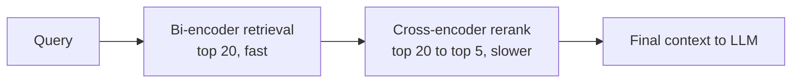

A vector search's top-20 results are cheap to retrieve and mediocre in ranking order — the bi-encoder that produced those embeddings scored query and document independently, which is fast but loses information a joint comparison would catch. A **cross-encoder reranker** scores query and document *together*, catching relevance signals a bi-encoder structurally can't, at the cost of a model call per candidate.

## Why It Works

A bi-encoder embeds the query and each document into the same vector space independently, then compares them with cosine similarity — fast, because documents are pre-embedded once at index time. A cross-encoder takes the query and a candidate document *together* as one input and outputs a relevance score directly, letting it model interactions between specific terms in the query and specific terms in the document that independent embedding can't capture.



The two-stage pattern — cheap retrieval to a wide candidate set, expensive reranking down to a narrow final set — is standard for a reason: running the cross-encoder against the entire corpus would be far too slow, but running it against 20 pre-filtered candidates is fast enough to fit in a typical latency budget.

## The Actual Cost

Reranking 20 candidates with a small cross-encoder (e.g. `ms-marco-MiniLM`) typically adds 50-150ms on CPU, less on GPU. That's the number to weigh against the precision gain — and in most benchmarks, reranking measurably improves the fraction of genuinely relevant documents in the top 5, which directly reduces the "confidently wrong because the context was wrong" failure mode.

```python
from sentence_transformers import CrossEncoder

reranker = CrossEncoder("cross-encoder/ms-marco-MiniLM-L-6-v2")

def rerank(query: str, candidates: list[str], top_k: int = 5) -> list[str]:
    pairs = [[query, doc] for doc in candidates]
    scores = reranker.predict(pairs)
    ranked = sorted(zip(candidates, scores), key=lambda x: x[1], reverse=True)
    return [doc for doc, _ in ranked[:top_k]]
```

## When to Skip It

Reranking isn't free, and it isn't always worth it:

- **Sub-200ms latency budgets** where every millisecond is contested — reranking may not fit
- **Corpora where the bi-encoder already ranks well** — homogeneous, narrow-domain corpora sometimes don't need the extra pass; measure before assuming you do
- **High query volume with tight cost constraints** — a reranker call on every query adds up; consider reranking only when the bi-encoder's top result confidence is below a threshold, rather than unconditionally

## Key Takeaways

1. **Cross-encoders score query and document jointly**, catching relevance signals a bi-encoder's independent embeddings structurally miss
2. **Two-stage retrieval — cheap bi-encoder to a wide set, reranker down to a narrow one — is the standard, efficient pattern**
3. **Budget 50-150ms for reranking a top-20 candidate set** with a small cross-encoder
4. **Measure whether your corpus needs it before assuming it does** — the gain isn't universal, and the latency cost is

---

*Part of the [Agentic AI in Practice series](/tags/agentic-ai-series/) — lessons from building production multi-agent systems.*
