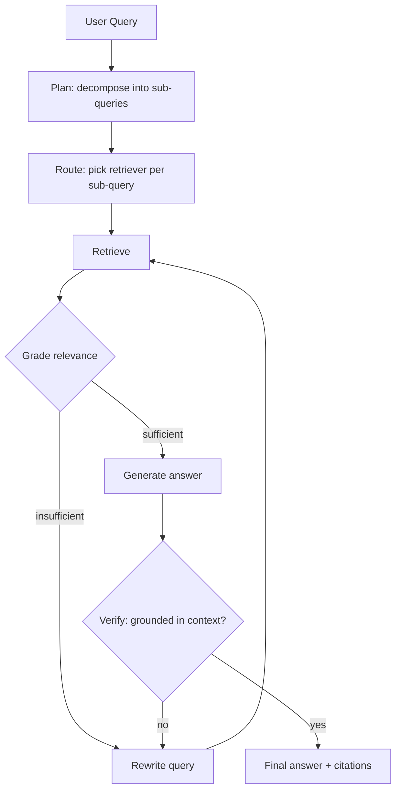

The [RAG architecture from the last post](/posts/rag-architecture-patterns-production/) follows a fixed pipeline: embed the query, retrieve top-k, generate. That works well when a question maps cleanly to one retrieval call. It breaks down on questions that need multiple lookups, questions where the first retrieval comes back weak, or questions that span multiple knowledge sources. **Agentic RAG** turns retrieval from a fixed step into a decision the model makes, evaluates, and repeats.

## Where Standard RAG Breaks Down

- **Multi-hop questions**: "What's the SLA for the plan our largest customer in APAC is on?" requires finding the customer, then their plan, then the SLA — three retrievals, each depending on the last
- **Ambiguous queries**: the user's question doesn't map cleanly onto the vocabulary in your documents
- **Weak initial retrieval**: the top-k chunks are only tangentially relevant, but a single-pass pipeline has no way to notice and try again
- **Multiple sources**: some questions need product docs, others need a ticketing system, others need both

Agentic RAG addresses all four by putting an LLM in the loop that decides *what* to retrieve, *checks* whether what came back is useful, and *decides* whether to retrieve again, reformulate, or answer.

## The Agentic RAG Loop



This is the same shape as Corrective RAG (CRAG) and self-RAG in the literature — grade, correct, retry — implemented as an explicit state machine rather than hoping a single prompt gets it right.

## Implementing It with LangGraph

LangGraph is a natural fit here because the loop has genuine branching and retry logic — exactly what [conditional edges are built for](/posts/langgraph-vs-crewai/).

```python
from typing import TypedDict
from langgraph.graph import StateGraph, END
from langchain_anthropic import ChatAnthropic
from langchain_core.messages import SystemMessage, HumanMessage

llm = ChatAnthropic(model="claude-sonnet-4-6", temperature=0)

class RAGState(TypedDict):
    query: str
    rewritten_query: str
    retrieved_chunks: list[str]
    relevance_grade: str  # "sufficient" | "insufficient"
    answer: str
    grounded: bool
    retry_count: int

def retrieve_node(state: RAGState) -> dict:
    query = state.get("rewritten_query") or state["query"]
    chunks = hybrid_retriever.retrieve(query, k=8)
    return {"retrieved_chunks": [c.page_content for c in chunks]}

def grade_node(state: RAGState) -> dict:
    context = "\n---\n".join(state["retrieved_chunks"])
    response = llm.invoke([
        SystemMessage(content=(
            "Judge whether the context below is sufficient to answer the question. "
            "Respond with exactly 'sufficient' or 'insufficient'."
        )),
        HumanMessage(content=f"Question: {state['query']}\n\nContext:\n{context}")
    ])
    return {"relevance_grade": response.content.strip().lower()}

def rewrite_node(state: RAGState) -> dict:
    response = llm.invoke([
        SystemMessage(content=(
            "The retrieved context didn't answer the question well. Rewrite the "
            "query to be more specific, use different terminology, or break it "
            "into a narrower sub-question."
        )),
        HumanMessage(content=f"Original question: {state['query']}")
    ])
    return {
        "rewritten_query": response.content.strip(),
        "retry_count": state.get("retry_count", 0) + 1,
    }

def generate_node(state: RAGState) -> dict:
    context = "\n---\n".join(state["retrieved_chunks"])
    response = llm.invoke([
        SystemMessage(content="Answer only from the provided context. Cite sources."),
        HumanMessage(content=f"Question: {state['query']}\n\nContext:\n{context}")
    ])
    return {"answer": response.content}

def verify_node(state: RAGState) -> dict:
    response = llm.invoke([
        SystemMessage(content=(
            "Is this answer fully supported by the context, with no invented "
            "facts? Respond 'grounded' or 'ungrounded'."
        )),
        HumanMessage(content=f"Context:\n{'---'.join(state['retrieved_chunks'])}\n\nAnswer:\n{state['answer']}")
    ])
    return {"grounded": response.content.strip().lower() == "grounded"}

def route_after_grade(state: RAGState) -> str:
    if state["relevance_grade"] == "sufficient":
        return "generate"
    if state.get("retry_count", 0) >= 2:
        return "generate"  # answer with best-effort context rather than loop forever
    return "rewrite"

def route_after_verify(state: RAGState) -> str:
    if state["grounded"] or state.get("retry_count", 0) >= 2:
        return "done"
    return "rewrite"

workflow = StateGraph(RAGState)
workflow.add_node("retrieve", retrieve_node)
workflow.add_node("grade", grade_node)
workflow.add_node("rewrite", rewrite_node)
workflow.add_node("generate", generate_node)
workflow.add_node("verify", verify_node)

workflow.set_entry_point("retrieve")
workflow.add_edge("retrieve", "grade")
workflow.add_conditional_edges("grade", route_after_grade, {"rewrite": "rewrite", "generate": "generate"})
workflow.add_edge("rewrite", "retrieve")
workflow.add_edge("generate", "verify")
workflow.add_conditional_edges("verify", route_after_verify, {"rewrite": "rewrite", "done": END})

graph = workflow.compile()
```

The `retry_count` cap matters as much as the loop itself — without it, an unanswerable question sends the agent into an infinite rewrite cycle, burning tokens on every iteration.

## Query Decomposition for Multi-Hop Questions

For genuinely multi-hop questions, add a planning step before retrieval that breaks the query into an ordered list of sub-queries, each retrieved and answered in sequence, with later sub-queries able to reference earlier results:

```python
def plan_node(state: RAGState) -> dict:
    response = llm.invoke([
        SystemMessage(content=(
            "Break this question into an ordered list of sub-questions, each "
            "answerable independently or using the answer to a prior one. "
            "Return one sub-question per line. If the question is simple, "
            "return it unchanged as a single line."
        )),
        HumanMessage(content=state["query"])
    ])
    sub_queries = [q.strip() for q in response.content.strip().split("\n") if q.strip()]
    return {"sub_queries": sub_queries}
```

## Routing Across Multiple Retrievers

When your knowledge lives in more than one place — a product doc store, a ticketing system, a metrics database — add a routing step that picks the retriever per sub-query rather than always hitting the same index:

```python
RETRIEVERS = {
    "product_docs": product_docs_retriever,
    "support_tickets": ticket_retriever,
    "internal_wiki": wiki_retriever,
}

def route_node(state: RAGState) -> dict:
    response = llm.invoke([
        SystemMessage(content=(
            f"Pick the best knowledge source for this query from: "
            f"{list(RETRIEVERS.keys())}. Respond with just the name."
        )),
        HumanMessage(content=state["query"])
    ])
    return {"selected_retriever": response.content.strip()}
```

## When Agentic RAG Is Overkill

Every extra node is an extra LLM call — latency and cost compound fast. Don't reach for agentic RAG when:

- Queries reliably map to a single retrieval (FAQ bots, single-document Q&A)
- Latency budget is under a couple of seconds
- Your standard hybrid-retrieve-then-rerank pipeline already scores well on evals

Add the grade → rewrite loop only for the query types that actually need it — you can route simple queries straight to generation and only send ambiguous or multi-hop queries through the full loop.

## Key Takeaways

1. **Agentic RAG turns retrieval into a decision, not a fixed step** — grade relevance, rewrite on failure, verify groundedness before returning
2. **Cap your retries** — an unanswerable question without a retry limit becomes an infinite, expensive loop
3. **Decompose multi-hop questions explicitly** — don't expect a single retrieval to answer a question that depends on a chain of facts
4. **Route across retrievers when knowledge is fragmented** — pick the source per sub-query instead of always querying the same index
5. **Reserve the full loop for queries that need it** — measure first, and only add agentic overhead where single-pass RAG demonstrably fails

---

*Part of the [Agentic AI in Practice series](/tags/agentic-ai-series/) — lessons from building production multi-agent systems.*
