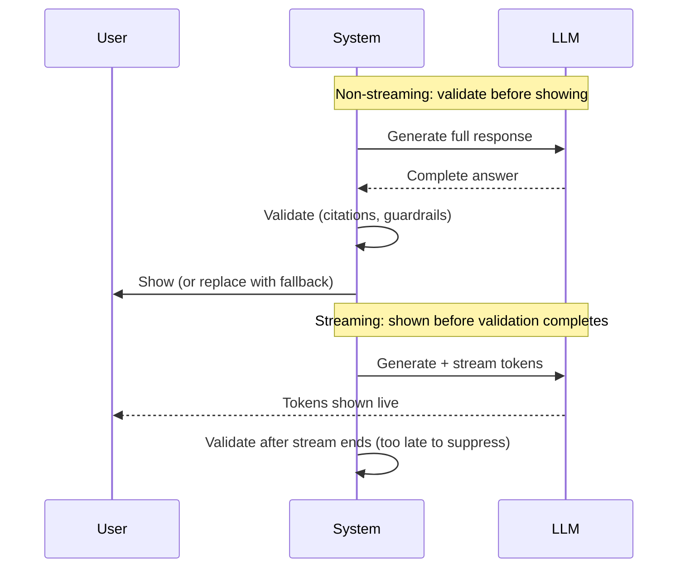

Streaming tokens as they're generated is one of the highest-leverage UX changes for a RAG system — perceived latency drops even when total generation time doesn't. It also removes something valuable: the moment, before a non-streamed response is shown, where you could still run a validation check and suppress a bad answer before the user ever sees it.

## The Tradeoff, Precisely

Non-streaming: generate the full answer, validate it (citation check, guardrail scan, groundedness check), then show it or replace it with a fallback. Slower, but nothing ungrounded ever reaches the user.

Streaming: show tokens as they arrive. Faster and more engaging, but by the time validation would catch a problem, half the answer is already on screen — you can't un-show it.



## Getting Most of Both

**Buffer the first sentence.** Hold back the first 1-2 sentences briefly, run a fast pre-check against the retrieved sources (does the opening claim have any support in context at all), then release the buffered text and continue streaming live. This catches the most damaging failure — an answer that's ungrounded from the very first sentence — while keeping the rest of the response fully streamed.

```python
async def stream_with_guarded_opening(query: str, sources: list[dict]):
    buffer = ""
    checked = False
    async for token in llm.astream(build_prompt(query, sources)):
        buffer += token
        if not checked and buffer.count(".") >= 1:
            first_sentence = buffer.split(".")[0] + "."
            if not quick_groundedness_check(first_sentence, sources):
                yield "I don't have enough grounded information to answer that confidently."
                return
            checked = True
            yield buffer  # release the buffered opening
            buffer = ""
        elif checked:
            yield token
```

**Validate after the stream ends anyway, and correct the record.** Even with a guarded opening, run the full citation and groundedness check once the stream completes. If it fails, don't pretend it didn't — surface a visible correction or flag ("This response may contain unverified claims — reviewing") rather than silently logging it. Users trust a system more that admits uncertainty after the fact than one that says nothing.

**Reserve full pre-validation for high-stakes surfaces.** Not every RAG surface needs the streaming tradeoff at all — an internal support tool answering low-stakes questions can stream freely, while a customer-facing surface making claims about pricing or contractual terms might be worth the latency cost of full non-streamed validation.

## Key Takeaways

1. **Streaming and pre-validation are in genuine tension** — there's no trick that gives you both for free
2. **Buffer and check the first sentence** — it's the single highest-leverage checkpoint, catching an ungrounded answer before most of it is shown
3. **Validate after the stream completes regardless**, and surface corrections visibly rather than silently logging them
4. **Match the tradeoff to the stakes of the surface** — not every RAG use case needs the same answer to this question

---

*Part of the [Agentic AI in Practice series](/tags/agentic-ai-series/) — lessons from building production multi-agent systems.*
