"Make the RAG pipeline faster" is not an actionable goal. "Get end-to-end latency under 2 seconds, with retrieval capped at 300ms and generation at 1.5s" is — because it tells you exactly which stage to optimize when you miss it, instead of guessing.

## Break the Budget Down by Stage

A typical RAG request has four to five stages, and each has a different cost profile and a different lever for improving it:

```mermaid
gantt
    dateFormat X
    axisFormat %Lms
    title Example Latency Budget (2000ms total)
    Query embedding      :0, 50
    Retrieval (vector+BM25) :50, 250
    Reranking             :250, 150
    Prompt assembly        :400, 20
    LLM generation (streamed, time-to-first-token) :420, 400
```



Set a target for each stage before you have a performance problem, not after. When end-to-end latency creeps up, the budget tells you immediately which stage regressed instead of forcing a fresh investigation every time.

## Where the Time Actually Goes, and What to Do About It

**Query embedding (typically 20-80ms).** Usually not worth optimizing unless you're calling a remote embedding API on every query — caching embeddings for repeated or near-duplicate queries helps here.

**Retrieval (typically 100-400ms).** The biggest lever is index configuration — HNSW parameter tuning (`ef_search`), appropriate sharding, and whether metadata filters are indexed or requiring a post-filter scan. A filter that isn't indexed can silently turn a 50ms query into a 500ms one.

**Reranking (50-200ms if used).** A direct function of how many candidates you rerank. Rerank fewer candidates, or skip reranking conditionally when the top result's initial score is already high-confidence.

**LLM generation (highly variable — the dominant cost for most pipelines).** This is where streaming matters most for *perceived* latency: total generation time might not change, but time-to-first-token can be a fraction of it, and that's what a user actually experiences as "fast."

## Measure Time-to-First-Token Separately From Total Time

For any streamed surface, total generation time is the wrong metric to optimize toward alone. Time-to-first-token (TTFT) is what users perceive as responsiveness; total time matters for cost and for how long a user has to wait for the *complete* answer, which is a different UX question.

```python
import time

async def measure_generation(prompt: str):
    start = time.monotonic()
    ttft = None
    async for token in llm.astream(prompt):
        if ttft is None:
            ttft = time.monotonic() - start
        yield token
    total = time.monotonic() - start
    log_metrics(ttft=ttft, total=total)
```

Track both, and set separate budgets for each — a pipeline can have excellent TTFT and mediocre total time, or the reverse, and they call for different fixes.

## Key Takeaways

1. **A per-stage latency budget is actionable; "make it faster" is not** — it tells you exactly where to look when you miss it
2. **Unindexed metadata filters are a common, silent latency regression** in the retrieval stage
3. **Streaming improves perceived latency (time-to-first-token), not necessarily total generation time** — track both separately
4. **Set the budget before there's a problem** — it turns every future regression into a one-stage investigation instead of a full pipeline audit

---

*Part of the [Agentic AI in Practice series](/tags/agentic-ai-series/) — lessons from building production multi-agent systems.*
