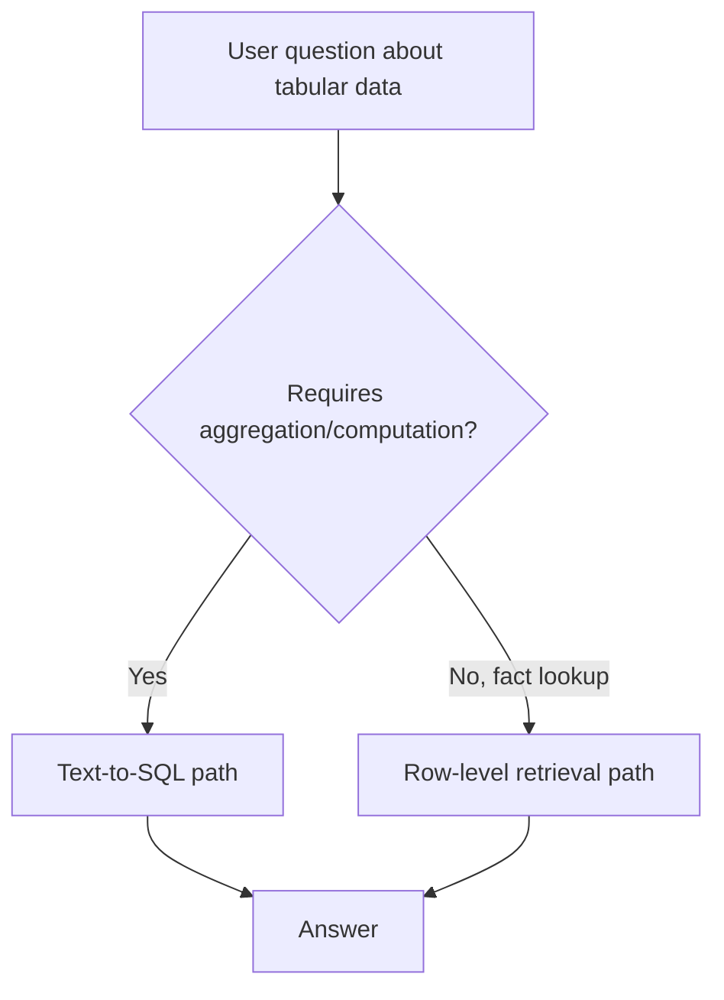

Chunk a table the same way you'd chunk prose, and you lose exactly the thing that made it a table: the relationship between a value and its row and column headers. A retrieved fragment reading "42, 2024-Q3, pending" is meaningless without the header context that gave those values meaning — and generic text chunking routinely separates the two.

## Three Approaches, Different Tradeoffs

**1. Serialize with context, per row.** Turn each row into a self-contained sentence that includes its headers, so a chunk is meaningful in isolation:

```python
def serialize_row(headers: list[str], row: list) -> str:
    return "; ".join(f"{h}: {v}" for h, v in zip(headers, row))

# "Order ID: 4471; Status: pending; Quarter: 2024-Q3; Amount: 42"
```

This works well for retrieval-then-generate on small-to-medium tables where a user's question maps to a handful of rows. It does not work for aggregate questions — "what's the average amount across all pending orders" — because no single row contains the answer.

**2. Text-to-SQL for aggregate and precise questions.** When the question requires computing over the data rather than retrieving a fact from it, route to a text-to-SQL step instead of embedding-based retrieval:

```python
def answer_over_table(question: str, table_schema: str) -> str:
    sql = llm.invoke(f"""Given this schema:
{table_schema}
Write a SQL query to answer: {question}
Return only the SQL, no explanation.""").content
    result = db.execute(validate_sql(sql))  # always validate before executing
    return llm.invoke(f"Question: {question}\nQuery result: {result}\nAnswer in plain language.").content
```

`validate_sql` matters — never execute LLM-generated SQL against a real database without checking it against an allowlist of read-only operations and, ideally, a query cost estimate before execution.

**3. Route between the two based on question type.** Most real systems need both — a classifier (or the routing agent itself) decides whether a question needs row-level retrieval or table-level computation:



## The Failure Mode to Watch For

The most common bug in RAG-over-tables systems is silently answering an aggregate question with row-level retrieval — the system retrieves 5 plausible-looking rows, the LLM synthesizes an answer that *sounds* like an aggregate, and it's wrong, because it never saw the full dataset. Make the routing decision explicit rather than letting a single retrieval-then-generate path handle everything; an implicit blend is where this fails silently.

## Key Takeaways

1. **Serialize rows with their headers included** — a bare value without context is meaningless once retrieved
2. **Route aggregate/computation questions to text-to-SQL, not embedding retrieval** — no retrieved row set can correctly answer "what's the average"
3. **Always validate LLM-generated SQL before execution** — allowlist operations, check query cost, never trust it blindly
4. **Make the routing decision explicit** — a system that blends both paths implicitly will answer aggregate questions wrong without any visible error

---

*Part of the [Agentic AI in Practice series](/tags/agentic-ai-series/) — lessons from building production multi-agent systems.*
