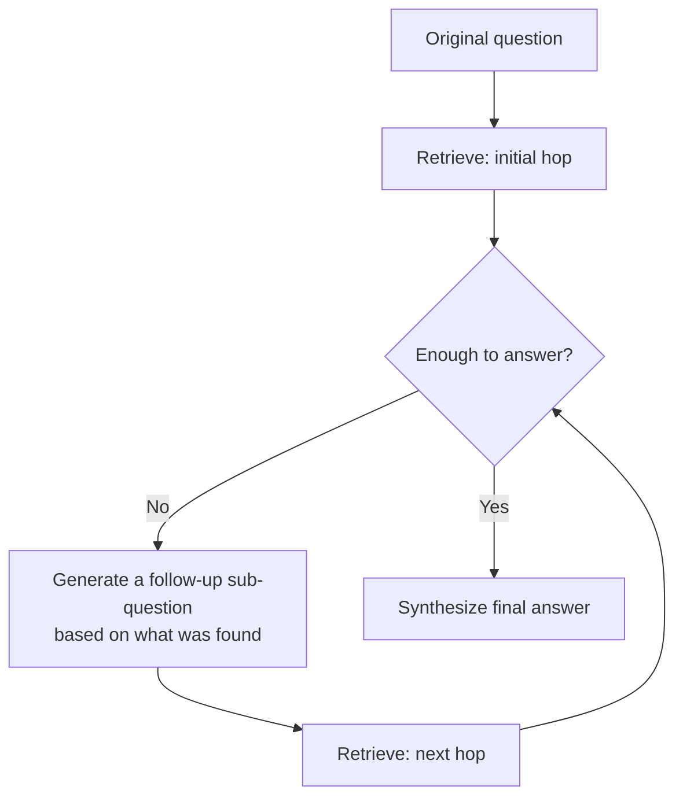

"Who is the current manager of the team that shipped the feature mentioned in ticket PROJ-4471?" cannot be answered with one retrieval call. You need the ticket first, to find the feature and the team, then a second retrieval to find that team's current manager. Single-shot RAG — embed the question, retrieve, generate — has no mechanism for this; it retrieves against the *original* question and never adapts based on what it finds.

## Recognizing When You Need It

Not every question needs multiple hops, and running multi-hop retrieval unconditionally adds latency and cost for questions that didn't need it. The signal to watch for: does answering the question require information that isn't in the question itself, but would only be discoverable *after* an initial retrieval? If yes, single-shot retrieval will return documents relevant to the surface-level question and miss the actual answer.

## The Pattern



```python
def multi_hop_retrieve(question: str, max_hops: int = 3) -> dict:
    accumulated_context = []
    current_query = question

    for hop in range(max_hops):
        results = retriever.search(current_query, top_k=5)
        accumulated_context.extend(results)

        assessment = llm.invoke(f"""Question: {question}
Context so far: {format_context(accumulated_context)}

Can you fully answer the question with this context? Answer yes or no.
If no, what is the next specific thing you need to search for?""")

        if "yes" in assessment.content.lower()[:10]:
            break
        current_query = extract_next_query(assessment.content)

    return {
        "answer": synthesize(question, accumulated_context),
        "hops_used": hop + 1,
        "context": accumulated_context,
    }
```

The `max_hops` ceiling matters as much as the loop itself — without it, a question the system genuinely can't answer from the available corpus can trigger unbounded retrieval attempts, each adding latency and cost with no path to resolution.

## Why This Belongs in Agentic RAG, Not Prompt Engineering

It's tempting to try to solve this by asking the model to "think step by step about what to search for" in a single prompt. That doesn't work reliably, because the model genuinely doesn't have the information from the second hop until the first hop's retrieval has actually executed — no amount of prompting substitutes for the retrieval call actually happening between reasoning steps. This is exactly the agentic-RAG loop covered in the earlier post on [combining retrieval with tool-using agents](/posts/agentic-rag-tool-using-agents/): retrieval as a decision the model makes and repeats, not a single upfront step.

## Key Takeaways

1. **Multi-hop retrieval is needed when the second search depends on what the first one finds** — single-shot RAG has no mechanism for this
2. **Not every question needs it** — reserve it for questions requiring information not present in the original query
3. **Always cap the hop count** — an unanswerable question can otherwise trigger unbounded retrieval attempts
4. **This requires actual sequential tool calls, not just a "think step by step" prompt** — the model needs the real result of hop one before it can plan hop two

---

*Part of the [Agentic AI in Practice series](/tags/agentic-ai-series/) — lessons from building production multi-agent systems.*
