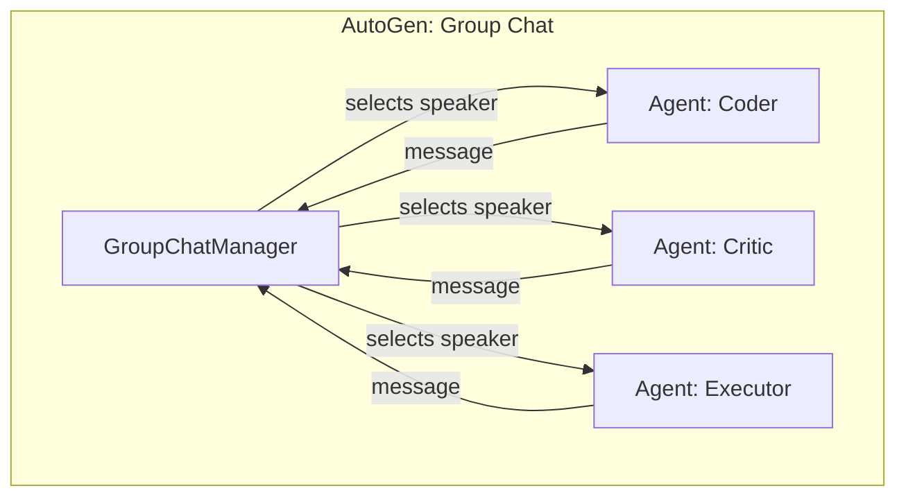

The [LangGraph vs CrewAI comparison](/posts/langgraph-vs-crewai/) covered the two frameworks that come up most in production conversations. There's a third that deserves equal consideration: **Microsoft's AutoGen**, which takes yet another approach — agents as conversational participants rather than graph nodes or role-based crew members.

## Three Different Mental Models

- **CrewAI**: agents are *team members* with roles, goals, and backstories; tasks flow through them
- **LangGraph**: agents are *nodes in a state graph*; execution flow is explicit and controllable
- **AutoGen**: agents are *participants in a conversation*; they talk to each other in a group chat, and a manager decides who speaks next



## The Same Pipeline in AutoGen

To extend the running example from the LangGraph/CrewAI comparison — research, draft, review — here's the AutoGen version:

```python
import autogen

config_list = [{"model": "claude-sonnet-4-6", "api_type": "anthropic"}]

researcher = autogen.AssistantAgent(
    name="Researcher",
    system_message="You research topics thoroughly and share structured notes with the group.",
    llm_config={"config_list": config_list},
)

writer = autogen.AssistantAgent(
    name="Writer",
    system_message="You write clear technical blog posts from research notes shared in the chat.",
    llm_config={"config_list": config_list},
)

reviewer = autogen.AssistantAgent(
    name="Reviewer",
    system_message=(
        "You review drafts for accuracy and clarity. Reply 'APPROVED' when satisfied, "
        "or give specific feedback for the Writer to address."
    ),
    llm_config={"config_list": config_list},
)

user_proxy = autogen.UserProxyAgent(
    name="user_proxy",
    human_input_mode="NEVER",
    code_execution_config=False,
    is_termination_msg=lambda msg: "APPROVED" in msg.get("content", ""),
)

group_chat = autogen.GroupChat(
    agents=[user_proxy, researcher, writer, reviewer],
    messages=[],
    max_round=12,
    speaker_selection_method="auto",  # an LLM decides who speaks next
)
manager = autogen.GroupChatManager(groupchat=group_chat, llm_config={"config_list": config_list})

user_proxy.initiate_chat(manager, message="Write a post about LangGraph checkpointing.")
```

**What stands out**: no explicit task graph at all. The `GroupChatManager` uses an LLM call to decide who should speak next based on conversation history. This is powerful for open-ended collaboration and genuinely painful when you need deterministic control over execution order — the model can decide to loop the Reviewer twice in a row, skip the Writer, or terminate early in ways that are hard to constrain.

## Where Each Framework Actually Wins

| Dimension                | AutoGen                              | CrewAI                        | LangGraph                     |
| ------------------------- | ------------------------------------- | ------------------------------ | ------------------------------ |
| **Execution model**       | Emergent (LLM picks next speaker)     | Sequential/hierarchical tasks | Explicit graph, conditional edges |
| **Determinism**           | Low — speaker order can vary run-to-run | Medium — task order is fixed  | High — you control every transition |
| **Code execution**        | Native, sandboxed (`UserProxyAgent`)  | Via custom tools               | Via custom tools               |
| **Human-in-the-loop**     | Native (`human_input_mode`)           | Limited                        | Native breakpoints              |
| **Best for**              | Open-ended research/coding collaboration | Role-based linear workflows | Production pipelines needing control |
| **Debugging**             | Conversation transcript                | Task-level output              | Full state inspection at every node |
| **Setup complexity**      | Low                                    | Low                             | Medium-high                     |

AutoGen's standout feature is native, sandboxed code execution through `UserProxyAgent` — if your workflow genuinely needs an agent that writes and runs code as part of its loop (data analysis, debugging, iterative script generation), AutoGen has the most mature story for that out of the box.

## A Decision Framework

**Reach for AutoGen when:**
- The task is exploratory — you don't know the exact sequence of steps in advance
- Code generation and execution is central to the workflow
- You want agents to critique and iterate on each other's work conversationally

**Reach for CrewAI when:**
- The workflow maps cleanly to a team of specialists in a mostly linear sequence
- You're prototyping and want to be productive within a day
- You don't need loops, conditional branching, or exact execution control

**Reach for LangGraph when:**
- The workflow has real branching logic or retry loops
- You need checkpointing, resumability, or human approval gates
- You're shipping to production and need full auditability of every step

## They Compose

None of these are exclusive. A common production pattern: use **LangGraph as the outer control plane** for the parts of the pipeline that must be deterministic and auditable, and drop an **AutoGen group chat** into a single node for the sub-task that's genuinely open-ended (say, a debugging session that needs a code-writing agent and a code-critiquing agent going back and forth):

```python
def debug_subtask_node(state: PipelineState) -> dict:
    # AutoGen handles the open-ended back-and-forth inside this one LangGraph node
    user_proxy.initiate_chat(manager, message=f"Debug this failing test: {state['failing_test']}")
    return {"debug_result": group_chat.messages[-1]["content"]}

workflow.add_node("debug", debug_subtask_node)
```

## Key Takeaways

1. **AutoGen's emergent conversation model trades determinism for flexibility** — good for exploration, risky for production pipelines that need predictable execution
2. **Native sandboxed code execution is AutoGen's strongest differentiator** — nothing else in this comparison matches it out of the box
3. **CrewAI stays the fastest path to a working prototype** for linear, role-based workflows
4. **LangGraph remains the right choice when you need control, retries, and auditability**
5. **Pick per sub-task, not per project** — a single system can use different frameworks for different nodes based on how much determinism each step actually needs

---

*Part of the [Agentic AI in Practice series](/tags/agentic-ai-series/) — lessons from building production multi-agent systems.*
