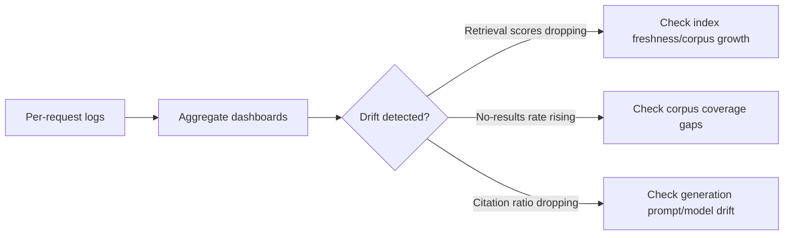

The minimum viable RAG logging setup — question in, answer out — answers "did the system respond." It cannot answer "why was this specific answer wrong," because everything that determined the answer (what got retrieved, in what order, with what scores) is gone by the time you're looking at the log.

## The Fields That Actually Matter

```python
def log_rag_request(query: str, rewritten_queries: list[str], retrieved: list[dict],
                     reranked: list[dict], answer: str, latency_ms: dict):
    log_entry = {
        "timestamp": time.time(),
        "request_id": generate_request_id(),
        "original_query": query,
        "rewritten_queries": rewritten_queries,
        "retrieval": [
            {"doc_id": d["id"], "score": d["score"], "rank": i}
            for i, d in enumerate(retrieved)
        ],
        "reranked": [
            {"doc_id": d["id"], "rerank_score": d["score"], "rank": i}
            for i, d in enumerate(reranked)
        ],
        "final_answer": answer,
        "latency_ms": latency_ms,  # per-stage breakdown
    }
    observability_store.write(log_entry)
```

The retrieval and reranking scores, specifically, are what let you retroactively diagnose a bad answer weeks later: was the right document retrieved at all (a retrieval failure), retrieved but ranked too low to survive top-k (a ranking failure), or retrieved and ranked well but the model still generated a wrong answer from good context (a generation failure)? Each of these needs a different fix, and none of them are distinguishable from "question in, answer out" logging alone.

## Aggregate Metrics Worth Tracking Over Time

Individual request logs answer "what happened on this one request." A few aggregate metrics, tracked over time, answer "is retrieval quality degrading":

- **Retrieval score distribution** — a downward drift in average top-1 score across all queries can signal embedding-index staleness or a corpus that's grown in ways the index configuration hasn't adapted to
- **Rate of "no relevant results" responses** — the model correctly declining to answer is good behavior, but a rising rate of it signals a coverage gap in the corpus
- **Citation-to-claim ratio** — a drop in how often generated claims carry a citation can signal the model drifting toward unsupported generation, worth investigating even before a user reports it



## Sampling for Human Review

Automated metrics catch drift; they don't catch a subtly wrong answer that scores fine on every automated signal. Sample a small percentage of production requests — weighted toward low-confidence or edge-case queries — for periodic human review, feeding anything genuinely wrong back into the eval set as a regression test.

## Key Takeaways

1. **Log retrieval and reranking scores, not just the final answer** — that's what lets you diagnose *which* stage failed
2. **Track aggregate score distributions over time** — individual logs show you one request; trends show you drift
3. **A rising "no relevant results" rate is a coverage signal, not just a UX nuisance**
4. **Sample production traffic for human review** — automated metrics won't catch every subtly wrong answer

---

*Part of the [Agentic AI in Practice series](/tags/agentic-ai-series/) — lessons from building production multi-agent systems.*
