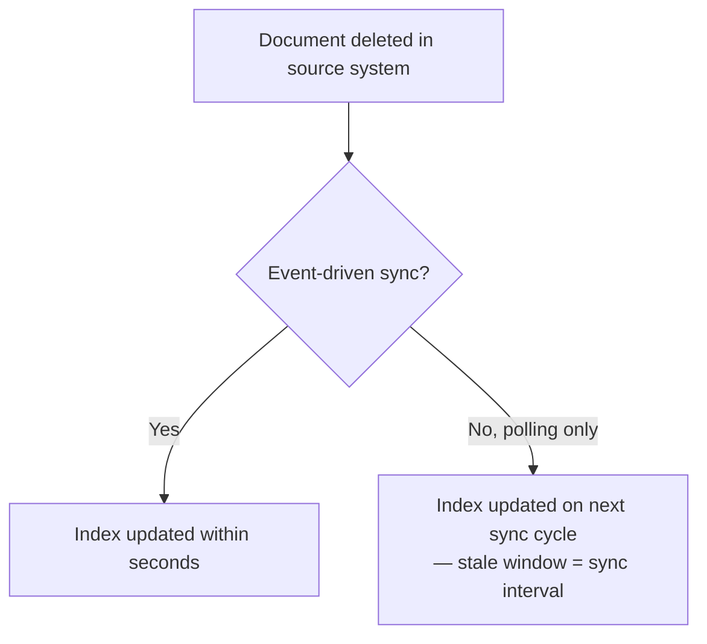

A vector index has no concept of "this document used to be true." It embeds text and returns whatever is semantically closest to the query, regardless of whether that text was correct yesterday and wrong today. Staleness isn't a retrieval bug — retrieval is working exactly as designed — it's a freshness gap in the source pipeline that retrieval has no way to detect on its own.

## Three Kinds of Staleness

**Superseded content**: a document that was correct when written, and has since been replaced by a newer version elsewhere in the corpus — both versions are indexed, and retrieval has no inherent preference for the current one.

**Silently outdated content**: a document that hasn't been formally superseded but describes a process, price, or policy that has since changed, with no updated version existing anywhere in the corpus yet.

**Deleted-but-indexed content**: a document removed from the source system but not yet removed from the vector index, because index sync ran on a schedule and the deletion hasn't propagated yet.

## Fixing Each

**For superseded content**, version metadata plus a retrieval-time filter or boost:

```python
def retrieve_with_recency_preference(query: str, top_k: int = 10) -> list[dict]:
    candidates = vector_index.search(query, top_k=top_k * 2)  # over-fetch
    # Boost recency, don't just sort by it — a highly relevant older doc
    # can still beat a barely-relevant new one
    for c in candidates:
        age_days = (time.time() - c["last_updated"]) / 86400
        c["adjusted_score"] = c["score"] * (0.98 ** min(age_days, 365))
    return sorted(candidates, key=lambda c: c["adjusted_score"], reverse=True)[:top_k]
```

**For silently outdated content**, there's no retrieval-time fix — this requires a source-side process: a documentation review cadence, or a tool-based verification step where the agent cross-checks a retrieved fact against a live source (an API, a database) rather than trusting the static document for time-sensitive fields like prices or availability.

**For deleted-but-indexed content**, sync latency needs a floor that matches your actual freshness requirements. A daily batch sync is fine for a slow-moving internal wiki; a support knowledge base with same-day corrections needs near-real-time deletion propagation, ideally driven by the same event that triggered the deletion in the source system rather than a polling schedule.



## The Metadata You Need From Day One

Retrofitting freshness handling onto a corpus with no version or update-timestamp metadata is far harder than building it in from the start. At minimum, every ingested document needs `last_updated`, a `superseded_by` field (nullable), and a `source_deleted` flag your sync process can set — even if nothing consumes them yet on day one.

## Key Takeaways

1. **Staleness is a source-pipeline gap, not a retrieval bug** — retrieval can't know what it wasn't told
2. **Superseded content is fixable with recency-boosted scoring** — boost, don't just sort by recency, or you lose relevance
3. **Silently outdated content needs a source-side fix** — a review cadence or live verification, not a retrieval-time trick
4. **Match sync latency to your actual freshness requirements** — and build version/timestamp metadata in from day one, before you need it

---

*Part of the [Agentic AI in Practice series](/tags/agentic-ai-series/) — lessons from building production multi-agent systems.*
