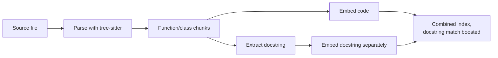

Prose-oriented chunking strategies — split on paragraphs, split every N characters — actively damage code retrieval. A function split across two chunks by an arbitrary character boundary produces two chunks, neither of which contains a complete, meaningful unit: one has a signature with no body, the other a body with no signature. Both embed poorly and retrieve poorly.

## Chunk on Syntax Boundaries, Not Character Count

Code has an actual grammar — functions, classes, methods — and a parser (tree-sitter is the standard choice, supporting dozens of languages with one consistent API) can chunk along those boundaries instead of guessing from character position:

```python
import tree_sitter_languages

def chunk_by_function(source_code: str, language: str) -> list[dict]:
    parser = tree_sitter_languages.get_parser(language)
    tree = parser.parse(bytes(source_code, "utf8"))
    chunks = []

    def visit(node):
        if node.type in ("function_definition", "method_definition", "class_definition"):
            chunks.append({
                "code": source_code[node.start_byte:node.end_byte],
                "type": node.type,
                "start_line": node.start_point[0] + 1,
            })
        else:
            for child in node.children:
                visit(child)

    visit(tree.root_node)
    return chunks
```

Each resulting chunk is a complete function, method, or class — self-contained and meaningful on its own, which is exactly the property generic character-count chunking destroys.

## Carry the Surrounding Context

A function's embedding is stronger with its imports and enclosing class context included, even though those aren't part of the function body itself — a method named `process` means very little without knowing which class it belongs to and what that class is for:

```python
def build_chunk_with_context(chunk: dict, file_imports: list[str], enclosing_class: str | None) -> str:
    header = "\n".join(file_imports[:5])  # relevant imports, not the whole file's worth
    class_context = f"# Part of class: {enclosing_class}\n" if enclosing_class else ""
    return f"{header}\n{class_context}{chunk['code']}"
```

## Docstrings and Comments Are a Separate Retrieval Signal

A function's docstring often describes *intent* in natural language that maps much more directly to a natural-language query than the code itself does — a user searching "how do we retry failed payments" matches a docstring saying exactly that far better than it matches the implementation's actual variable names and control flow. Index docstrings as a boosted or separately-weighted signal alongside the code body, not merged indistinguishably into it.



## Key Takeaways

1. **Chunk on syntax boundaries with a parser (tree-sitter), not character count** — every chunk should be a complete function, method, or class
2. **Carry relevant imports and enclosing class context** — a code fragment's meaning depends on more than its own body
3. **Index docstrings as a distinct, boosted signal** — natural-language queries match docstring intent far better than raw code
4. **This is a case where the extra parsing effort at index time pays for itself directly in retrieval quality**

---

*Part of the [Agentic AI in Practice series](/tags/agentic-ai-series/) — lessons from building production multi-agent systems.*
