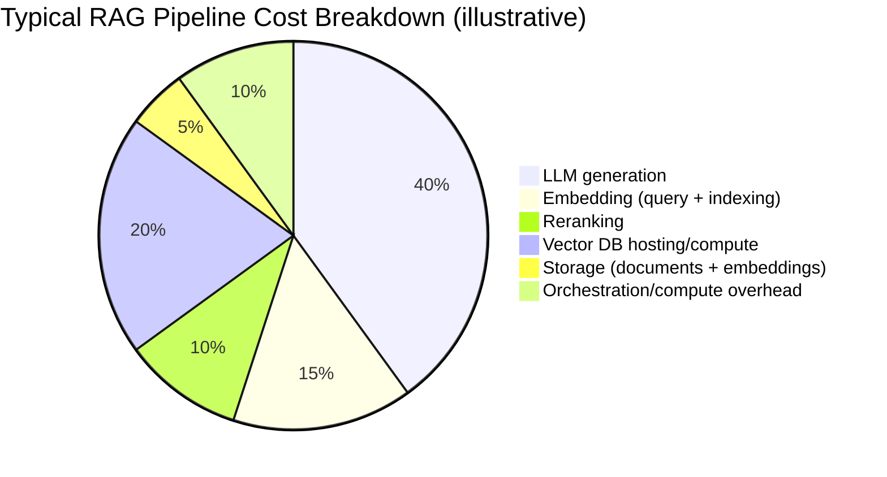

Ask most teams what their RAG pipeline costs and they'll quote the LLM generation spend — because that's the number the model provider's dashboard shows prominently. It's often not the largest line item once you break down the full pipeline, and the parts that don't show up on that one dashboard are exactly the ones that get missed in planning.

## The Full Cost Breakdown



The exact split varies enormously by scale and architecture, but the pattern that surprises people consistently is how much sits outside generation: vector database hosting cost scales with index size and query volume in a way that's easy to underestimate at design time and expensive to discover at production scale.

## Indexing Cost Is a One-Time-Feeling Cost That Isn't

Initial corpus indexing feels like a one-time cost — embed everything once, done. In practice, most corpora aren't static: documents get added, edited, and deleted continuously, and each change requires re-embedding. A corpus with high document churn can spend more on ongoing re-indexing than on the original bulk index, and that recurring cost rarely gets modeled during initial planning because the first indexing pass genuinely was a one-time event.

```python
def estimate_reindex_cost(daily_doc_changes: int, avg_tokens_per_doc: int, embedding_cost_per_1k_tokens: float) -> float:
    daily_tokens = daily_doc_changes * avg_tokens_per_doc
    return (daily_tokens / 1000) * embedding_cost_per_1k_tokens * 30  # monthly
```

## Where Reranking Cost Sneaks Up

A cross-encoder reranker call is cheap per-query and adds up fast at scale, particularly for self-hosted rerankers where the cost is GPU capacity rather than a clean per-call API price — a cost that's easy to under-provision for at launch traffic levels and then discover under real production load.

## The Actual Lever: Reduce Calls Before Reducing Their Cost

The highest-leverage cost optimization is usually not "use a cheaper model" — it's reducing the number of calls that need to happen at all:

- **Cache aggressively** (with the fingerprinting approach from earlier in this series) to skip repeated retrieval and generation entirely
- **Skip reranking conditionally** when the top retrieval result already has high confidence
- **Route simple queries to a cheaper/smaller model**, reserving the expensive model for genuinely complex questions — the same principle covered later in this blog's [model routing and cascades post](/posts/model-routing-cascades-cutting-llm-costs/)

## Key Takeaways

1. **Generation is rarely the whole cost story** — vector DB hosting, embedding, and reranking often add up to more than expected
2. **Re-indexing on document churn is a recurring cost, not a one-time cost** — model it before it surprises you
3. **Reranking cost scales with query volume in ways that are easy to under-provision for**
4. **The biggest lever is usually reducing the number of calls**, not just picking a cheaper model per call

---

*Part of the [Agentic AI in Practice series](/tags/agentic-ai-series/) — lessons from building production multi-agent systems.*
