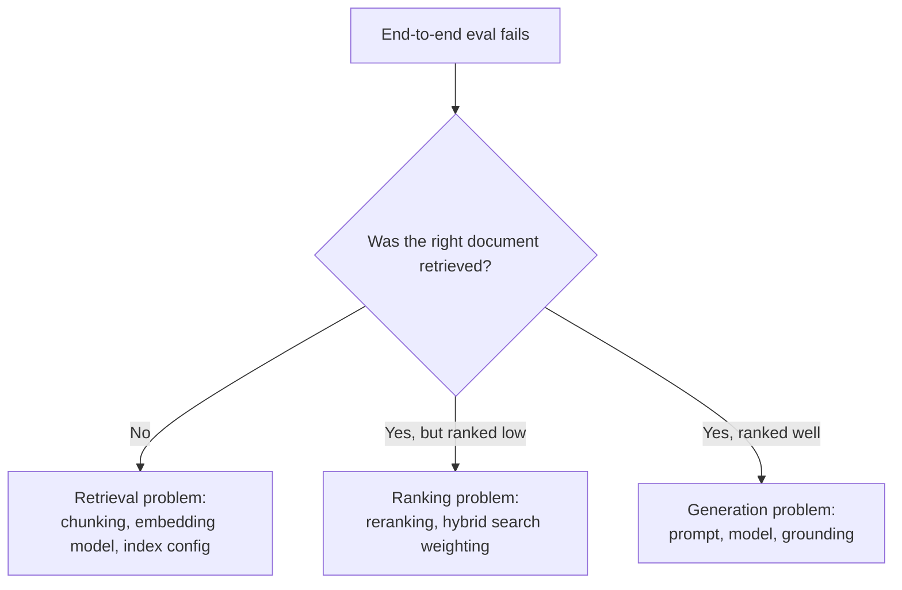

End-to-end RAG evaluation — was the final answer correct — is necessary but insufficient on its own. When it fails, it doesn't tell you *why*: whether the right documents were never retrieved, or were retrieved but the model still generated a wrong answer from good context. Evaluating retrieval in isolation, before the LLM is even in the loop, separates these two failure modes cleanly.

## Retrieval Metrics That Don't Require an LLM Call

Offline retrieval evaluation needs a labeled set of (query, relevant_document_ids) pairs — the same kind of golden dataset needed for any eval, and worth building once and reusing across every retrieval change:

```python
def evaluate_retrieval(eval_set: list[dict], retriever, k: int = 5) -> dict:
    """eval_set: [{"query": ..., "relevant_doc_ids": [...]}]"""
    precisions, recalls, mrrs = [], [], []

    for item in eval_set:
        retrieved = retriever.search(item["query"], top_k=k)
        retrieved_ids = [r["id"] for r in retrieved]
        relevant = set(item["relevant_doc_ids"])

        hits = [1 if rid in relevant else 0 for rid in retrieved_ids]
        precisions.append(sum(hits) / k)
        recalls.append(sum(hits) / len(relevant) if relevant else 0)

        first_hit_rank = next((i + 1 for i, h in enumerate(hits) if h), None)
        mrrs.append(1 / first_hit_rank if first_hit_rank else 0)

    return {
        "precision@k": sum(precisions) / len(precisions),
        "recall@k": sum(recalls) / len(recalls),
        "mrr": sum(mrrs) / len(mrrs),
    }
```

- **Precision@k**: of the top-k retrieved documents, what fraction are actually relevant
- **Recall@k**: of all relevant documents, what fraction made it into the top-k
- **MRR (Mean Reciprocal Rank)**: how high up the first relevant result ranks, on average — a proxy for how often the model has to dig past irrelevant results to find something useful

None of these require an LLM call, which means this eval runs in seconds against hundreds of queries, not minutes against dozens.

## Why This Catches What End-to-End Eval Misses



Without offline retrieval metrics, every end-to-end failure requires manual inspection to figure out which branch of this tree you're in. With them, running the retrieval eval alone tells you immediately whether the problem is upstream (retrieval/ranking) or downstream (generation) — before spending any time debugging the wrong stage.

## Build the Eval Set Incrementally

Fifty labeled query-document pairs is enough to start catching regressions; it doesn't need to be exhaustive on day one. The highest-value source for growing it is production: sample real queries, especially ones where a user gave negative feedback or rephrased their question (a signal the first answer didn't land), and add them once labeled.

## Key Takeaways

1. **Evaluate retrieval separately from generation** — end-to-end failure alone can't tell you which stage broke
2. **Precision@k, recall@k, and MRR require no LLM call** — fast enough to run against hundreds of queries routinely
3. **This isolates whether a regression is a retrieval problem or a generation problem** before you spend time debugging the wrong one
4. **Start small and grow the eval set from real production queries**, especially ones with negative user feedback

---

*Part of the [Agentic AI in Practice series](/tags/agentic-ai-series/) — lessons from building production multi-agent systems.*
