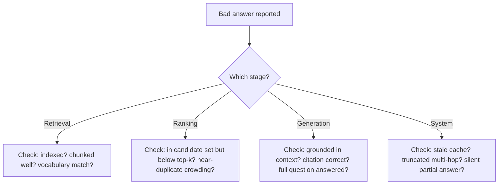

This closes out three weeks of RAG-architecture posts with the reference list I actually use when a RAG pipeline produces a bad answer: a taxonomy of failure modes organized by which stage caused them, because the fix is different for each.

## Retrieval-Stage Failures

- **The relevant document was never indexed** — a coverage gap, not a retrieval bug; the fix is on the ingestion side
- **The relevant document exists but was chunked badly** — the answer is split across a chunk boundary, and no single chunk contains enough to be retrieved as relevant (see [chunking strategies](/posts/chunking-strategies-retrieval-quality/))
- **Query-document vocabulary mismatch** — the user's words and the document's words don't overlap enough for either lexical or semantic matching to connect them reliably

## Ranking-Stage Failures

- **The relevant document was retrieved but ranked below the top-k cutoff** — it exists in the candidate set, just not the final context; usually fixable with reranking or a wider initial retrieval
- **A near-duplicate chunk crowded out a more useful one** — common with high overlap settings, where two chunks are similar enough that only one needed to survive to top-k

## Generation-Stage Failures

- **Ungrounded generation despite correct context** — the model had the right information and answered from its own training data anyway, ignoring the provided context
- **Correct answer, missing or wrong citation** — the content is right, the attribution is wrong, which is arguably worse for trust than an openly ungrounded answer (see [grounding answers with citations](/posts/grounding-answers-citations-users-trust/))
- **Correct partial answer to a compound question** — the model answered one half of a multi-part question and silently dropped the other

## System-Stage Failures

- **Stale context from an outdated cache or unindexed deletion** — the pipeline worked correctly against context that itself was wrong
- **Silent timeout truncating a multi-hop retrieval** — the system needed more hops than its budget allowed and returned a partial, unlabeled-as-partial answer

## Using This as a Debugging Checklist

When a bad answer is reported, the offline retrieval metrics from the [previous post](/posts/evaluating-retrievers-offline/) tell you whether the problem is retrieval/ranking or generation. This taxonomy is the next level of detail once you know which side of that split you're on — a specific list of what to actually check, rather than starting from a blank investigation each time.

## Key Takeaways

1. **A wrong answer has a specific cause, not a generic "RAG is unreliable" explanation** — find which stage actually failed
2. **Retrieval and ranking failures are usually index/chunking/config problems**; generation failures are prompt/grounding problems
3. **Citation-wrong-but-content-right is its own failure mode**, distinct from and arguably worse than open hallucination
4. **Keep a running taxonomy like this one** — every new failure mode discovered in production is worth adding, turning incident response into pattern matching over time

---

*Part of the [Agentic AI in Practice series](/tags/agentic-ai-series/) — lessons from building production multi-agent systems.*
