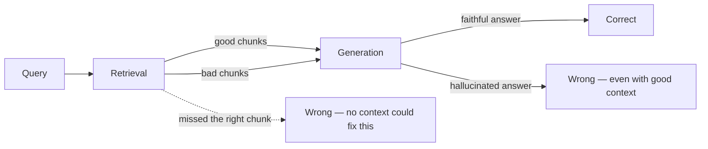

The [agent evaluation post](/posts/agent-evaluation-ragas/) earlier in this series covered evaluating agent trajectories generally. RAG systems need their own evaluation layer on top of that, because RAG has two independent failure surfaces — **retrieval** can fail even when generation is perfect, and **generation** can hallucinate even when retrieval is perfect. You need metrics for both, separately, or you won't know which half of the pipeline to fix.

## The Two Failure Surfaces



If you only measure end-to-end answer correctness, a bad retrieval and a hallucinating generation step look identical from the outside. You need chunk-level and answer-level metrics separately.

## Retrieval Metrics

**Context Precision** — of the chunks retrieved, how many were actually relevant? Penalizes noisy retrieval that dilutes the prompt with irrelevant context.

**Context Recall** — of the chunks that *should* have been retrieved to answer the question, how many were? Penalizes missed relevant information — the failure mode no amount of good generation can fix.

```python
from ragas import evaluate
from ragas.metrics import context_precision, context_recall, faithfulness, answer_relevancy
from datasets import Dataset

eval_dataset = Dataset.from_dict({
    "question": questions,
    "contexts": retrieved_contexts,      # list[list[str]] — what was retrieved
    "answer": generated_answers,
    "ground_truth": reference_answers,   # from your golden set
})

results = evaluate(
    eval_dataset,
    metrics=[context_precision, context_recall, faithfulness, answer_relevancy],
)
print(results)
# {'context_precision': 0.81, 'context_recall': 0.74, 'faithfulness': 0.93, 'answer_relevancy': 0.88}
```

A low `context_recall` with high `faithfulness` tells you the model is being faithful to *insufficient* context — the fix is in retrieval (chunking, hybrid search, reranking from the [RAG architecture post](/posts/rag-architecture-patterns-production/)), not in the prompt.

## Generation Metrics

**Faithfulness** — does every claim in the answer trace back to something in the retrieved context? This is the hallucination check, and it's the metric that matters most for anything user-facing or regulated.

**Answer Relevancy** — does the answer actually address the question asked, independent of whether it's grounded? A perfectly faithful answer to the wrong interpretation of the question still fails the user.

```python
def check_faithfulness_manually(answer: str, contexts: list[str], llm) -> dict:
    """A lightweight LLM-as-judge faithfulness check when you want more control than ragas defaults."""
    claims_prompt = f"List each factual claim in this answer as a separate line:\n\n{answer}"
    claims = llm.invoke(claims_prompt).content.strip().split("\n")

    unsupported = []
    context_text = "\n---\n".join(contexts)
    for claim in claims:
        verdict = llm.invoke(
            f"Context:\n{context_text}\n\nClaim: {claim}\n\n"
            "Is this claim directly supported by the context? Answer YES or NO only."
        ).content.strip()
        if verdict.upper() != "YES":
            unsupported.append(claim)

    return {
        "total_claims": len(claims),
        "unsupported_claims": unsupported,
        "faithfulness_score": 1 - (len(unsupported) / max(len(claims), 1)),
    }
```

Breaking faithfulness down per-claim, rather than as a single score, is what lets you actually debug a failure — you see *which* sentence in the answer went off the rails.

## Building a Golden Dataset

Metrics are only as good as the dataset you run them against. A golden set needs:

- **Real user questions**, pulled from logs — not questions you'd like users to ask
- **Questions with no good answer in the corpus**, to verify the system says "I don't know" instead of hallucinating
- **Multi-hop and ambiguous questions**, to stress-test [agentic RAG](/posts/agentic-rag-tool-using-agents/) routing and rewriting
- **Reference answers and the specific source chunks** that should be retrieved for each question

```python
golden_set = [
    {
        "question": "What's the refund window for annual plans?",
        "expected_chunk_ids": ["billing_policy#refunds", "billing_policy#annual_terms"],
        "ground_truth": "Annual plans have a 30-day refund window from the purchase date.",
    },
    {
        "question": "Can I run this on Windows 95?",  # no answer exists in the corpus
        "expected_chunk_ids": [],
        "ground_truth": "I don't have information about Windows 95 compatibility.",
    },
    # ... 50-200 more, covering the real distribution of questions
]
```

Start with 50–100 examples covering your top query categories; this is enough to catch regressions long before you have thousands.

## Wiring Evaluation into CI

Treat RAG regressions the same way you'd treat a failing unit test — run the eval suite on every change to chunking strategy, embedding model, or prompt, and fail the build if scores drop below a threshold:

```python
import sys

BASELINE = {"context_recall": 0.70, "faithfulness": 0.90}

def test_rag_regression():
    results = evaluate(build_eval_dataset(golden_set), metrics=[context_recall, faithfulness])
    failures = [
        m for m, threshold in BASELINE.items()
        if results[m] < threshold
    ]
    if failures:
        print(f"RAG regression detected in: {failures}")
        sys.exit(1)
```

This catches the change that seemed harmless — a new chunk size, a swapped embedding model, a "small" prompt tweak — before it ships and silently degrades answer quality for real users.

## Key Takeaways

1. **Measure retrieval and generation separately** — context precision/recall for retrieval, faithfulness/relevancy for generation, so you know which half to fix
2. **Low context recall means retrieval, not generation, is broken** — no prompt engineering fixes a chunk that was never retrieved
3. **Break faithfulness down per-claim** — a single aggregate score tells you *that* something's wrong, not *what*
4. **Include unanswerable questions in your golden set** — verify the system says "I don't know" instead of confidently hallucinating
5. **Run evaluation in CI, not just before launch** — RAG quality degrades silently with every change to chunking, embeddings, or prompts

---

*Part of the [Agentic AI in Practice series](/tags/agentic-ai-series/) — lessons from building production multi-agent systems.*
