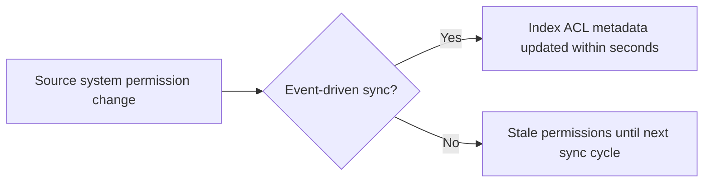

A vector search returns the k nearest neighbors to a query embedding, full stop — it has no built-in notion of whether the user asking is allowed to see the documents it's about to return. If access control isn't enforced explicitly at the retrieval layer, it doesn't exist, regardless of what permissions the source system enforces.

## Filter Before Ranking, Not After

The naive approach — retrieve top-k, then filter out documents the user can't see — silently returns fewer than k results whenever access-restricted documents would have ranked highly, and in the worst case returns zero useful results after filtering even though relevant, accessible documents existed further down the unfiltered list.

```python
def secure_retrieve(query: str, user_permissions: set[str], top_k: int = 10) -> list[dict]:
    # Metadata filter applied AT the vector search, not after
    results = vector_index.search(
        query,
        top_k=top_k,
        filter={"acl": {"$in": list(user_permissions)}},  # pre-filter, not post-filter
    )
    return results
```

Most vector databases support metadata filtering natively at query time — use it. The permission check needs to happen as part of the search, so the top-k results are already the top-k *accessible* results, not the top-k overall results with the inaccessible ones stripped out afterward.

## Where the ACL Data Comes From

The access control list on each chunk needs to reflect the source system's actual permissions, kept in sync — not a one-time snapshot at ingestion time. A document whose permissions change in the source system (a file moved to a restricted folder, a user removed from a team) needs that change propagated to the index promptly, or retrieval will keep enforcing stale permissions.



## Row-Level Security as the Pattern, Not Just the Postgres Feature

If you're on pgvector, Postgres row-level security (RLS) policies can enforce this at the database layer directly, which has the advantage of being enforced even against ad-hoc queries that bypass your application code:

```sql
CREATE POLICY tenant_isolation ON documents
    USING (tenant_id = current_setting('app.current_tenant')::uuid);
```

For other vector databases without native RLS, the equivalent discipline — every query, no exceptions, includes the permission filter — has to be enforced in application code, which means it needs to live in one shared retrieval function, not be re-implemented at every call site where retrieval happens.

## Key Takeaways

1. **Vector search has no inherent access control** — it has to be enforced explicitly, every time
2. **Filter at query time, not after retrieval** — post-filtering silently returns fewer than k results and can hide accessible relevant documents
3. **ACL metadata needs to stay synced with the source system**, not frozen at ingestion time
4. **Centralize the permission filter in one retrieval function** — don't rely on every call site remembering to apply it

---

*Part of the [Agentic AI in Practice series](/tags/agentic-ai-series/) — lessons from building production multi-agent systems.*
