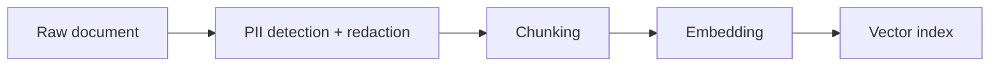

If personally identifiable information makes it into the vector index, redacting it from the final generated answer doesn't undo the exposure — the PII is still embedded, still retrievable by a well-crafted query, and still present in whatever logs captured the retrieved context along the way. Redaction has to happen at ingestion, before anything downstream ever sees it.

## Detection Is the Hard Part, Not Removal

Once PII is identified in a document, removing or masking it is mechanical. Identifying it reliably across free-form text is the actual problem — regex catches well-formatted patterns (SSNs, phone numbers, emails) and misses everything context-dependent (a name, an address embedded in a sentence, an account number in a format specific to your business).

```python
import re
from presidio_analyzer import AnalyzerEngine

analyzer = AnalyzerEngine()

def redact_pii(text: str) -> tuple[str, list[dict]]:
    results = analyzer.analyze(text=text, language="en")
    redacted = text
    findings = []
    for r in sorted(results, key=lambda x: x.start, reverse=True):
        findings.append({"type": r.entity_type, "start": r.start, "end": r.end, "score": r.score})
        redacted = redacted[:r.start] + f"[REDACTED:{r.entity_type}]" + redacted[r.end:]
    return redacted, findings
```

A library like Presidio combines pattern matching with NER models for the context-dependent cases regex alone misses — still not perfect, but meaningfully better than pattern matching in isolation.

## The Pipeline Placement That Matters



Redaction has to sit *before* chunking and embedding, not after. If it runs after embedding, the embedding itself was already computed from the unredacted text — redacting the stored text afterward doesn't change what the vector represents, and a sufficiently similar query can still retrieve based on the original, unredacted semantic content.

## What to Do With Findings, Not Just the Redacted Text

Discard the findings list and you lose the ability to audit what was caught, tune detection thresholds, or investigate a compliance question later. Store findings (type, confidence score, not the PII value itself) alongside the redacted document, so "did we ever index any SSNs" is answerable from logs instead of requiring a fresh scan of the entire corpus.

## Confidence Thresholds Are a Real Tradeoff

A low confidence threshold catches more true PII and also redacts more false positives — legitimate content mistaken for PII, degrading retrieval quality on that content. A high threshold preserves more legitimate content and risks missing genuine PII. There's no threshold that's right for every corpus; tune it against a labeled sample and re-tune when the corpus composition changes meaningfully.

## Key Takeaways

1. **Redact before embedding, not after** — post-embedding redaction doesn't change what the vector actually represents
2. **Detection, not removal, is the hard part** — regex alone misses context-dependent PII; combine it with NER-based detection
3. **Store findings metadata, not just redacted text** — it's what makes compliance questions answerable without a fresh corpus scan
4. **Tune the confidence threshold against your actual corpus** — there's no universally correct setting

---

*Part of the [Agentic AI in Practice series](/tags/agentic-ai-series/) — lessons from building production multi-agent systems.*
