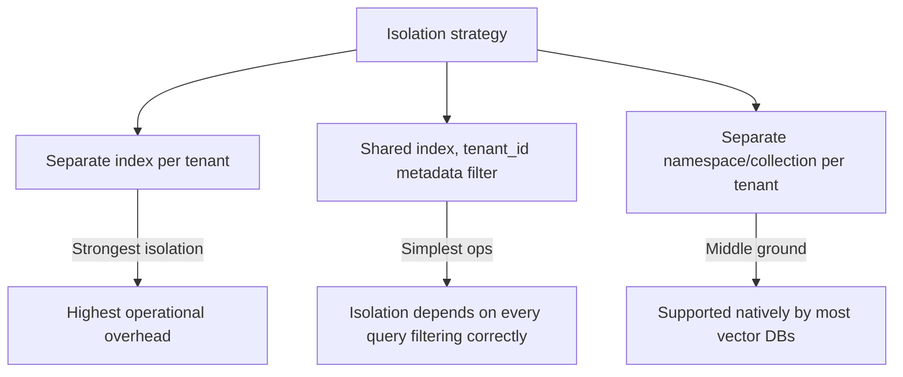

A single shared vector index serving multiple customers is operationally simpler than one index per tenant — one system to maintain, one set of index parameters to tune, easier resource utilization. It's also one missed `tenant_id` filter away from customer A's data showing up in customer B's retrieval results. The isolation strategy has to make that mistake structurally hard, not just documented as a convention developers are expected to remember.

## Three Isolation Models



**Separate index per tenant** gives the strongest isolation — a bug in query construction literally cannot leak across tenants, because there's no shared data structure to leak from. The cost is real: index count scales with tenant count, which becomes an operational burden past some scale, and small tenants pay disproportionate overhead for infrastructure sized for isolation rather than their actual data volume.

**Shared index with a metadata filter** is the cheapest to operate and the riskiest to get wrong — isolation depends entirely on every single query correctly applying the tenant filter, with no structural backstop if one doesn't.

**Namespaces or collections per tenant** (supported natively by Pinecone, Qdrant, and others) is the middle ground most teams land on: physical separation within a shared underlying infrastructure, without the operational overhead of fully separate indexes.

## Making the Filter Impossible to Forget

If you do go with a shared index, the tenant filter cannot be something each call site remembers to add — it needs to be structurally enforced in one place:

```python
class TenantScopedRetriever:
    def __init__(self, vector_index, tenant_id: str):
        self.vector_index = vector_index
        self.tenant_id = tenant_id  # set once, at construction

    def search(self, query: str, top_k: int = 10) -> list[dict]:
        return self.vector_index.search(
            query, top_k=top_k, filter={"tenant_id": self.tenant_id}
        )
```

Every retrieval call goes through an instance scoped to one tenant at construction time — there's no method signature that lets a caller search without a tenant, and no way to accidentally omit the filter at a specific call site.

## Test Isolation Like a Security Boundary

Standard functional tests check that retrieval returns relevant results. Isolation tests need to check the opposite: that a query scoped to tenant A returns *zero* results from tenant B's data, run against a fixture seeded with data from multiple tenants. This is a distinct test category from functional correctness and belongs in CI as its own gate, not folded into general retrieval quality tests.

## Key Takeaways

1. **Isolation strategy is a real tradeoff between operational cost and structural safety** — pick deliberately, not by default
2. **A shared-index filter needs to be structurally hard to forget**, not a convention documented and hoped for
3. **Namespaces/collections are the common middle ground** most vector databases support natively
4. **Test isolation as its own security-boundary test category** — verify zero cross-tenant leakage, not just relevant-results-returned

---

*Part of the [Agentic AI in Practice series](/tags/agentic-ai-series/) — lessons from building production multi-agent systems.*
