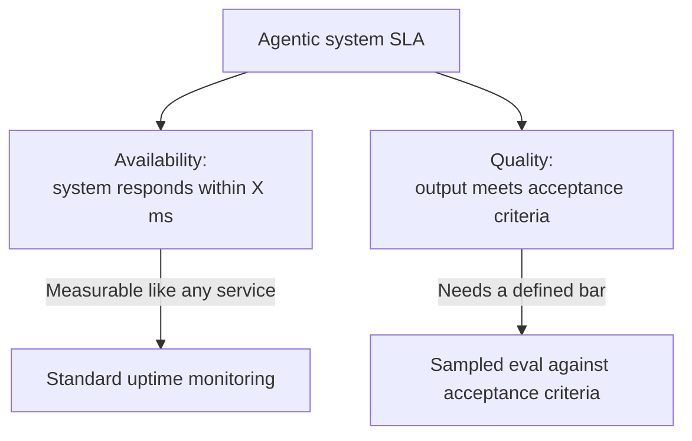

The instinct when a new agentic system launches is to either promise the same SLA as every other production service (99.9% uptime, sub-second p99 latency) without any real basis for it, or refuse to commit to any SLA at all because "it's AI, it's unpredictable." Neither is useful to the teams depending on the system. There's a middle path.

## Separate What You Can Promise From What You Can't

An agentic system has failure modes a traditional service doesn't: not just "is the service up" but "did the agent produce a correct or acceptable result." These need separate SLAs, because they're genuinely different guarantees with different measurement approaches.



**Availability SLA** — the system responds within a latency budget, with the fallback behavior (a clear "I can't answer this confidently" is a valid, on-SLA response; a silent failure is not) counting as available. This is measurable with the same tooling as any other service.

**Quality SLA** — a defined percentage of sampled outputs meet an acceptance bar, measured against the eval framework, not a promise about every individual response. This is the part that's genuinely new for most SRE teams, and it requires an actual evaluation pipeline running continuously in production, not just at launch.

## Start Narrower Than You Want To

The honest version of an early SLA is narrower in scope than what a mature system eventually supports: committing to quality bars only for the request types actually covered by your eval set, and explicitly flagging everything else as "best effort, not yet SLA-covered." Widening the SLA's scope as eval coverage grows is a much safer trajectory than over-promising broad coverage on day one and discovering gaps in production.

```python
def check_sla_eligible(request_type: str, eval_coverage: set[str]) -> bool:
    """Only request types with eval coverage are counted toward the quality SLA."""
    return request_type in eval_coverage
```

## Make the Escalation Path Part of the SLA

An SLA without a defined response to a breach is just a number on a dashboard. What happens when the quality SLA is missed for a week — is there an on-call rotation empowered to roll back a model or prompt version? Does someone specific get paged? Define this alongside the SLA itself, not after the first breach happens.

## Key Takeaways

1. **Separate availability SLA from quality SLA** — they're different guarantees requiring different measurement
2. **A clear "I can't answer confidently" response should count as available**, not as a failure
3. **Start with SLA scope narrower than the system's actual coverage**, and widen it as eval coverage grows — not the reverse
4. **Define the breach-response path (who's paged, what rollback authority exists) alongside the SLA itself**

---

*Part of the [Agentic AI in Practice series](/tags/agentic-ai-series/) — lessons from building production multi-agent systems.*
