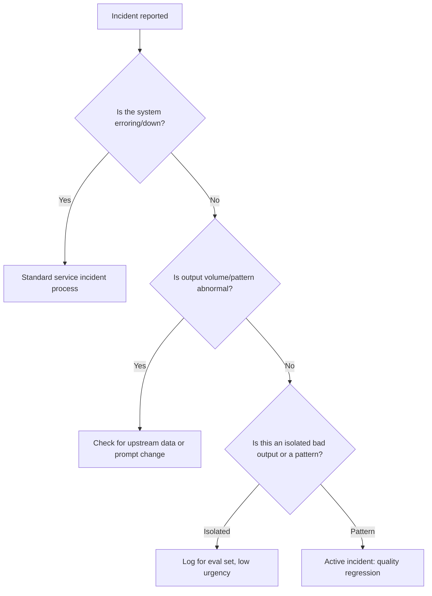

A traditional on-call runbook is built around a clear signal: the service is throwing errors, or it's down. An agent incident is often neither — the system is responding normally, with no elevated error rate, and quietly producing wrong or harmful output. The runbook needs a different first step than "check the error dashboard."

## The Triage Questions, in Order



The branch that matters most is the last one — an isolated bad output from an agent operating on genuinely open-ended tasks is expected and not itself an incident; a *pattern* of bad outputs, especially one that started at a specific time, is.

## What to Check First for a Quality Regression

1. **Did a model version change?** Provider-side model updates can shift behavior without any change on your end — check the model version string logged with recent requests against historical.
2. **Did a prompt or system message change?** Check deploy history for the relevant service, not just recent code merges — prompt changes sometimes ship through config, separate from code deploys.
3. **Did the retrieved context change?** For RAG-backed agents, a source document update or index change can shift what's grounding responses without any model or prompt change at all.
4. **Did input distribution shift?** A marketing campaign, a new user segment, or a seasonal pattern can shift what kinds of requests the system is handling, exposing a gap that was always there but rarely triggered.

## The Rollback Decision

Unlike a traditional service where rollback is usually unambiguous once a bad deploy is identified, an agent quality regression rollback needs a judgment call: is the regression bad enough to roll back a model or prompt version, accepting whatever the *previous* known issues were, versus trying to hot-fix forward? Define who has the authority to make this call before an incident, not during one — this is not a decision to improvise under pressure.

```python
INCIDENT_SEVERITY = {
    "isolated_bad_output": "log_only",
    "pattern_new_since_deploy": "page_oncall",
    "pattern_safety_relevant": "page_oncall_and_disable_feature",
}
```

## Close the Loop Into the Eval Set

Every genuine incident, once resolved, should produce at least one new eval case — the specific input that triggered it, with the correct expected behavior labeled. This is what prevents the same regression from recurring silently after the next model or prompt change; without it, an incident's only lasting artifact is a postmortem doc nobody re-reads.

## Key Takeaways

1. **Agent incidents often look like normal operation, not errors** — the first triage question is "is this a pattern," not "is the service up"
2. **Check model version, prompt/config changes, retrieved context, and input distribution shift, in that order**
3. **Rollback authority for a quality regression needs to be decided before an incident**, not during one
4. **Every resolved incident should add a labeled case to the eval set** — that's what actually prevents recurrence

---

*Part of the [Agentic AI in Practice series](/tags/agentic-ai-series/) — lessons from building production multi-agent systems.*
