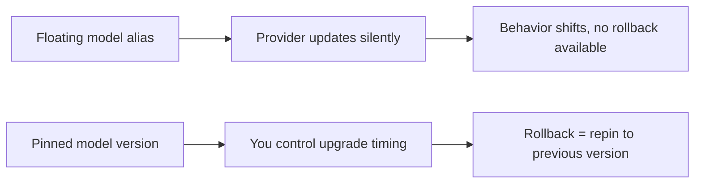

Code deploys have mature rollback tooling — revert the commit, redeploy the previous image, done. Agentic systems have at least three more categories of change that can cause a regression and need their own rollback path: prompts, model versions, and retrieval configuration. Treating only code as rollback-able leaves the most common source of agent regressions without a fast path back to known-good.

## Version Everything That Can Cause a Regression

```python
@dataclass
class AgentConfigVersion:
    version_id: str
    prompt_template: str
    model_name: str
    model_params: dict  # temperature, max_tokens, etc.
    retrieval_config: dict  # top_k, reranking enabled, index version
    deployed_at: datetime
    deployed_by: str

config_history = ConfigVersionStore()  # append-only, every change recorded
```

The append-only history matters as much as the current config — when a regression is reported, the first question is often "what changed, and when," and that's only answerable if every change is a recorded version, not an in-place overwrite of the previous one.

## Prompt Rollback Needs to Be as Fast as Code Rollback

If a prompt lives in application code, rolling it back means a full deploy cycle — slow, when the priority is stopping active harm. Externalizing prompts to a versioned config store, separate from the code deploy pipeline, lets a prompt rollback happen in seconds:

```python
def rollback_prompt(target_version_id: str):
    previous_config = config_history.get(target_version_id)
    active_config_store.set("prompt_template", previous_config.prompt_template)
    # No code deploy required — takes effect on next request
```

## Model Rollback Is Sometimes Not Available to You

Provider-side model updates (a new default version behind the same model name) can't always be rolled back — if the previous version has been deprecated, there's no "previous" to return to. This is an argument for pinning to specific model versions rather than a floating "latest" alias in anything production-facing, even though it means you have to opt into upgrades deliberately rather than receiving them automatically.



## Retrieval Config Rollback

A reranking toggle, a `top_k` change, or an index version bump can cause a regression just as easily as a prompt change, and often gets less scrutiny because it feels like infrastructure rather than behavior. Version retrieval config alongside prompt and model config, in the same store, so a rollback restores the *entire* configuration surface that determined the previous behavior — not just the parts that felt most "AI-related."

## Key Takeaways

1. **Prompts, model versions, and retrieval config are all rollback-able surfaces** — not just code
2. **Externalize prompts from code deploys** so a prompt rollback takes seconds, not a full deploy cycle
3. **Pin model versions explicitly** — a floating alias means you can't always roll back to what you had
4. **Version retrieval configuration alongside prompt and model config** — it causes regressions just as easily and gets checked less often

---

*Part of the [Agentic AI in Practice series](/tags/agentic-ai-series/) — lessons from building production multi-agent systems.*
