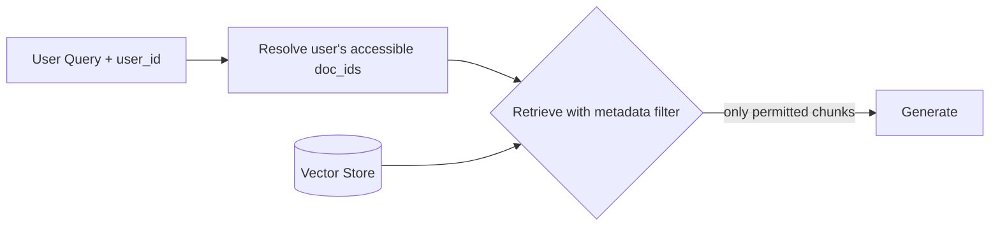

A RAG demo over a single, public, static document set is a solved problem. Enterprise RAG is a different engineering problem entirely, because the documents are private, permissioned, constantly changing, and owned by dozens of teams who each expect their access controls to be respected. This post covers the issues that only surface once you deploy RAG against real enterprise content.

## Document-Level Access Control

The single most common enterprise RAG bug: retrieval returns a chunk from a document the requesting user isn't allowed to read. Vector similarity has no concept of permissions — you have to enforce them explicitly, at retrieval time, not after.



```python
def permission_filtered_retrieve(query: str, user_id: str, k: int = 8) -> list:
    accessible_doc_ids = permissions_service.get_accessible_docs(user_id)

    # Filter at the vector store level — never filter after retrieval,
    # or you'll under-fill k with permitted results while wasting the call
    # on chunks the user can never see.
    results = vector_store.similarity_search(
        query,
        k=k,
        filter={"doc_id": {"$in": accessible_doc_ids}},
    )
    return results
```

Filtering *after* retrieval is a common shortcut that quietly breaks: if 6 of your top-8 chunks belong to documents the user can't see, you return 2 chunks of context instead of 8, and answer quality craters for no reason the user can diagnose. Always push the permission filter into the vector store query itself.

For document sets with row-level or field-level sensitivity (e.g., a contract with a redacted clause for some roles), permission checks need to happen at the chunk level, not just the document level — chunk your access control metadata as granularly as your content requires.

## Multi-Tenancy

If you're serving multiple customers or business units from one system, tenant isolation needs to be enforced at the storage layer, not just the application layer:

```python
# Namespace or collection per tenant — not a shared collection with a tenant_id filter
def get_tenant_vector_store(tenant_id: str):
    return vector_store_client.get_collection(f"kb_{tenant_id}")
```

A shared collection with an application-level `tenant_id` filter works until a bug in the filter logic leaks tenant A's data into tenant B's answers — a class of bug that's easy to introduce and expensive to explain to a customer. Separate collections (or separate indexes entirely for regulated tenants) remove that failure mode structurally.

## Freshness and Incremental Indexing

Enterprise documents change constantly — wikis get edited, policies get updated, tickets get closed. A full re-index on every change doesn't scale past a few thousand documents. Track `updated_at` and re-embed only what changed:

```python
def incremental_reindex(source_docs: list[dict]):
    for doc in source_docs:
        existing = index_metadata_store.get(doc["doc_id"])
        if existing and existing["updated_at"] >= doc["updated_at"]:
            continue  # unchanged since last index

        chunks = chunk_document(doc)
        vector_store.delete(filter={"doc_id": doc["doc_id"]})  # remove stale chunks
        vector_store.add_texts(
            texts=[c.page_content for c in chunks],
            metadatas=[{**c.metadata, "doc_id": doc["doc_id"], "updated_at": doc["updated_at"]} for c in chunks],
        )
        index_metadata_store.set(doc["doc_id"], {"updated_at": doc["updated_at"]})
```

Deleting-then-adding rather than upserting matters when chunk boundaries shift between versions — an upsert by chunk ID leaves orphaned old chunks if the new version produces fewer chunks than the old one.

## PII and Sensitive Content

Enterprise document sets routinely contain PII, salary data, and legal-hold material that shouldn't end up verbatim in an LLM prompt or in logs. Two separate controls are needed:

- **Redaction before indexing** for content that should never be retrievable in raw form (SSNs, account numbers)
- **Prompt/response logging policy** — decide explicitly whether retrieved context and generated answers are logged, and if so, for how long and with what access controls

```python
import re

PII_PATTERNS = {
    "ssn": re.compile(r"\b\d{3}-\d{2}-\d{4}\b"),
    "credit_card": re.compile(r"\b\d{4}[- ]?\d{4}[- ]?\d{4}[- ]?\d{4}\b"),
}

def redact_before_indexing(text: str) -> str:
    for label, pattern in PII_PATTERNS.items():
        text = pattern.sub(f"[REDACTED_{label.upper()}]", text)
    return text
```

## Cost at Scale

Embedding and reranking costs scale with document volume and query volume independently — plan for both:

| Cost Driver           | Scales With              | Mitigation                                     |
| ---------------------- | -------------------------- | ------------------------------------------------ |
| Embedding (indexing)   | Document volume, update frequency | Incremental re-indexing, batch embedding calls |
| Vector storage          | Total chunks × dimensions  | Lower-dimension embedding models, quantization  |
| Retrieval (query time) | Query volume                | Cache embeddings for repeated/similar queries   |
| Reranking               | Query volume × candidates reranked | Rerank fewer candidates (top 20 not top 100)   |
| Generation (LLM)        | Query volume × context size | Trim context to what's actually needed          |

Query-time cost is usually the one teams underestimate — a reranker call on every query, at enterprise query volumes, adds up fast. Cache aggressively on near-duplicate queries and keep the reranking candidate pool as small as your recall metrics allow.

## Observability for Enterprise RAG

Beyond the [general agent observability guidance](/posts/from-chatbot-to-agent-architecture/), enterprise RAG needs to log, per query: which user asked, which documents were in the accessible set, which chunks were actually retrieved, and which document owner to notify if their content is driving wrong answers. When a business unit asks "why did the assistant say X about our product," you need to answer in minutes, not by re-running the pipeline manually.

## Key Takeaways

1. **Enforce access control at the vector store query, not after retrieval** — post-filtering silently starves the context window of permitted results
2. **Isolate tenants at the storage layer** — a shared collection with a filter is one bug away from a data leak between customers
3. **Re-index incrementally by `updated_at`** — full rebuilds don't scale past a few thousand documents
4. **Redact PII before indexing, not after** — you can't un-embed a chunk that already contains raw sensitive data
5. **Budget for query-time cost separately from indexing cost** — reranking and generation costs scale with usage, not corpus size

---

*Part of the [Agentic AI in Practice series](/tags/agentic-ai-series/) — lessons from building production multi-agent systems.*
