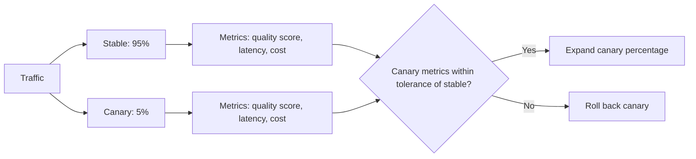

A code deploy behind a canary rollout — 5% of traffic, watch the error rate, expand or roll back — is standard practice at most engineering orgs. A prompt or model change frequently ships straight to 100% of traffic, on the reasoning that it's "just a prompt" and doesn't carry the same risk as code. It carries a different kind of risk, not less of one, and canary discipline applies just as much.

## What Makes Prompt Canaries Different

A code regression usually shows up as an error rate spike — fast, unambiguous, alertable. A prompt regression shows up as a subtle shift in output quality that doesn't trip any traditional error monitor, because the system isn't erroring, it's just answering worse. The canary process has to include a quality signal, not just availability metrics.

```python
def route_to_variant(request_id: str, canary_percentage: float) -> str:
    # Deterministic hashing keeps a given user consistently on one variant
    # for the duration of the canary, rather than flip-flopping per-request
    bucket = int(hashlib.md5(request_id.encode()).hexdigest(), 16) % 100
    return "canary" if bucket < canary_percentage else "stable"

variant = route_to_variant(user_id, canary_percentage=5)
config = prompt_configs[variant]
```

## The Comparison That Actually Matters



Running the canary variant's sampled outputs through the same automated eval/judge used for offline regression testing, and comparing its score distribution against the stable variant's, is what catches a quality regression before it reaches full traffic — waiting for user complaints means the canary already failed at its job.

## Sample Size Matters More Than People Expect

5% of low-traffic systems can mean a canary running against a handful of requests per hour — not enough to distinguish a real regression from noise for days. For lower-traffic systems, either run the canary longer before deciding, or canary against a higher percentage temporarily to get a statistically meaningful sample faster, accepting the higher blast radius as a deliberate tradeoff.

## Automate the Rollback Trigger, Not Just the Detection

Detecting a regression is only useful if it's acted on quickly. Wire the canary's quality-score comparison to an automatic rollback trigger past a defined threshold, rather than relying on a human to notice a dashboard has drifted — the whole point of canarying is to limit blast radius, and that only holds if the response to a bad canary is fast.

## Key Takeaways

1. **Prompt and model changes carry real regression risk** and deserve the same canary discipline as code
2. **Prompt regressions show up as quality drift, not error rate** — the canary needs a quality signal, not just availability metrics
3. **Deterministic routing keeps a user on one variant for the canary's duration**, avoiding a confusing flip-flop experience
4. **Automate the rollback trigger** — detection without a fast automated response defeats the purpose of canarying at all

---

*Part of the [Agentic AI in Practice series](/tags/agentic-ai-series/) — lessons from building production multi-agent systems.*
