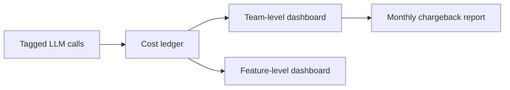

A shared LLM gateway serving multiple internal teams through one provider account, one API key, is operationally convenient and makes a very ordinary question — "which team's usage is driving this month's spend" — unanswerable after the fact unless attribution was built into the request path from the start.

## Tag at the Point of the Call, Not After

Cost attribution has to be captured at request time, when you actually know which team, service, and feature triggered the call. Reconstructing it later from logs that don't carry this metadata is either impossible or requires error-prone inference from things like IP address or timing.

```python
def make_llm_call(prompt: str, team: str, service: str, feature: str, model: str):
    response = llm_client.invoke(prompt, model=model)
    cost_ledger.record(
        team=team, service=service, feature=feature, model=model,
        input_tokens=response.usage.input_tokens,
        output_tokens=response.usage.output_tokens,
        cost_usd=compute_cost(response.usage, model),
        timestamp=time.time(),
    )
    return response
```

The three-level tag (team, service, feature) matters — team-level attribution alone tells you which team to talk to; service and feature level tells that team which part of their own system to optimize, which is the level where actual cost reductions get made.

## Enforce Tagging at the Gateway, Not by Convention

If tagging is optional or easy to skip, some fraction of calls will go untagged, and untagged spend is invisible spend — it shows up in the provider's total bill and nowhere in your attribution breakdown. A shared gateway is the right enforcement point: reject or flag untagged calls rather than trusting every caller to remember.

```python
def gateway_middleware(request):
    if not all([request.headers.get("X-Team"), request.headers.get("X-Feature")]):
        raise ValueError("LLM calls must be tagged with team and feature")
    return forward_to_provider(request)
```

## Build the Dashboard Before Finance Asks for It



A team-level and feature-level cost dashboard, built proactively, changes the conversation from a reactive "here's an unexpected invoice, please explain" to a routine one where teams can see their own trend and self-correct before a cost review meeting even happens. This is worth building before the first time finance asks, not in response to it.

## Anomaly Detection Comes Free Once You Have This

Once cost is broken down by team and feature, spotting an anomaly — one feature's spend doubling week over week — becomes a simple threshold check on a dimension you already have, rather than a fresh investigation into a lump-sum total that gives no indication of where to look.

## Key Takeaways

1. **Tag cost at the point of the call** — team, service, and feature — reconstructing it later is unreliable or impossible
2. **Enforce tagging at the gateway**, not by convention — optional tagging becomes invisible spend
3. **Build the cost dashboard proactively** — it changes cost conversations from reactive to routine
4. **Anomaly detection is a threshold check once attribution exists** — it's a fresh investigation without it

---

*Part of the [Agentic AI in Practice series](/tags/agentic-ai-series/) — lessons from building production multi-agent systems.*
