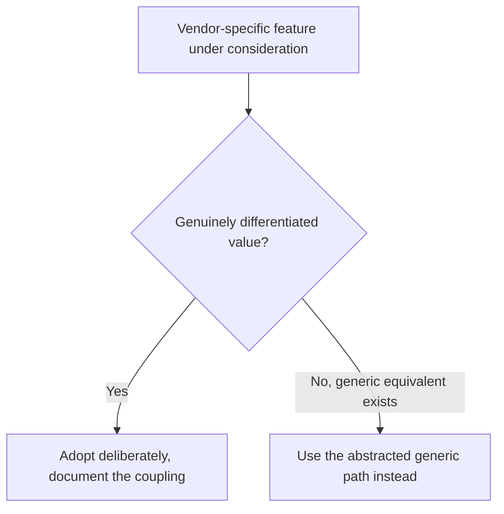

Every managed vector database vendor makes migration harder the longer you use it — not through any hostile design, just as a natural consequence of adopting vendor-specific features (proprietary filtering syntax, unique index types, built-in reranking modules) that don't have a drop-in equivalent elsewhere. The lock-in isn't a cliff; it's a slope you're already on from the first API call.

## The Real Cost of Lock-In Isn't the Migration Itself

It's leverage. A vendor that knows switching costs are high has less pressure to compete on price at renewal time. This is true even if you never actually intend to migrate — the *credible option* to migrate is what keeps pricing conversations honest, and that option erodes with every vendor-specific feature adopted without an abstraction layer underneath it.

## An Abstraction Layer, Kept Thin

The standard mitigation is a retrieval interface your application code depends on, with vendor-specific implementations behind it:

```python
from abc import ABC, abstractmethod

class VectorStore(ABC):
    @abstractmethod
    def upsert(self, ids: list[str], vectors: list[list[float]], metadata: list[dict]): ...
    @abstractmethod
    def search(self, query_vector: list[float], top_k: int, filter: dict) -> list[dict]: ...

class PineconeStore(VectorStore):
    def search(self, query_vector, top_k, filter):
        # translate the generic filter dict into Pinecone's specific filter DSL
        ...

class QdrantStore(VectorStore):
    def search(self, query_vector, top_k, filter):
        # translate into Qdrant's filter syntax
        ...
```

The discipline that makes this actually work is resisting the temptation to reach past the abstraction for a vendor-specific feature when it would be convenient — every such exception re-couples application code to that vendor and quietly widens the migration gap the abstraction was meant to bound.

## Where the Abstraction Breaks Down, Honestly

Vendor-specific advanced features — built-in hybrid search fusion logic, proprietary rerankers, specific index-tuning parameters — genuinely don't have equivalents behind a thin common interface, and forcing them into one either loses the feature's value or makes the abstraction leaky anyway. Be deliberate: decide explicitly which vendor-specific capabilities are worth the coupling, rather than accumulating them incidentally.



## Data Export Matters More Than API Compatibility

The actual migration bottleneck is rarely rewriting query code — it's exporting embeddings and metadata at scale without re-computing them from scratch, which can be a meaningful re-indexing cost on its own. Confirm the vendor supports bulk export in a format you can re-ingest elsewhere *before* you're locked in enough to need it, not after.

## Key Takeaways

1. **Lock-in cost is mostly about negotiating leverage**, not the hypothetical migration itself
2. **A thin abstraction layer bounds the coupling** — the discipline is not reaching past it for convenience
3. **Some vendor-specific features are worth the coupling** — decide that deliberately, not incidentally
4. **Verify bulk data export capability early** — it's the actual migration bottleneck, more than query syntax differences

---

*Part of the [Agentic AI in Practice series](/tags/agentic-ai-series/) — lessons from building production multi-agent systems.*
