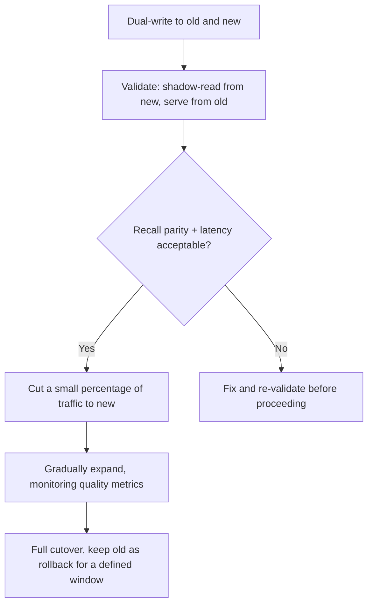

"Export the vectors, import them into the new database, point the application at it" describes the mechanical steps of a vector database migration and skips every part that actually determines whether it goes well. A migration plan that stops at the mechanics is missing the parts that cause production incidents.

## What to Verify Before Committing

**Recall parity.** The new database's index (a different HNSW implementation, different default parameters) can produce a meaningfully different top-k result set for the same query, even with identical vectors, because approximate nearest-neighbor search trades exactness for speed differently across implementations. Run your offline retrieval eval (precision@k, recall@k, MRR — the same metrics from earlier in this series) against both databases before cutting over, not after.

```python
def compare_recall_parity(eval_set: list[dict], old_store, new_store, k: int = 5) -> dict:
    old_metrics = evaluate_retrieval(eval_set, old_store, k)
    new_metrics = evaluate_retrieval(eval_set, new_store, k)
    return {
        "old": old_metrics,
        "new": new_metrics,
        "recall_delta": new_metrics["recall@k"] - old_metrics["recall@k"],
    }
```

**Latency under realistic load, not a quick smoke test.** A migration tested with a handful of manual queries can look identical in latency to the old system and diverge significantly under production concurrency — index parameters that work well at low QPS sometimes don't scale the same way. Load test at realistic (or slightly above realistic) concurrency before cutover.

**Filter semantics.** Metadata filtering syntax and behavior differ across vector databases in ways that aren't always obvious from documentation — how `$in` handles an empty list, how range filters treat null values, whether filters compose with AND or OR by default when multiple are specified. Test the actual filter queries your application uses, not just basic search.

## The Cutover Strategy



Shadow-reading — querying both databases in parallel, serving from the old one, logging the comparison — surfaces divergence before any user sees an effect, and is worth the extra infrastructure cost for the duration of the migration validation window.

## Don't Delete the Old Index Immediately

Keep the old vector database running, even if not serving traffic, for a defined rollback window after full cutover. Re-indexing from scratch if a subtle issue surfaces a week after decommissioning is a far worse position than paying for parallel infrastructure briefly.

## Key Takeaways

1. **Recall parity isn't guaranteed even with identical vectors** — different ANN implementations behave differently; measure it explicitly
2. **Load test at realistic concurrency**, not a quick manual smoke test — index behavior can diverge under real load
3. **Test actual filter queries your application uses** — filter semantics vary meaningfully across vector databases
4. **Shadow-read before cutover, and keep the old index alive through a rollback window** after full cutover

---

*Part of the [Agentic AI in Practice series](/tags/agentic-ai-series/) — lessons from building production multi-agent systems.*
