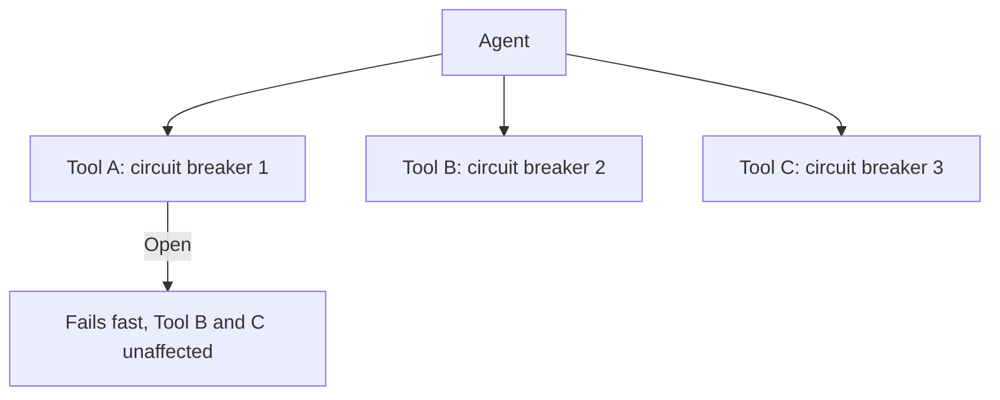

An agent hitting a failing downstream tool will, left to its own devices, retry — sometimes because you built explicit retry logic, sometimes because the model itself decides to "try again" as a reasoning step. Under a real outage, dozens or hundreds of agent instances all retrying the same failing dependency doesn't just fail to get useful work done — it can meaningfully add load to a service that's already struggling, turning a partial outage into a worse one.

## The Pattern, Applied to Agent Tool Calls

A circuit breaker tracks a downstream dependency's recent failure rate and, once it crosses a threshold, stops sending requests entirely for a cooldown period — failing fast instead of piling onto a struggling service, and giving it room to recover instead of adding load during recovery.

```python
class CircuitBreaker:
    def __init__(self, failure_threshold: int = 5, cooldown_seconds: int = 30):
        self.failure_threshold = failure_threshold
        self.cooldown_seconds = cooldown_seconds
        self.failures = 0
        self.state = "closed"  # closed = normal, open = failing fast, half_open = testing recovery
        self.opened_at = None

    def call(self, fn, *args, **kwargs):
        if self.state == "open":
            if time.monotonic() - self.opened_at > self.cooldown_seconds:
                self.state = "half_open"
            else:
                raise CircuitOpenError("Tool unavailable, circuit open")
        try:
            result = fn(*args, **kwargs)
            if self.state == "half_open":
                self.state = "closed"
                self.failures = 0
            return result
        except Exception:
            self.failures += 1
            if self.failures >= self.failure_threshold:
                self.state = "open"
                self.opened_at = time.monotonic()
            raise
```

## Give the Agent a Way to Reason About "Circuit Open"

A raw exception when a circuit is open is correct for the infrastructure layer and useless for the agent's reasoning unless it's surfaced as something the model can act on. Return a structured, model-readable signal instead of letting the exception propagate as an opaque failure:

```python
@tool("search_inventory")
def search_inventory(query: str) -> str:
    try:
        return inventory_breaker.call(inventory_api.search, query)
    except CircuitOpenError:
        return "Inventory search is temporarily unavailable (service degraded). Do not retry this immediately — inform the user or try an alternative approach."
```

The explicit "do not retry this immediately" instruction matters — without it, a capable model will sometimes retry the same tool call anyway, defeating the circuit breaker's purpose at the reasoning layer even though it's enforced correctly at the infrastructure layer.

## Per-Tool, Not Global

A single circuit breaker across all of an agent's tools means one flaky tool trips the breaker for every tool, even healthy ones. Scope circuit breakers per tool (or per downstream dependency, if multiple tools share one), so a failure in one integration doesn't take down the agent's access to unrelated, healthy tools.



## Key Takeaways

1. **An agent retrying a failing tool can amplify an outage** — circuit breakers stop that amplification structurally
2. **Surface "circuit open" as a model-readable tool result**, not a raw exception, and tell the model explicitly not to retry immediately
3. **Scope circuit breakers per tool**, not globally, so one flaky integration doesn't disable healthy ones
4. **The cooldown period gives the downstream service room to recover** instead of adding load during recovery

---

*Part of the [Agentic AI in Practice series](/tags/agentic-ai-series/) — lessons from building production multi-agent systems.*
