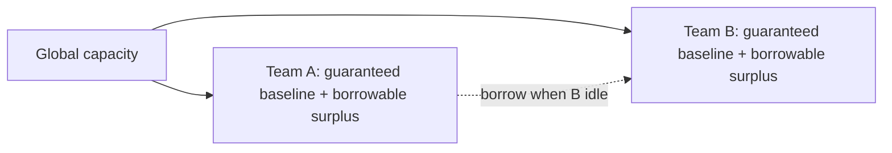

A tool server shared across multiple teams' agents — an internal search API, a document processing service — will, without per-consumer rate limiting, let whichever team's agent happens to be busiest at a given moment consume most of the available capacity. This isn't a malicious scenario; it's the default outcome of shared infrastructure with a global rate limit and no per-consumer fairness logic.

## Global Limits Don't Solve This

A single global rate limit on the tool server protects the server from being overwhelmed in aggregate. It does nothing to ensure fair allocation *among* the consumers sharing that budget — team A running an unusually large batch job can consume the entire global limit, leaving team B's normal-volume traffic rate-limited even though team B didn't do anything differently than usual.

## Per-Consumer Fair-Share Limiting

```python
class FairShareLimiter:
    def __init__(self, global_limit_per_sec: int, teams: list[str]):
        self.global_limit = global_limit_per_sec
        self.per_team_limit = global_limit_per_sec // len(teams)  # equal baseline share
        self.buckets = {team: TokenBucket(self.per_team_limit) for team in teams}

    def allow(self, team: str) -> bool:
        return self.buckets[team].try_consume(1)
```

An equal per-team split is the simplest starting point and often not the fairest one in practice — a team running a latency-sensitive customer-facing agent has a different priority than a team running an overnight batch job, even at equal traffic volume. Weighted fair-share, where each team's guaranteed baseline reflects actual priority rather than an even split, is usually the better production model:

```python
team_weights = {"customer-support": 0.5, "internal-analytics": 0.2, "batch-reporting": 0.3}
per_team_limit = {team: int(global_limit_per_sec * weight) for team, weight in team_weights.items()}
```

## Let Unused Capacity Be Borrowed, Within Limits

A strict per-team ceiling wastes capacity when one team is idle and another is bursting — the whole point of a *shared* server is to pool capacity, not partition it as if each team had a dedicated instance. A borrowing scheme lets a team temporarily exceed its baseline share when others aren't using theirs, while still enforcing the baseline as a floor each team is guaranteed even during contention:



## Make the Limit Visible to the Agent, Not Just Enforced Silently

The same principle from circuit breakers applies here: when a team's agent is rate-limited, the response should be a structured, model-readable signal ("rate limit reached, retry after Xs") rather than a generic error, so the agent's own retry or backoff logic can act on it sensibly instead of hammering the limit repeatedly.

## Key Takeaways

1. **A global rate limit doesn't guarantee fair allocation among consumers sharing it** — one busy team can starve another
2. **Weighted fair-share, reflecting actual priority, usually beats an equal per-team split**
3. **Allow borrowing of unused capacity within a guaranteed baseline** — strict partitioning wastes the point of shared infrastructure
4. **Surface rate-limit signals in a model-readable format** so agent retry logic can respond sensibly

---

*Part of the [Agentic AI in Practice series](/tags/agentic-ai-series/) — lessons from building production multi-agent systems.*
