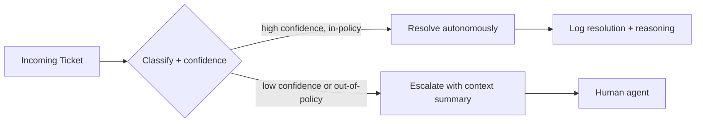

It's easy to find agentic AI demos. It's harder to find honest accounts of what's actually running in production and delivering measured value. This post covers five use case patterns that show up repeatedly across enterprises deploying agentic AI, with the architecture shape and the ROI signal that justified each one.

## 1. Customer Support Triage and Resolution

**The problem**: support queues mix trivial questions ("what's my order status") with genuinely complex ones, and routing them all through a human triage step is expensive and slow.

**The pattern**: an agent classifies incoming tickets, resolves the ones it can autonomously (using tools to look up order status, process standard refunds within policy limits, answer from a knowledge base via RAG), and escalates with a structured summary for anything outside its confidence or authority.



**ROI signal**: percentage of tickets resolved without human touch, and average handle time for the tickets that do escalate (a good summary from the agent should cut human resolution time even when it can't resolve independently).

**What makes this work**: the escalation path is not a failure mode, it's a first-class feature. An agent that fabricates a resolution rather than escalating a low-confidence case erodes trust fast — the [best-practices post](/posts/best-practices-reliable-agentic-systems/) covers guardrails for exactly this.

## 2. IT Operations and Incident Response

**The problem**: on-call engineers spend the first 10–20 minutes of an incident on the same diagnostic steps — checking recent deploys, error rate dashboards, related past incidents — before they can start actually fixing anything.

**The pattern**: an agent triggered by an alert gathers context automatically (recent deploys, relevant logs, similar past incidents from a RAG index over the incident history), proposes a hypothesis, and drafts the first version of the incident summary — with a human still making every action decision.

**ROI signal**: time-to-first-hypothesis, and reduction in mean-time-to-acknowledge because the on-call engineer opens the incident channel to a pre-populated context brief instead of a blank page.

**Critical constraint**: this pattern stays firmly human-in-the-loop for anything that touches production — the agent gathers and proposes, a human approves and executes. Enterprises that skip this constraint and let the agent restart services or roll back deploys autonomously are taking on incident-response risk that hasn't been earned by track record yet.

## 3. Sales Intelligence and Account Research

**The problem**: reps spend hours before a call assembling account context — recent news, org chart changes, past support tickets, contract terms — time that doesn't scale with pipeline size.

**The pattern**: a multi-agent system (a natural fit for [CrewAI's role-based model](/posts/multi-agent-orchestration-crewai/)) with specialized agents for news research, CRM history retrieval, and contract summary, coordinated into a single account brief generated automatically ahead of scheduled calls.

**ROI signal**: rep prep time saved per call, and — more importantly — whether reps report the briefs as actually useful rather than generic. This use case fails quietly if the output reads like a templated summary instead of surfacing the one or two facts that matter for this specific call.

## 4. Finance Reconciliation and Reporting

**The problem**: month-end close involves reconciling numbers across systems that don't agree — ERP, billing, bank statements — and tracking down discrepancies is manual, tedious, and error-prone.

**The pattern**: an agent with tools to query each system, compare figures, and flag discrepancies above a threshold, producing a structured exception report rather than "fixing" anything itself. This is a high-stakes domain, so the agent's role is strictly limited to *finding and explaining* discrepancies — a human always makes the correcting entry.

```python
@tool
def compare_ledger_balances(account_id: str, period: str) -> str:
    """Compare ERP and bank statement balances for an account/period. Returns discrepancies only."""
    erp_balance = erp_client.get_balance(account_id, period)
    bank_balance = bank_client.get_balance(account_id, period)
    diff = abs(erp_balance - bank_balance)
    if diff < DISCREPANCY_THRESHOLD:
        return f"No material discrepancy for {account_id} ({period}): within threshold."
    return (
        f"DISCREPANCY: {account_id} ({period}) — ERP: {erp_balance}, "
        f"Bank: {bank_balance}, Diff: {diff}. Requires human review."
    )
```

**ROI signal**: close-cycle time reduction, and the ratio of true-positive to false-positive discrepancy flags — a reconciliation agent that cries wolf on every minor rounding difference gets ignored within a week.

## 5. Contract and Legal Document Review

**The problem**: reviewing incoming contracts for non-standard clauses is slow and requires legal expertise that's expensive to apply to every routine vendor agreement.

**The pattern**: an agent compares an incoming contract against a playbook of standard clauses (via RAG over the playbook and past approved contracts), flags deviations with the specific clause and standard language it deviates from, and routes contracts with no material deviations for fast-track approval. This mirrors the same triage pattern as customer support — resolve the routine cases, escalate the exceptions with structured context.

**ROI signal**: percentage of contracts fast-tracked without full manual review, and — critically — a false-negative rate near zero on flagging deviations. Unlike the other four use cases, an error here (missing a real deviation) has outsized downside, so this pattern needs a materially higher evaluation bar before it's trusted to fast-track anything.

## The Common Thread

| Use Case              | Autonomy Level                     | Escalation Is                  |
| ---------------------- | ------------------------------------ | --------------------------------- |
| Support triage          | Resolve routine, escalate the rest  | A designed feature, not a failure |
| Incident response       | Gather + propose, human executes    | The default for anything production-touching |
| Sales research          | Fully autonomous brief generation   | N/A — output is informational only |
| Finance reconciliation  | Flag only, human corrects           | Every discrepancy, by design      |
| Contract review         | Fast-track clean cases only         | Any deviation, with a high recall bar |

Every use case that's actually delivering ROI shares the same shape: **the agent's autonomy is scoped tightly to what it can do reliably, and escalation to a human is designed in from day one, not bolted on after the first embarrassing mistake.** The enterprises struggling with agentic AI ROI are almost always the ones that skipped this scoping step and tried to automate the entire workflow end-to-end before establishing where the agent is actually trustworthy.

## Key Takeaways

1. **Scope autonomy to what the agent can do reliably** — the goal is not maximum automation, it's automation matched to demonstrated reliability
2. **Design escalation as a feature, not a fallback** — a good escalation with rich context is often the majority of the value, even when the agent can't resolve independently
3. **Match the human-in-the-loop bar to the cost of being wrong** — finance and legal need near-zero false negatives; sales research tolerates more variance
4. **Measure the metric that matters, not just "did the agent respond"** — resolution rate, time saved, false-positive rate — pick per use case
5. **Start where the routine/exception split is clean** — the five patterns above all work because most inputs are routine and the exceptions are identifiable

---

*Part of the [Agentic AI in Practice series](/tags/agentic-ai-series/) — lessons from building production multi-agent systems.*
