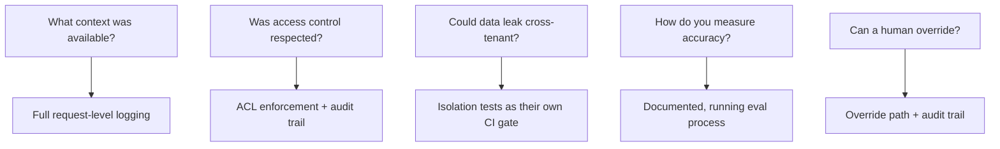

Engineering teams often approach a compliance review expecting a vague, hard-to-satisfy bar — "prove the AI is safe." In practice, compliance reviews for RAG systems in regulated industries (finance, healthcare, insurance) ask a specific, bounded set of questions. Knowing them before you build makes the review a formality instead of a redesign.

## The Questions That Actually Come Up

**"Can you show exactly what information was available to the system when it generated this specific response?"** This is a logging and reproducibility requirement — the retrieved context for every production response needs to be logged and retrievable by request ID, not just the final answer (the same logging discipline from earlier in this series on [RAG observability](/posts/rag-observability-beyond-final-answer/)).

**"Who was allowed to access this document, and did the system respect that?"** Covered by retrieval-time access control ([earlier post](/posts/access-control-retrieval-row-level-security/)) — but compliance additionally wants an audit trail proving the check happened, not just that it's implemented in code.

**"How do you know the system doesn't leak PII from one customer's records into another customer's answer?"** This is the multi-tenant isolation question, plus PII redaction, plus a specific test suite demonstrating both — compliance teams generally want to see test evidence, not just architectural description.

**"What happens when the system is wrong, and how would you know?"** This is the eval and monitoring question — a documented process for measuring accuracy, not a claim that the system is accurate.

**"Can a human override or correct a system decision, and is that override auditable?"** For any RAG system informing a decision with real consequences (a claims decision, a lending decision), full autonomy without an override path is rarely acceptable, and the override itself needs its own audit trail.

## Building for This From the Start

Every one of these maps to something covered earlier in this series — the compliance review isn't a separate workstream bolted on at the end, it's largely a documentation and evidence-gathering exercise on top of infrastructure that should already exist for operational reasons.

## The Gap Teams Actually Get Caught On

Not missing infrastructure — missing *evidence*. A team that built proper access control but never wrote a test proving cross-tenant isolation, or logs retrieved context but has no documented retention/access policy for those logs, has the engineering right and the compliance evidence incomplete. Build the evidence artifacts (test suites, documented policies, audit trail samples) alongside the infrastructure, not as an afterthought before a review.

## Key Takeaways

1. **Compliance questions are specific and bounded**, not a vague "prove it's safe" bar
2. **Most of them map directly to infrastructure that should exist for operational reasons anyway** — logging, access control, isolation, eval
3. **The gap teams get caught on is evidence, not engineering** — a test suite proving isolation, not just isolation that works
4. **Build compliance evidence artifacts alongside the infrastructure**, not scrambled together right before a review

---

*Part of the [Agentic AI in Practice series](/tags/agentic-ai-series/) — lessons from building production multi-agent systems.*
