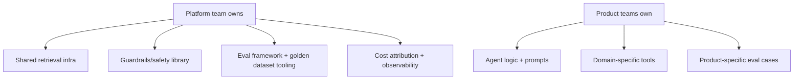

The signal that it's time for an internal agent platform team isn't a headcount milestone — it's three or more product teams independently solving the same infrastructure problems (retrieval pipelines, guardrails, evaluation harnesses, cost tracking) with three incompatible implementations, none of which get the ongoing investment a shared, owned system would.

## What the Platform Team Actually Owns

The scope that works, based on what tends to actually get duplicated: shared retrieval infrastructure, a guardrails/safety library, an evaluation framework and golden-dataset tooling, and cost attribution and observability. Notably *not* on this list: the actual agent logic and prompts for any specific product use case — that stays with product teams, who understand their domain better than a central platform team ever will.



## Build the Second Consumer Before the First Abstraction

The common mistake is over-engineering a platform for hypothetical future consumers before a second real one exists. The stronger pattern: build the first version embedded in one product team's actual use case, get it working there, and only extract it into a shared platform once a second team's genuine need proves the abstraction is right — not guessed at. This avoids building generic infrastructure nobody's actual requirements shaped.

## The Team Composition That Works at Small Scale

A platform team doesn't need to start large. A workable starting shape: one engineer focused on retrieval/RAG infrastructure, one on evaluation and guardrails, and a lead who splits time between platform work and staying close enough to product teams' actual usage to keep the roadmap grounded in real needs rather than platform-team-internal priorities.

## The Metric That Actually Matters

Not "how many teams use the platform" — that's a vanity metric that rewards mandating adoption over earning it. The metric that reflects genuine value: time from "product team wants to build an agent feature" to "that feature is in production with proper guardrails and eval coverage," compared for teams using the platform versus teams building from scratch. If the platform doesn't measurably shrink that number, it's not delivering the thing it exists to deliver, regardless of adoption count.

```python
def platform_value_metric(team: str) -> dict:
    return {
        "team": team,
        "used_platform": team in platform_adopters,
        "days_idea_to_production": get_time_to_production(team),
        "had_guardrails_at_launch": had_guardrails(team),
        "had_eval_coverage_at_launch": had_eval_coverage(team),
    }
```

## Key Takeaways

1. **The signal to build a platform team is duplicated infrastructure across 3+ product teams**, not a headcount target
2. **Own shared infrastructure, not product-specific agent logic** — that stays with the teams who understand their domain
3. **Extract the platform from a real second consumer's need**, not a guess at future requirements
4. **Measure time-to-production-with-proper-guardrails, not adoption count** — adoption without that improvement isn't the platform doing its job

---

*Part of the [Agentic AI in Practice series](/tags/agentic-ai-series/) — lessons from building production multi-agent systems.*
