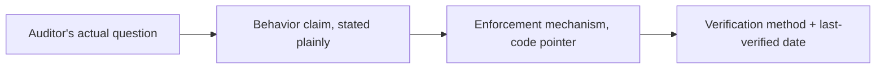

Handing an auditor your codebase and prompt files, expecting them to reconstruct how the system behaves, doesn't work — not because the code is badly written, but because "how does this system behave" is a different question than "what does this code do," and auditors generally aren't positioned to bridge that gap from source alone. The documentation needs to answer their actual question directly.

## The Format That Actually Answers Their Question

Not an architecture diagram (useful for engineers, opaque to a non-technical auditor) and not a prompt dump (technically complete, practically unreadable as a behavior spec). What works: a **behavior specification** — plain-language statements of what the system does and doesn't do, each backed by a pointer to the actual enforcement mechanism and the test that verifies it.

```markdown
## Behavior: Customer data isolation
**Claim**: The system never includes one customer's data in another customer's response.
**Enforcement**: Retrieval-time tenant_id filter (see `retrieval/tenant_scoped.py`)
**Verification**: Automated isolation test suite, run on every deploy (see `tests/test_isolation.py`)
**Last verified**: 2026-05-20, all tests passing

## Behavior: Human override capability
**Claim**: Any system-generated decision can be reviewed and overridden by an authorized human.
**Enforcement**: Override UI + audit log (see `review/override_service.py`)
**Verification**: Manual review, quarterly override-usage audit
**Last verified**: 2026-05-01, 14 overrides logged and reviewed
```

The "last verified" field matters as much as the claim itself — a behavior document with no recency signal invites the reasonable question of whether it's still accurate, which is exactly the question an auditor is there to ask.

## Map Behaviors to the Compliance Questions Directly

This works best organized around the actual questions compliance and audit teams ask — access control, data isolation, accuracy measurement, override capability, from the [regulated-industries post](/posts/rag-regulated-industries-compliance/) earlier in this series — rather than around your internal architecture. An auditor reading top-to-bottom through "here's how our microservices are organized" has to do the mapping to their actual question themselves; organizing the document around their questions does that work for them.



## Keep It Current, Not Just Comprehensive

A behavior document that's accurate at launch and never updated becomes actively misleading the first time the underlying enforcement mechanism changes. Tie updates to the same PR review process from the prompt change-management post — a code change affecting a documented behavior should require updating the corresponding behavior doc entry in the same PR, not as separate, easily-forgotten follow-up work.

## Key Takeaways

1. **Auditors need plain-language behavior claims with enforcement pointers**, not code or architecture diagrams
2. **Every claim needs a verification method and a last-verified date** — an undated claim invites doubt about its currency
3. **Organize around the compliance questions being asked**, not around your internal system architecture
4. **Tie documentation updates to the same PR that changes the underlying behavior** — otherwise it drifts out of date silently

---

*Part of the [Agentic AI in Practice series](/tags/agentic-ai-series/) — lessons from building production multi-agent systems.*
