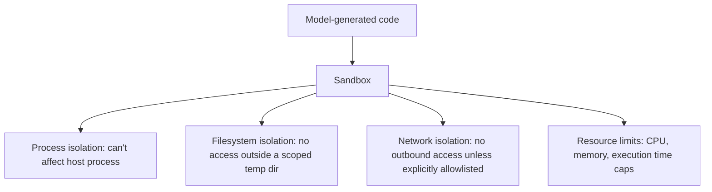

Any agent tool that executes model-generated code — a "run this Python snippet" tool, a SQL execution tool, a shell command tool — is, without a sandbox, functionally equivalent to giving an untrusted, occasionally-adversarial input source direct code execution on your infrastructure. Prompt injection is the most direct path to that adversarial input, but it isn't the only one; even a well-intentioned model can generate code that does something unintended.

## What "Sandbox" Actually Needs to Mean

A sandbox that only limits CPU and memory isn't a security boundary — it's a resource limit. Real isolation for agent-executed code needs process isolation, filesystem isolation, and network isolation, each addressing a distinct risk:



## A Practical Implementation

Container-based sandboxing (a fresh, ephemeral container per execution, destroyed after) is the standard approach — it gives real process and filesystem isolation without building a custom interpreter-level sandbox, which is a much harder security problem to get right from scratch.

```python
import docker

def execute_sandboxed(code: str, timeout_seconds: int = 10) -> dict:
    client = docker.from_env()
    try:
        result = client.containers.run(
            image="python:3.12-slim",
            command=["python", "-c", code],
            network_disabled=True,          # no network access at all
            mem_limit="256m",
            cpu_quota=50000,                # 50% of one CPU
            read_only=True,                 # no filesystem writes outside /tmp
            tmpfs={"/tmp": "size=64m"},
            remove=True,
            timeout=timeout_seconds,
        )
        return {"success": True, "output": result.decode()}
    except docker.errors.ContainerError as e:
        return {"success": False, "error": str(e)}
```

`network_disabled=True` is the single highest-leverage line in that configuration — most damage a malicious or buggy generated script could do (exfiltrating data, calling an unintended external service) requires network access, and removing it entirely closes off that entire category of risk even if other controls have gaps.

## Network Access, If You Need It, Should Be Explicitly Allowlisted

Some legitimate use cases need the sandboxed code to call specific external APIs. Rather than enabling general network access, proxy through an allowlisted egress gateway that only permits calls to specifically approved destinations — the sandbox never gets unrestricted network access, only a narrow, auditable path to what it actually needs.

## Test the Sandbox Like an Attacker Would

Standard functional testing verifies the sandbox runs legitimate code correctly. Security testing needs to verify it correctly *blocks* what it's supposed to block: attempted filesystem escapes, attempted network calls, resource exhaustion attempts, and attempted process/container escapes. This is a distinct test suite, ideally maintained or reviewed by someone thinking adversarially, not just the team that built the sandbox.

## Key Takeaways

1. **Resource limits alone are not a security boundary** — real sandboxing needs process, filesystem, and network isolation
2. **Container-based, ephemeral-per-execution sandboxing is the practical standard** — building custom interpreter-level isolation is a harder problem than it looks
3. **Disable network access by default**; if needed, proxy through an explicit allowlist rather than granting general access
4. **Test the sandbox adversarially**, as its own security test suite — not just for functional correctness

---

*Part of the [Agentic AI in Practice series](/tags/agentic-ai-series/) — lessons from building production multi-agent systems.*
