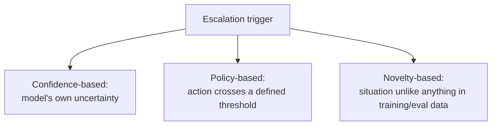

The instinct to measure agent maturity by how rarely it needs human intervention gets escalation backwards. An agent that never escalates hasn't necessarily gotten better — it may have simply stopped flagging the cases where it should. Escalation isn't a sign of an incomplete system; done well, it's what makes an agent trustworthy enough to operate with real autonomy on everything else.

## Three Categories of Escalation Trigger



**Confidence-based escalation** relies on the model's own signal of uncertainty — genuinely useful when available and calibrated, unreliable when it isn't (an overconfident model escalates too rarely; an undercalibrated one escalates too often and erodes trust in the system's autonomy).

**Policy-based escalation** is deterministic and doesn't depend on the model's self-assessment at all: any action above a dollar threshold, any decision affecting a specific protected category, any action that's irreversible — these get routed to a human regardless of how confident the model is. This is the most reliable category precisely because it doesn't trust the model to know when it needs help.

**Novelty-based escalation** flags situations that don't resemble anything in the eval set or recent operating history — a proxy for "we don't actually know how the system behaves here," which is a different and often more important signal than the model's stated confidence on a case it may not recognize as unusual.

## Policy-Based Should Be the Backstop, Always

```python
ESCALATION_POLICIES = [
    {"condition": lambda action: action.dollar_amount > 5000, "reason": "high-value action"},
    {"condition": lambda action: action.type == "irreversible", "reason": "irreversible action"},
    {"condition": lambda action: action.affects_protected_category, "reason": "protected category"},
]

def should_escalate(action, model_confidence: float) -> tuple[bool, str]:
    for policy in ESCALATION_POLICIES:
        if policy["condition"](action):
            return True, policy["reason"]
    if model_confidence < 0.7:
        return True, "low model confidence"
    return False, ""
```

Policy checks run first and unconditionally, before confidence-based escalation is even consulted — this is deliberate. A model that's highly confident about a $50,000 action should still escalate, because confidence was never the thing that should have gated that decision in the first place.

## Design the Escalation UX, Not Just the Trigger

An escalation that dumps raw agent state on a human reviewer with no summary of what decision is needed and why is nearly as bad as no escalation — the human either rubber-stamps it without real review (defeating the purpose) or has to spend real time reconstructing context the system already had. A good escalation includes a plain-language summary of the situation, the specific decision needed, and the relevant context, formatted for a human to act on quickly.

## Key Takeaways

1. **Escalation is a trust-building feature, not evidence of an incomplete system** — measure it, don't just minimize it
2. **Policy-based triggers should run first and unconditionally** — never let model confidence override a hard policy threshold
3. **Novelty-based escalation catches what confidence-based escalation misses** — situations the model may not recognize as unusual
4. **Design the escalation UX with the same care as the trigger logic** — a raw state dump defeats the purpose of escalating at all

---

*Part of the [Agentic AI in Practice series](/tags/agentic-ai-series/) — lessons from building production multi-agent systems.*
