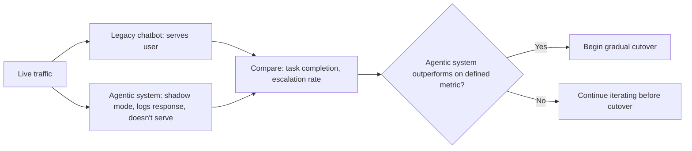

A legacy rules-based or intent-classification chatbot fails predictably — it says "I don't understand" on inputs outside its coverage, which is annoying but bounded and visible. An agentic replacement fails differently — it will usually attempt an answer even on inputs it handles poorly, which can be worse for the user even when it's a net improvement in aggregate, because the failure mode changed from "visibly can't help" to "confidently unhelpful."

## Don't Cut Over on Faith

The retirement plan that works: run both systems in parallel against the same live traffic for a defined period, compare outcomes on a metric that reflects the thing you actually care about (task completion, escalation-to-human rate, user-reported satisfaction), and only retire the legacy system once the new one demonstrably outperforms it on that metric, not just on a qualitative sense that it's "smarter."



## The Coverage Gap You're Likely to Discover

Legacy rules-based systems, for all their limitations, often encode years of accumulated edge-case handling — specific phrasings, specific escalation triggers for specific scenarios — that were added reactively over time in response to real incidents. An agentic rewrite, built fresh, doesn't automatically inherit that accumulated knowledge unless someone deliberately mines the old system's rules and conversation logs for cases to fold into the new system's eval set and guardrails.

```python
def extract_legacy_edge_cases(legacy_rules_config, legacy_conversation_logs) -> list[dict]:
    """Mine the old system for cases the new system needs to handle explicitly."""
    edge_cases = []
    for rule in legacy_rules_config.rules:
        if rule.trigger_type == "escalation":
            edge_cases.append({"input_pattern": rule.pattern, "expected_behavior": "escalate", "source": "legacy_rule"})
    # Also mine logs for conversations that hit specific legacy fallback paths
    return edge_cases
```

This mining step is easy to skip under deadline pressure, and it's usually where the most painful post-launch regressions come from — not the agentic system being worse in general, but it being worse specifically on the narrow set of cases the legacy system had quietly gotten right through years of patches.

## Keep an Explicit Fallback to the Legacy Behavior for High-Risk Cases

For the subset of interactions with real consequences — anything the legacy system's escalation rules were built to catch — consider keeping those specific rules active as a hard override even after the general cutover, rather than trusting the new agentic system's judgment on exactly the cases the old system was most carefully tuned for.

## Key Takeaways

1. **Agentic and rules-based systems fail differently** — a straight cutover trades a visible failure mode for an invisible one
2. **Run both in parallel and compare on a real outcome metric** before retiring the legacy system, not on a qualitative sense of improvement
3. **Mine the legacy system's rules and logs for accumulated edge-case handling** — it won't transfer automatically to a fresh rewrite
4. **Keep hard overrides for the legacy system's most carefully-tuned high-risk cases**, even after general cutover

---

*Part of the [Agentic AI in Practice series](/tags/agentic-ai-series/) — lessons from building production multi-agent systems.*
