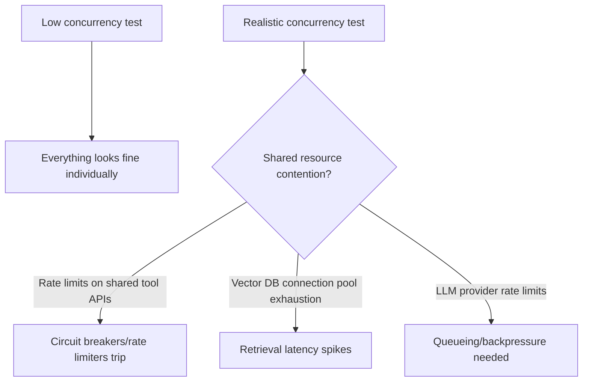

Standard load testing tooling (fire N concurrent requests, measure response time and error rate) was built for services with roughly deterministic, fast response characteristics. An agent pipeline breaks both assumptions — response time varies enormously based on how many tool calls or reasoning steps a given request needs, and "correct" isn't binary the way an HTTP 200 is. Load testing an agent pipeline needs adjustments to the standard playbook, not just a bigger concurrency number.

## Simulate Realistic Request Diversity, Not Uniform Load

A load test that fires the same simple request a thousand times measures something real (raw throughput ceiling) and misses the thing that actually matters in production: how the system behaves under a realistic *mix* of simple and complex requests concurrently, where a handful of expensive multi-hop requests can starve resources that simpler requests also need.

```python
def generate_load_test_traffic(duration_seconds: int, requests_per_second: float) -> list[dict]:
    # Weighted sample matching observed production request-type distribution,
    # not a uniform mix and not all-simple
    request_types = load_production_distribution()  # e.g. {"simple": 0.7, "multi_hop": 0.2, "complex_synthesis": 0.1}
    traffic = []
    for _ in range(int(duration_seconds * requests_per_second)):
        req_type = weighted_choice(request_types)
        traffic.append(sample_request(req_type))
    return traffic
```

## Watch for Resource Contention That Doesn't Show Up at Low Concurrency



The failure modes that only appear under realistic concurrency are usually about shared resources — a downstream tool API's own rate limit, a vector database connection pool sized for lower concurrency, the LLM provider's own rate limits being hit in aggregate across concurrent requests. None of these show up in a low-concurrency smoke test; all of them show up the first time real traffic actually arrives, unless load testing catches them first.

## Define "Correct" for the Test, Not Just "Responded"

A load test that only measures response time and HTTP status codes will report success even if the agent pipeline degrades to always returning a generic fallback under load — technically responding within budget, practically useless. Sample a percentage of load-test responses through the same automated eval/judge used elsewhere, so a load test can catch "responds fast but with degraded quality" in addition to "responds slow or errors."

## Test the Backpressure Path Deliberately

What should happen when the pipeline is genuinely at capacity — queue requests with a clear wait-time signal, shed load with an honest "system is at capacity, try again shortly" message, or something else? This needs to be a deliberate design decision, tested explicitly, not whatever the system happens to do when it runs out of resources under load.

## Key Takeaways

1. **Test with realistic request-type mix, not uniform simple requests** — expensive requests can starve resources simpler ones also need
2. **Realistic concurrency surfaces shared-resource contention** that low-concurrency smoke tests never will
3. **Sample load-test responses through an eval/judge**, not just response time — a degraded fallback can look like success on latency alone
4. **Design and test the backpressure path deliberately** — queue, shed load, or degrade gracefully, as a decision, not a default

---

*Part of the [Agentic AI in Practice series](/tags/agentic-ai-series/) — lessons from building production multi-agent systems.*
