"Is it production-ready?" gets asked constantly about agentic systems and answered as a subjective judgment call more often than it should be. This closes out several weeks of posts on RAG reliability, cost, and operations with the concrete checklist version — every item traceable to a specific post earlier in this stretch, so "production-ready" means something checkable rather than a vibe.

## The Checklist

```mermaid
flowchart TD
    PR[Production-Ready] --> Rel[Reliability]
    PR --> Sec[Security & Compliance]
    PR --> Obs[Observability]
    PR --> Ops[Operations]

    Rel --> R1[Circuit breakers on external tool calls]
    Rel --> R2[Rate limiting with fair-share across consumers]
    Rel --> R3[Load tested at realistic concurrency + request mix]

    Sec --> S1[Retrieval-time access control, tested for isolation]
    Sec --> S2[PII redaction at ingestion]
    Sec --> S3[Sandboxed execution for any code-running tools]

    Obs --> O1[Per-request logging: retrieved context, not just final answer]
    Obs --> O2[Per-task/team cost attribution]
    Obs --> O3[Offline retrieval eval + end-to-end eval, both running continuously]

    Ops --> P1[Versioned, canary-able prompt and config rollout]
    Ops --> P2[On-call runbook covering quality-regression triage]
    Ops --> P3[Rollback path for prompt, model, and retrieval config, not just code]
```



## Why a Checklist, Not a Score

A weighted score ("80% production-ready") invites the wrong question — which 20% is missing and does it matter for this specific system? A binary checklist per item, reviewed against the *specific* system in question, is more honest: some items genuinely don't apply to every system (a purely internal tool may not need the same compliance evidence as a customer-facing one), and the checklist should be scoped deliberately rather than treated as one-size-fits-all.

```python
def assess_readiness(system_name: str, checklist: dict, applicable_items: set[str]) -> dict:
    relevant = {k: v for k, v in checklist.items() if k in applicable_items}
    return {
        "system": system_name,
        "items_checked": sum(relevant.values()),
        "items_applicable": len(relevant),
        "gaps": [k for k, v in relevant.items() if not v],
    }
```

## The Honest Answer Is Usually "Ready for What, Specifically"

A system can be genuinely production-ready for internal, low-stakes use and not ready for customer-facing, high-stakes use — not because it's bad, but because the two contexts have different requirements from this checklist. "Production-ready" isn't a single bar a system clears once; it's relative to what the system is actually being asked to do, and that framing avoids both false confidence and unnecessary over-engineering for a use case that didn't need every item on the list.

## Key Takeaways

1. **Every item on this checklist traces to a specific operational failure mode covered earlier in this series** — none of it is theoretical
2. **Use a checklist, not a percentage score** — it forces the specific question of what's missing and whether it matters here
3. **Scope the checklist to the system's actual stakes** — not every system needs every item, and treating them all as universal invites over-engineering
4. **"Production-ready" is relative to what the system is asked to do**, not a single bar every system clears identically

---

*Part of the [Agentic AI in Practice series](/tags/agentic-ai-series/) — lessons from building production multi-agent systems.*
