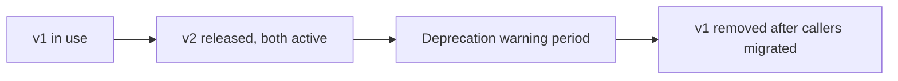

An agent skill's input schema and description are a contract, whether or not you've thought of it that way — every agent, prompt, and few-shot example that references it depends on that contract staying stable. Changing a parameter name or a description's meaning without versioning breaks every caller silently, and unlike a typed API, there's no compiler to catch the break before it reaches production.

## Why This Is Easy to Get Wrong

Skills tend to evolve incrementally — a parameter gets renamed for clarity, a description gets tightened, an optional field becomes required because "it's always been provided anyway." Each change feels small in isolation. In aggregate, and without versioning, they accumulate into a skill whose current behavior no longer matches what older prompts and few-shot examples assumed about it.

## A Versioning Scheme That Works

```python
@dataclass
class SkillVersion:
    name: str
    version: str  # semver
    schema: dict
    description: str
    deprecated: bool = False
    deprecation_message: str = ""

skill_registry = {
    "search_knowledge_base": {
        "1.0.0": SkillVersion("search_knowledge_base", "1.0.0", schema_v1, desc_v1),
        "2.0.0": SkillVersion("search_knowledge_base", "2.0.0", schema_v2, desc_v2, deprecated=False),
    }
}
```

The rule that matters: **a breaking change (renamed parameter, changed required/optional status, semantically different description) is a new major version, registered alongside the old one, not a replacement of it.** Non-breaking changes (a clarified description with the same meaning, an added optional parameter) can update the existing version in place.

## Give Callers a Migration Window



Removing v1 the moment v2 ships forces every caller to migrate simultaneously — unrealistic for anything with more than a handful of consumers. A deprecation period, where v1 still works but logs a warning (visible in traces, surfaced to whoever owns each calling agent), gives callers time to migrate on their own schedule while making the eventual removal predictable rather than a surprise.

```python
def call_skill(skill_name: str, version: str, **kwargs):
    skill = skill_registry[skill_name][version]
    if skill.deprecated:
        logger.warning(f"{skill_name} v{version} is deprecated: {skill.deprecation_message}")
    return skill.execute(**kwargs)
```

## Track Which Version Each Agent Actually Uses

Without this, "can we remove v1 yet" is a question nobody can answer confidently — the safe move is always to wait longer, and deprecated versions accumulate indefinitely. Log the skill version invoked on every call, and use that to build an actual dependency picture: which agents, prompts, or product surfaces are still on v1, and what needs to happen for each of them to migrate.

## Key Takeaways

1. **A skill's schema and description are a contract** — treat changes to them with the same discipline as an API contract
2. **Breaking changes get a new major version, registered alongside the old one** — never silently replace an in-use skill's contract
3. **Give callers a deprecation window with visible warnings**, not an abrupt removal
4. **Log which skill version each call actually uses** — it's the only reliable way to know when a deprecated version can safely be removed

---

*Tags: agent skills, versioning, production, AI engineering*
