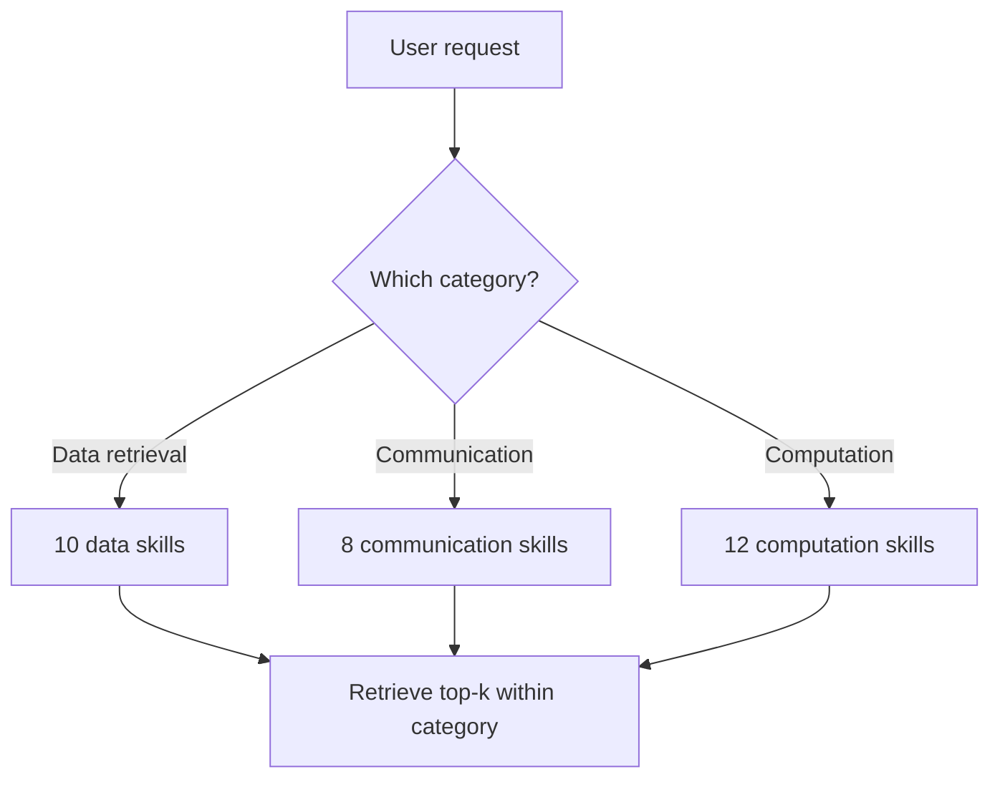

Passing every available skill's schema to the model on every call works fine at 10-15 skills and degrades measurably past that. Two things get worse simultaneously: context consumption (200 tool schemas is a lot of tokens spent before the actual task even starts), and selection accuracy (the model has a harder time picking the genuinely right tool out of a large, undifferentiated list, especially when several skills have superficially similar descriptions).

## Treat Skill Selection as Retrieval, Not Enumeration

The fix that scales: don't show the model all 200 skills. Retrieve the small subset (5-15) most likely to be relevant to the current request, and only pass those into context — the same retrieval-then-generate pattern used for RAG, applied to tool selection instead of document selection.

```python
def retrieve_relevant_skills(user_request: str, skill_registry: list[dict], top_k: int = 10) -> list[dict]:
    request_embedding = embed(user_request)
    scored = [
        (skill, cosine_similarity(request_embedding, skill["description_embedding"]))
        for skill in skill_registry
    ]
    return [skill for skill, score in sorted(scored, key=lambda x: x[1], reverse=True)[:top_k]]

relevant_skills = retrieve_relevant_skills(user_request, full_skill_registry, top_k=10)
response = agent.invoke(user_request, tools=relevant_skills)  # not the full 200
```

Each skill's description gets embedded once, at registration time — the retrieval step at request time is a cheap vector search, not a per-request embedding computation, keeping the added latency small relative to the LLM call itself.

## Organize Skills Into Categories, Not Just a Flat List



A two-stage approach — classify the request's broad category first, then retrieve within that category — narrows the search space further and can improve precision over flat retrieval across all 200 skills at once, particularly when categories have internally similar skills that would otherwise compete for retrieval ranking against each other.

## Watch for Skills That Never Get Retrieved

A skill that's technically registered but never shows up in the top-k for any real request is effectively dead — either its description doesn't match how requests actually get phrased, or it genuinely isn't needed anymore. Track retrieval frequency per skill; a skill with zero retrievals over a meaningful window is worth investigating, not just leaving registered indefinitely.

```python
def audit_unused_skills(retrieval_logs: list[dict], skill_registry: list[dict], window_days: int = 30) -> list[str]:
    retrieved_recently = {log["skill_name"] for log in retrieval_logs if log["age_days"] < window_days}
    return [s["name"] for s in skill_registry if s["name"] not in retrieved_recently]
```

## Key Takeaways

1. **Passing all skills to every call degrades both context efficiency and selection accuracy past roughly 10-15 skills**
2. **Retrieve the relevant subset instead of enumerating everything** — the same retrieval pattern RAG uses, applied to tool selection**
3. **A category-first, retrieve-within-category approach narrows the search space further** for very large skill registries
4. **Audit for skills that never get retrieved** — an unused skill is either miswritten or genuinely dead weight

---

*Tags: agent skills, tool use, scalability, AI engineering*
