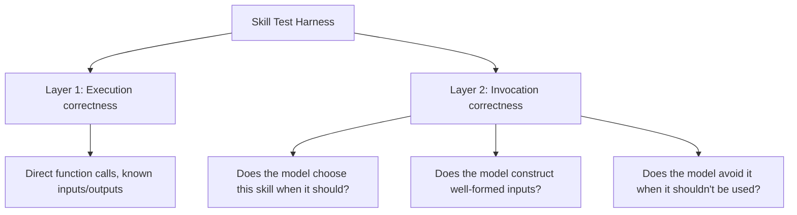

Testing a skill's execution logic — call the function directly with known inputs, assert the output — is standard unit testing and most teams already do it. What's usually missing is the second, equally important layer: does the *model* actually invoke this skill correctly, with well-formed inputs, in the situations it's supposed to? A skill can pass every unit test and still fail in production because the model never calls it the way the tests assumed.

## Two Layers of Testing



## Layer 1: Standard Unit Tests

```python
def test_search_inventory_returns_expected_results():
    result = search_inventory(query="blue widgets", max_results=5)
    assert result["success"] is True
    assert len(result["items"]) <= 5

def test_search_inventory_handles_empty_query():
    result = search_inventory(query="", max_results=5)
    assert result["success"] is False
    assert "error" in result
```

Nothing unusual here — this is the same discipline as testing any function, and it's necessary but not sufficient for a skill specifically because it never involves the model at all.

## Layer 2: Invocation Tests

These run the skill through an actual agent, against a set of realistic scenarios, and check whether the model chose to invoke it and with what inputs — testing the interface layer, not the execution layer:

```python
INVOCATION_TEST_CASES = [
    {
        "user_message": "Do we have any blue widgets in stock?",
        "expected_skill_called": "search_inventory",
        "expected_args_contain": {"query": "blue widgets"},
    },
    {
        "user_message": "What's the weather like today?",  # should NOT trigger inventory search
        "expected_skill_called": None,
    },
]

def run_invocation_tests(agent, test_cases: list[dict]) -> dict:
    results = []
    for case in test_cases:
        trace = agent.invoke_with_trace(case["user_message"])
        called_skill = trace.get_first_tool_call()
        passed = (
            called_skill == case["expected_skill_called"]
            if case["expected_skill_called"]
            else called_skill is None
        )
        results.append({"case": case, "passed": passed, "actual": called_skill})
    return {"pass_rate": sum(r["passed"] for r in results) / len(results), "details": results}
```

The negative test case — a message that should *not* trigger the skill — is as important as the positive ones. Over-invocation (the model reaching for a skill in cases it wasn't meant for) is a common failure mode that unit tests of the skill's execution logic alone will never catch, because the skill itself works fine; the problem is the model calling it when it shouldn't.

## Run Both Layers in CI, on Every Skill Change

Layer 1 catches implementation bugs. Layer 2 catches interface/description problems — a skill whose description is ambiguous enough that the model under- or over-invokes it. Both belong in CI, gating any change to a skill's implementation *or* its description, since either can break either layer.

## Key Takeaways

1. **Test execution correctness and invocation correctness as two distinct layers** — a skill can pass one and fail the other
2. **Invocation tests run the skill through an actual agent**, checking whether the model chose it correctly, not just whether the function works
3. **Include negative test cases** — verifying the model correctly avoids a skill is as important as verifying it uses one
4. **Gate both layers in CI on any change to implementation or description** — either can silently break either layer

---

*Tags: agent skills, testing, tutorial, AI engineering*
