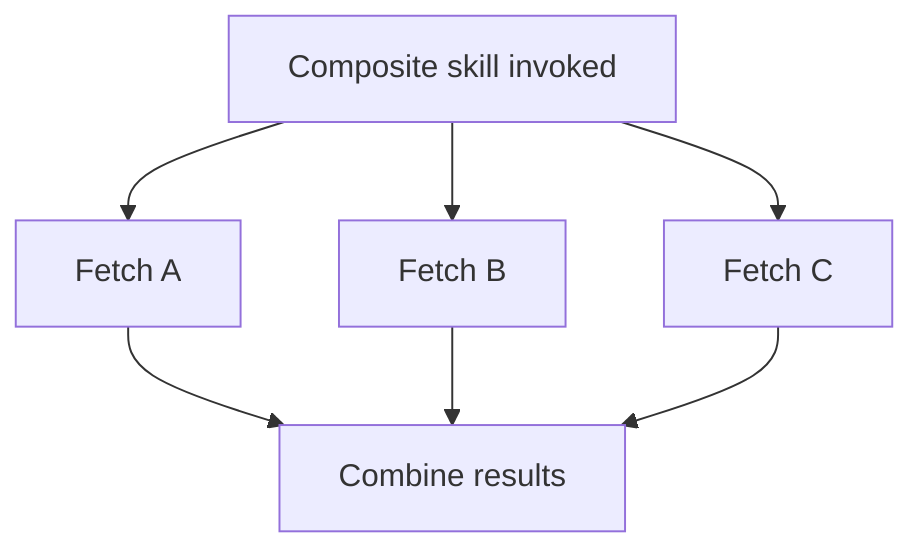

The atomic-vs-composite question — one big skill or several small ones — was introduced early in this series as a starting heuristic (start atomic, compose when you see a pattern). After building and observing enough production skills, three concrete composition patterns show up repeatedly, each suited to a different situation.

## Pattern 1: Sequential Composition

Two atomic skills that are almost always called in a fixed order become a strong candidate for a composite that wraps both, when the sequencing itself doesn't need model judgment between the steps:

```python
# Before: model orchestrates two separate calls every time
# lookup_customer() then get_customer_orders(customer_id)

# After: composite skill wraps the fixed sequence
@tool("get_customer_with_orders")
def get_customer_with_orders(customer_identifier: str) -> dict:
    """Look up a customer and their order history in one call.
    Use this instead of separate lookup_customer + get_customer_orders calls."""
    customer = lookup_customer(customer_identifier)
    orders = get_customer_orders(customer["id"])
    return {"customer": customer, "orders": orders}
```

This reduces both latency (one round trip instead of two) and the chance of a broken sequence (the model calling the second skill with a malformed ID from the first). It only makes sense when the sequence genuinely doesn't benefit from model judgment in between — if the model sometimes needs to *decide* whether to fetch orders based on what the customer lookup returned, keep them atomic.

## Pattern 2: Conditional Composition

Where the composite needs to make an internal decision the model doesn't need visibility into — validate an input, then route to one of several downstream calls based on what it finds:

```python
@tool("process_refund_request")
def process_refund_request(order_id: str, reason: str) -> dict:
    """Validates and processes a refund request end-to-end,
    routing to automatic or manual review based on policy."""
    order = get_order(order_id)
    if order["amount"] < AUTO_APPROVE_THRESHOLD and reason in AUTO_APPROVE_REASONS:
        return issue_refund(order_id)
    return route_to_manual_review(order_id, reason)
```

This hides internal branching logic the model doesn't need to reason about — the model's job is deciding *whether* to request a refund, not deciding whether this specific refund qualifies for auto-approval, which is a deterministic business-rule decision better encoded in the skill than left to model judgment.

## Pattern 3: Parallel Composition

For independent lookups that can run concurrently and only need to be combined at the end:



This is purely a latency optimization — the model doesn't need three sequential round trips for three independent pieces of information it needs together, and a composite that fans out internally returns all three in roughly the time of the slowest single call rather than the sum of all three.

## The Decision Rule, Refined

Compose when: the sequence/branching/parallelism is fixed and doesn't need model judgment between the internal steps. Keep atomic when: the model genuinely needs to see an intermediate result to decide what happens next.

## Key Takeaways

1. **Sequential composition** wins when a fixed call order needs no model judgment in between
2. **Conditional composition** hides internal branching logic the model doesn't need visibility into
3. **Parallel composition** is a latency optimization for independent lookups combined at the end
4. **The deciding factor throughout: does the model need to see an intermediate result to decide the next step?** If yes, keep atomic

---

*Tags: agent skills, design patterns, architecture, AI engineering*
